# Inspector guidance native gallery

All 16 captures were rendered and inspected. See [scope and lifecycle](README.md).

## Dark · 80x24

### Server guidance

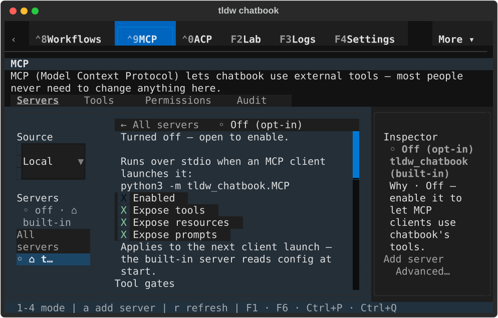

[Terminal text](native/textual-dark-80x24-server.txt)

### Audit detail

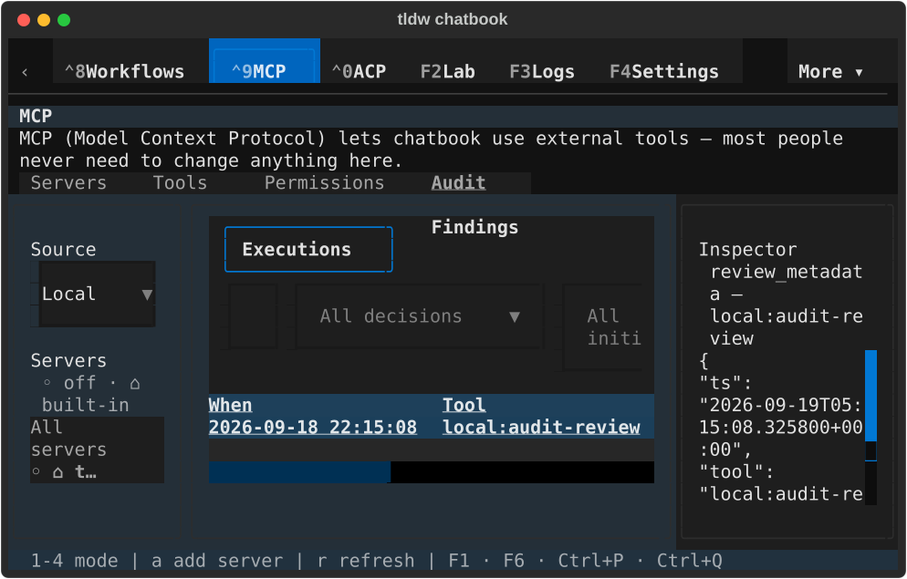

[Terminal text](native/textual-dark-80x24-audit.txt)

### Tool detail

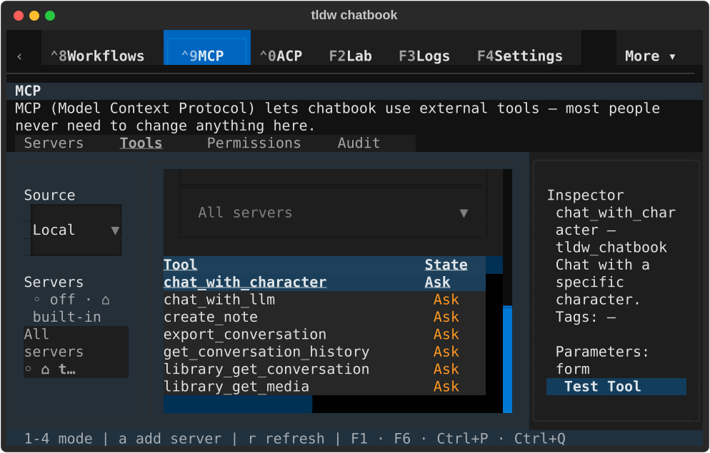

[Terminal text](native/textual-dark-80x24-tool.txt)

### Server guidance restored

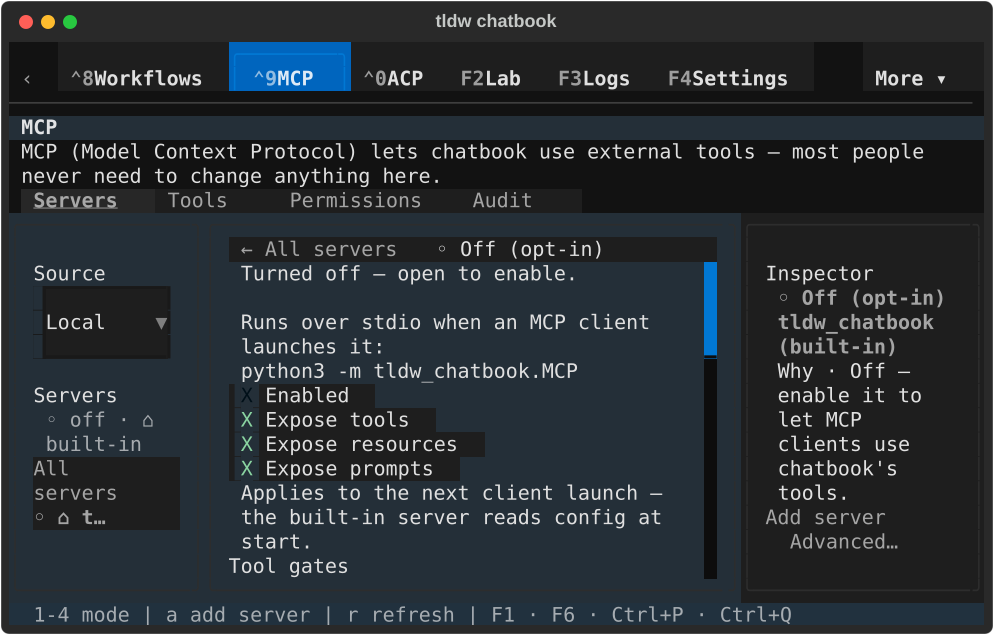

[Terminal text](native/textual-dark-80x24-restored.txt)

## Dark · 170x48

### Server guidance

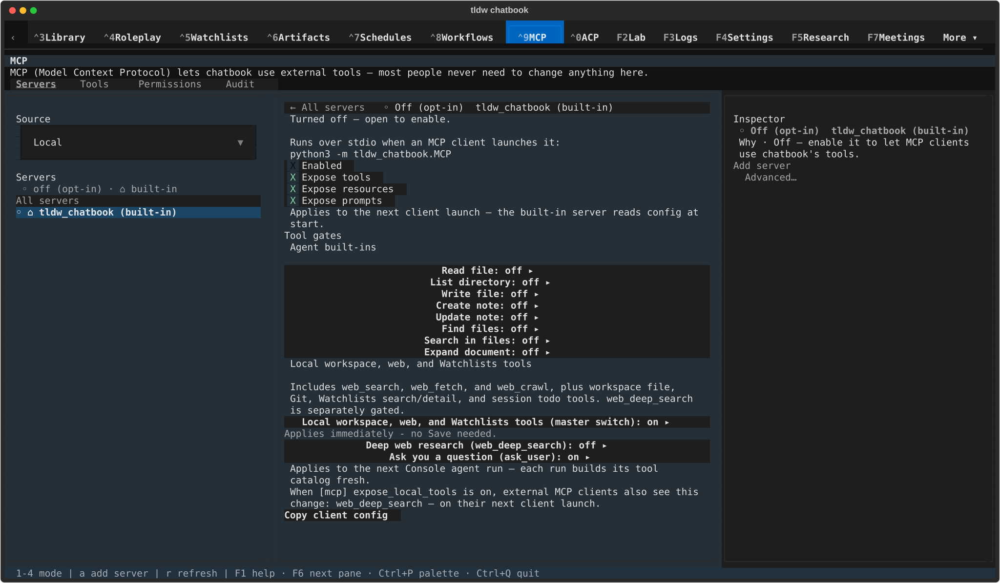

[Terminal text](native/textual-dark-170x48-server.txt)

### Audit detail

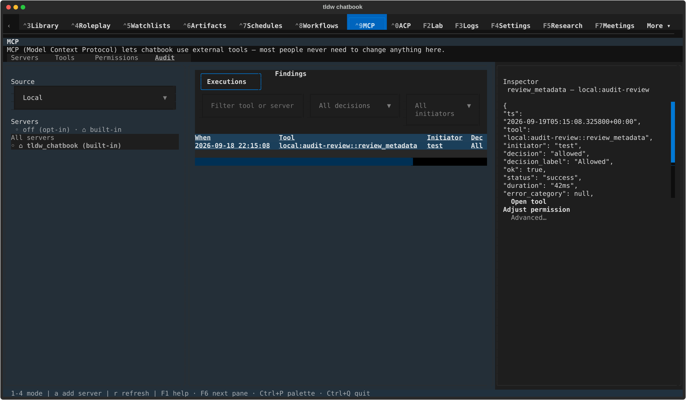

[Terminal text](native/textual-dark-170x48-audit.txt)

### Tool detail

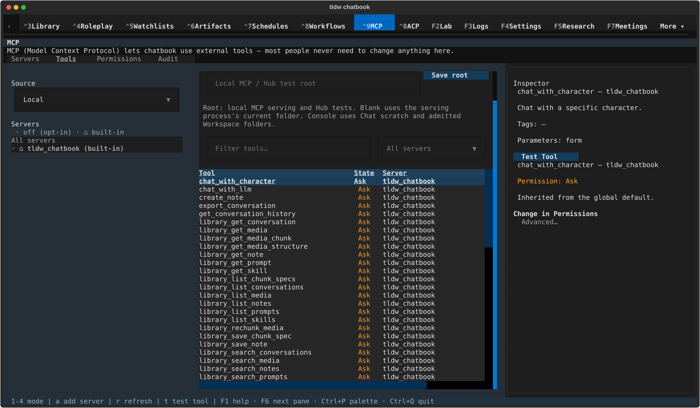

[Terminal text](native/textual-dark-170x48-tool.txt)

### Server guidance restored

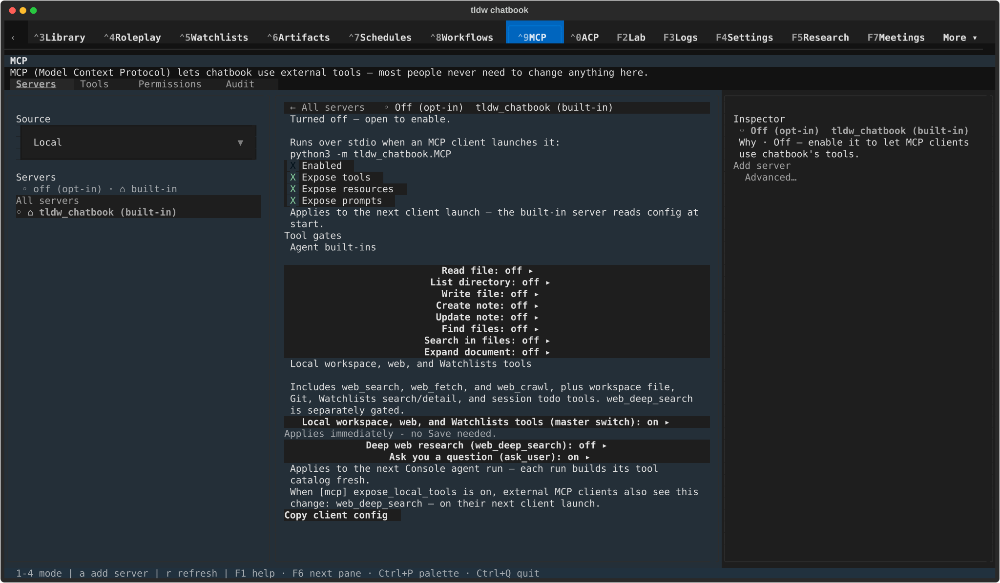

[Terminal text](native/textual-dark-170x48-restored.txt)

## Light · 80x24

### Server guidance

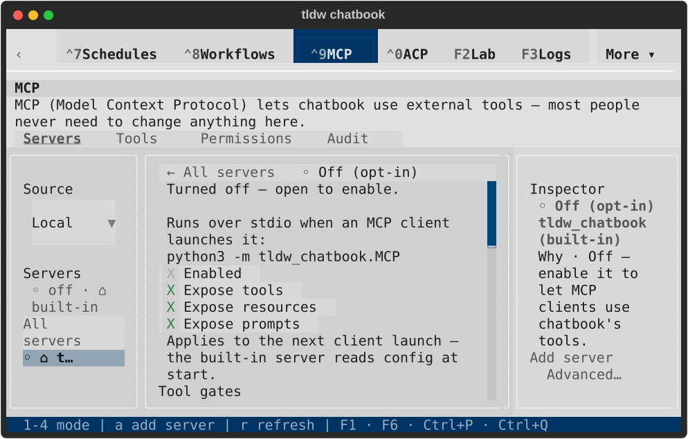

[Terminal text](native/textual-light-80x24-server.txt)

### Audit detail

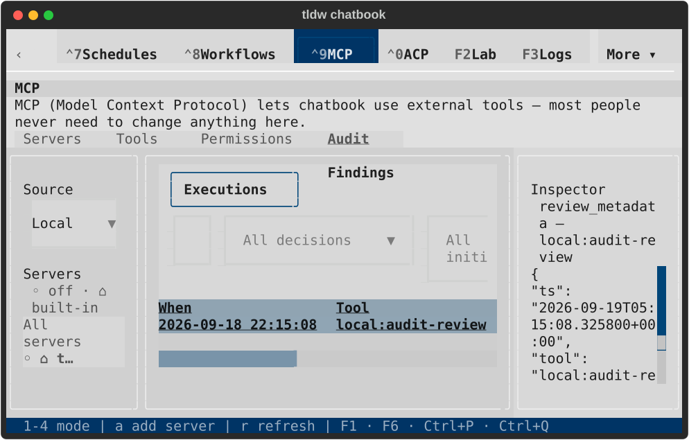

[Terminal text](native/textual-light-80x24-audit.txt)

### Tool detail

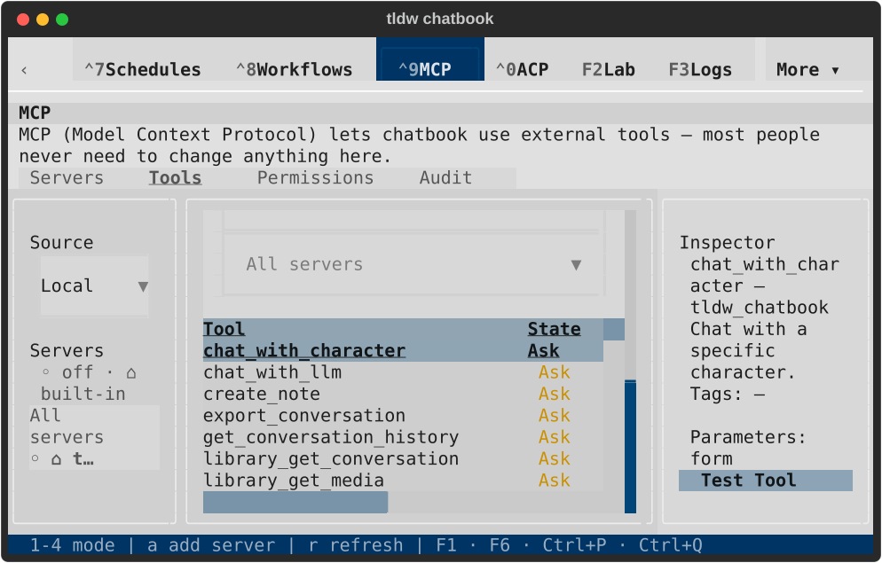

[Terminal text](native/textual-light-80x24-tool.txt)

### Server guidance restored

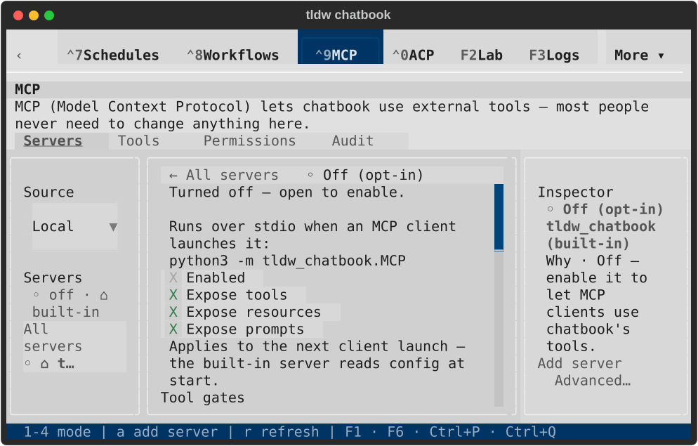

[Terminal text](native/textual-light-80x24-restored.txt)

## Light · 170x48

### Server guidance

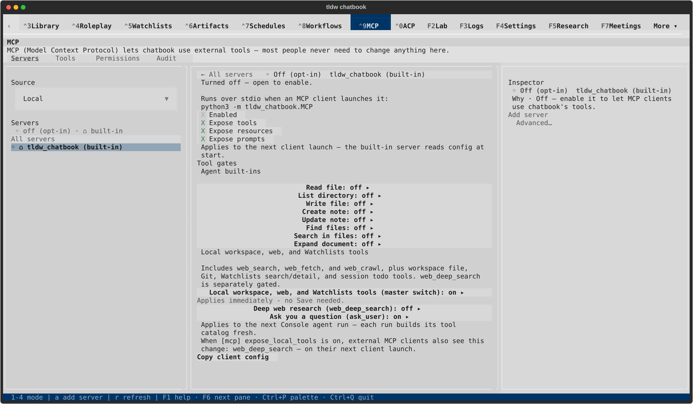

[Terminal text](native/textual-light-170x48-server.txt)

### Audit detail

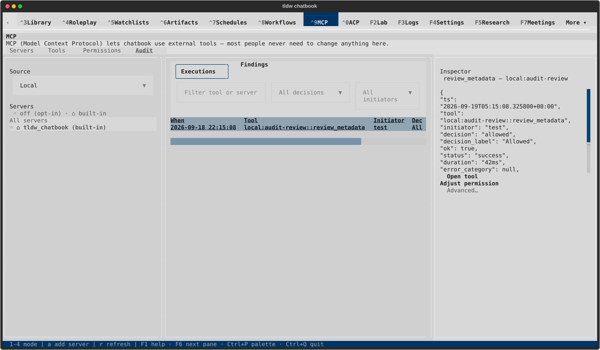

[Terminal text](native/textual-light-170x48-audit.txt)

### Tool detail

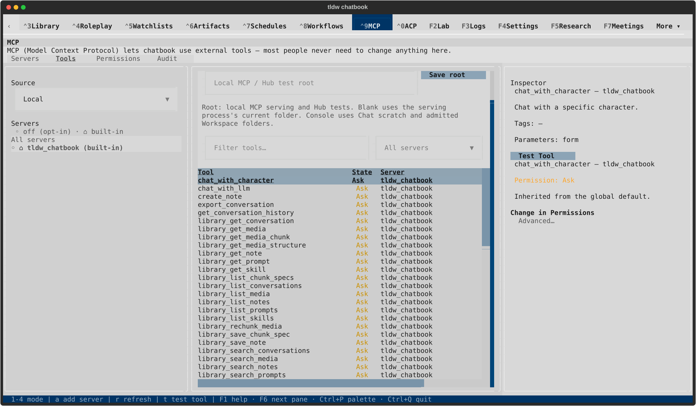

[Terminal text](native/textual-light-170x48-tool.txt)

### Server guidance restored

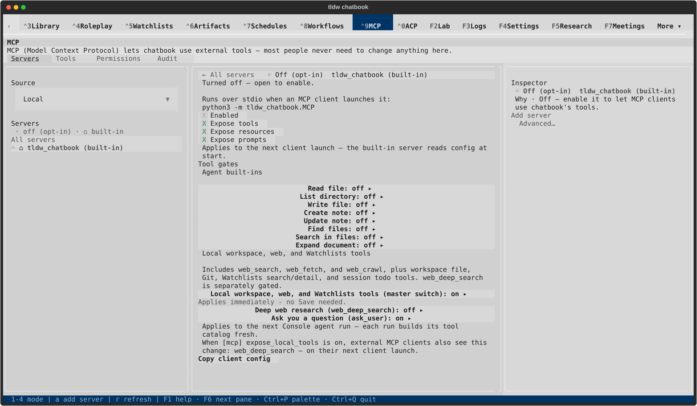

[Terminal text](native/textual-light-170x48-restored.txt)
