# Current inspector guidance captures

Real private native TldwCli at current integration source. One synthetic Audit record and the real built-in catalog; no tool executions. Inspector content is scrolled into view explicitly, so these captures qualify guidance ownership, not automatic inspector navigation.

## dark · 80x24

### Servers: guidance visible

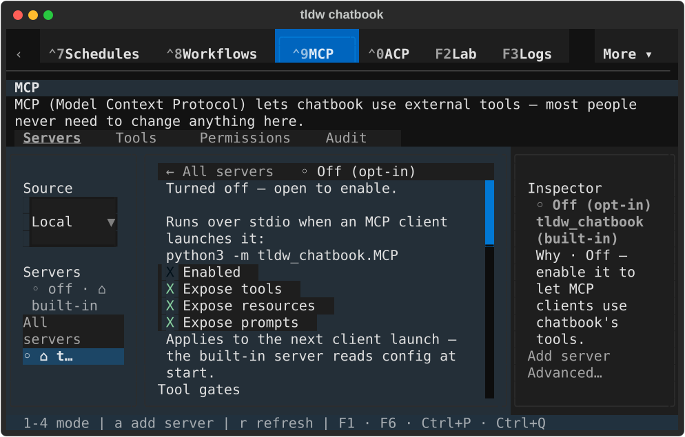

[Terminal text](native/textual-dark-80x24-server.txt)

### Audit: guidance hidden

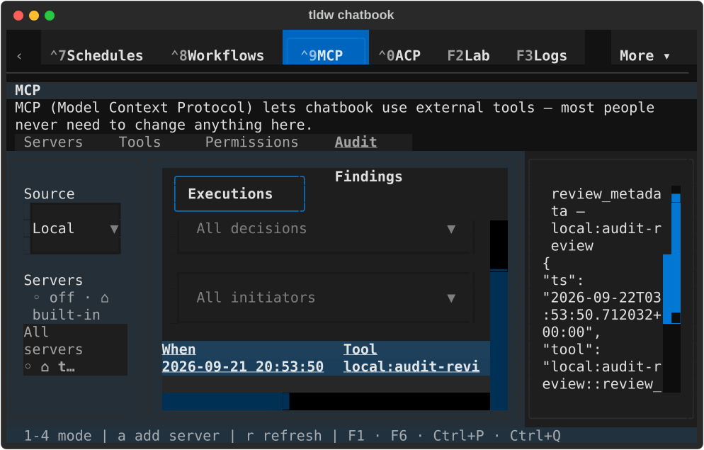

[Terminal text](native/textual-dark-80x24-audit.txt)

### Tools: guidance hidden

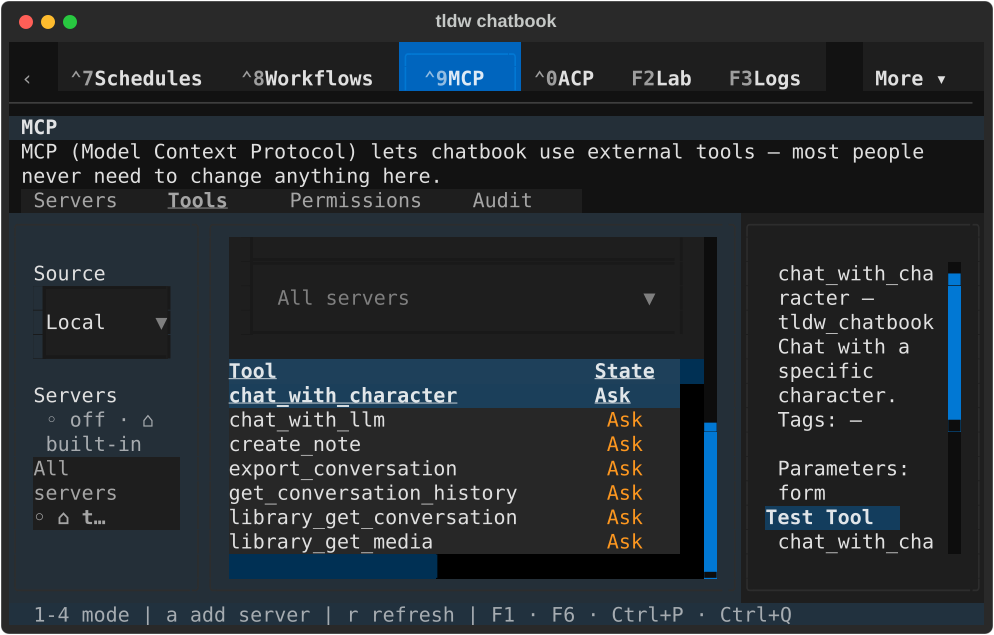

[Terminal text](native/textual-dark-80x24-tool.txt)

### Servers: guidance restored

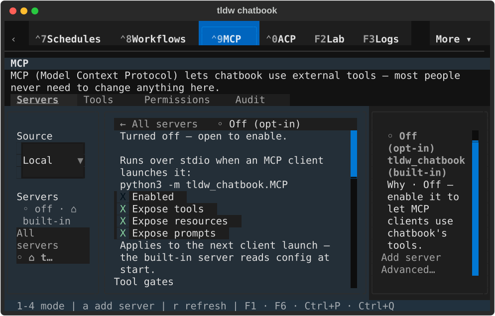

[Terminal text](native/textual-dark-80x24-restored.txt)

## dark · 170x48

### Servers: guidance visible

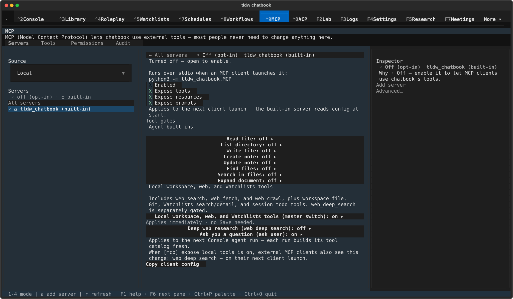

[Terminal text](native/textual-dark-170x48-server.txt)

### Audit: guidance hidden

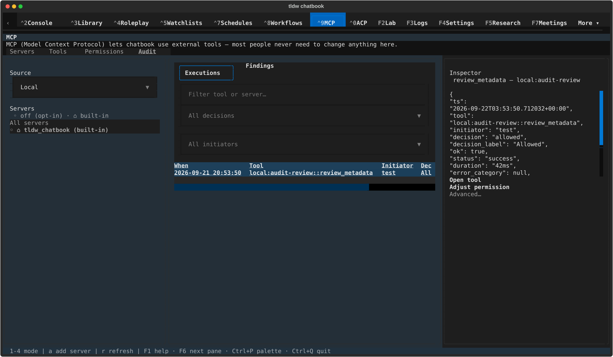

[Terminal text](native/textual-dark-170x48-audit.txt)

### Tools: guidance hidden

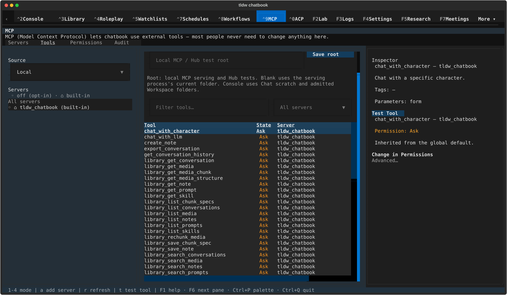

[Terminal text](native/textual-dark-170x48-tool.txt)

### Servers: guidance restored

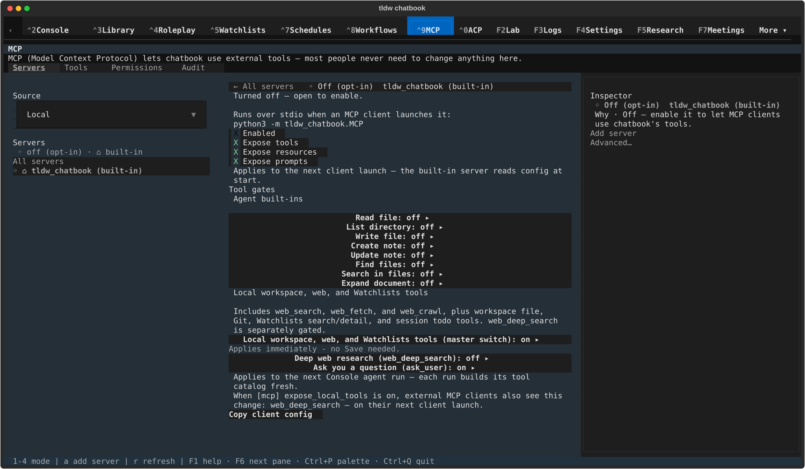

[Terminal text](native/textual-dark-170x48-restored.txt)

## light · 80x24

### Servers: guidance visible

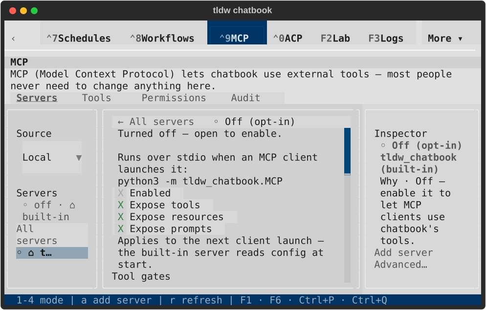

[Terminal text](native/textual-light-80x24-server.txt)

### Audit: guidance hidden

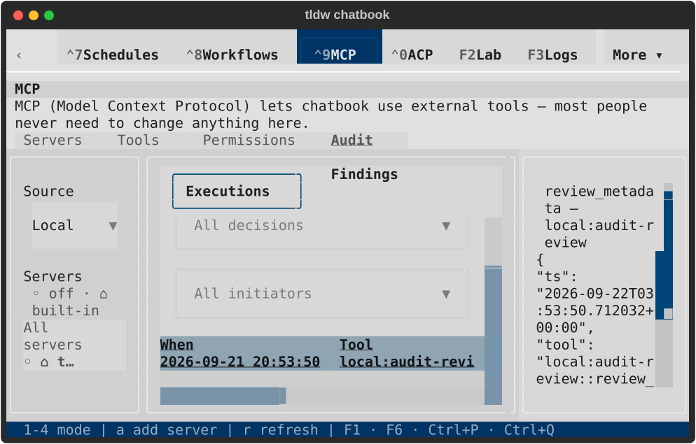

[Terminal text](native/textual-light-80x24-audit.txt)

### Tools: guidance hidden

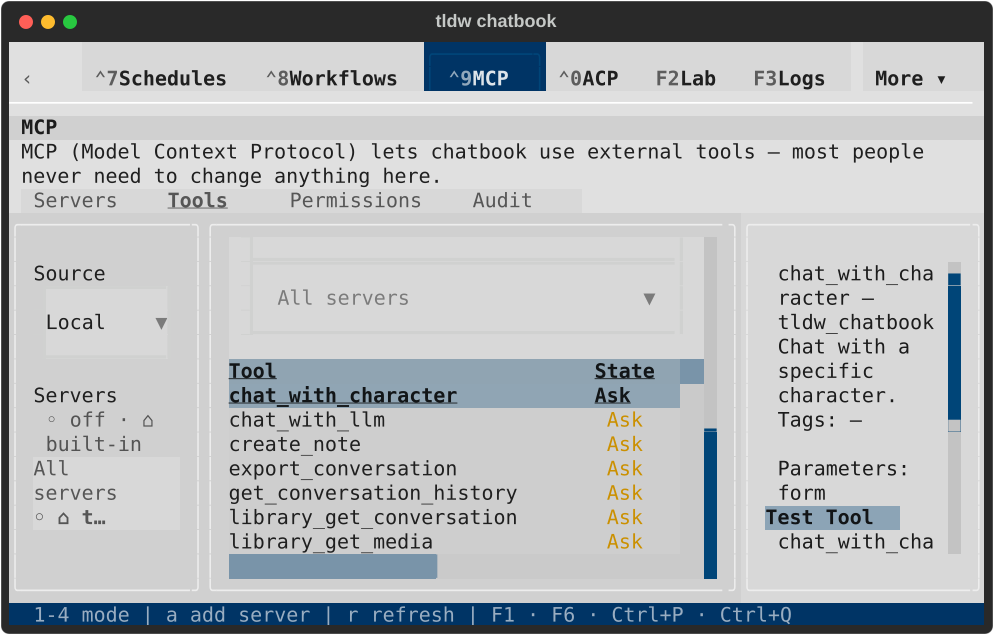

[Terminal text](native/textual-light-80x24-tool.txt)

### Servers: guidance restored

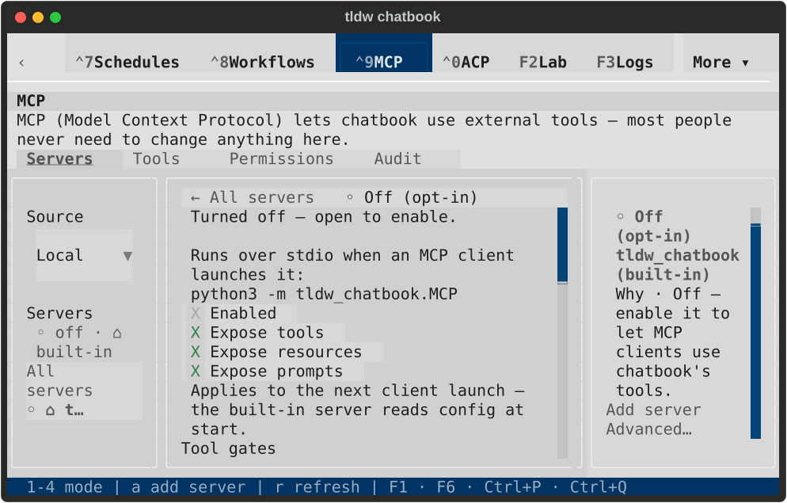

[Terminal text](native/textual-light-80x24-restored.txt)

## light · 170x48

### Servers: guidance visible

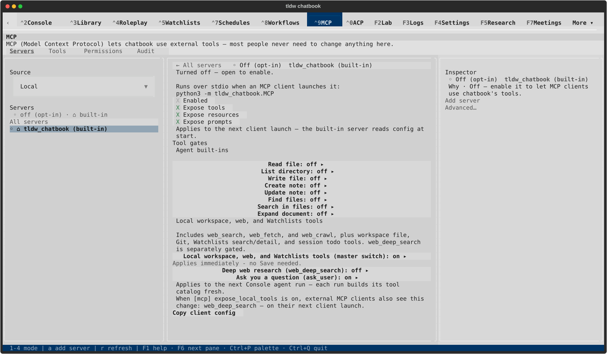

[Terminal text](native/textual-light-170x48-server.txt)

### Audit: guidance hidden

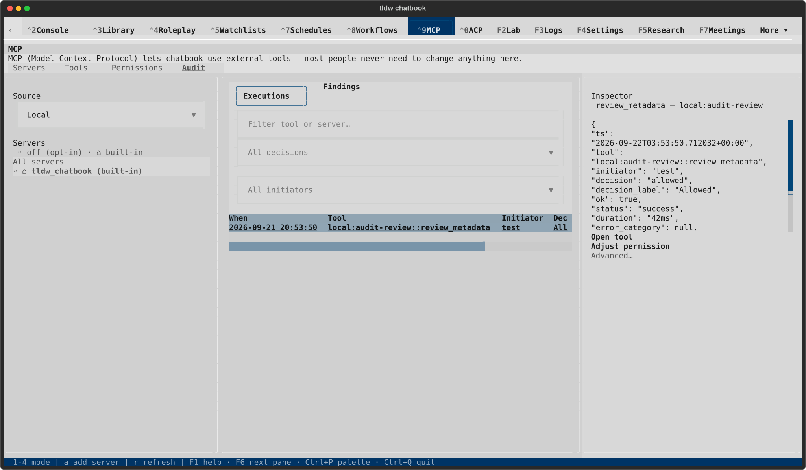

[Terminal text](native/textual-light-170x48-audit.txt)

### Tools: guidance hidden

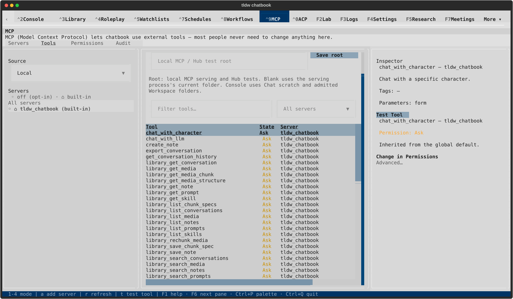

[Terminal text](native/textual-light-170x48-tool.txt)

### Servers: guidance restored

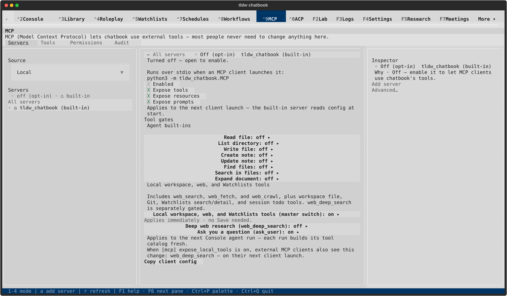

[Terminal text](native/textual-light-170x48-restored.txt)
