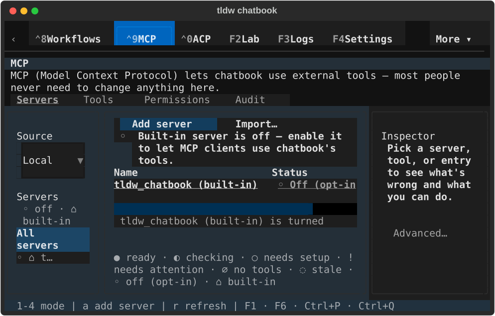
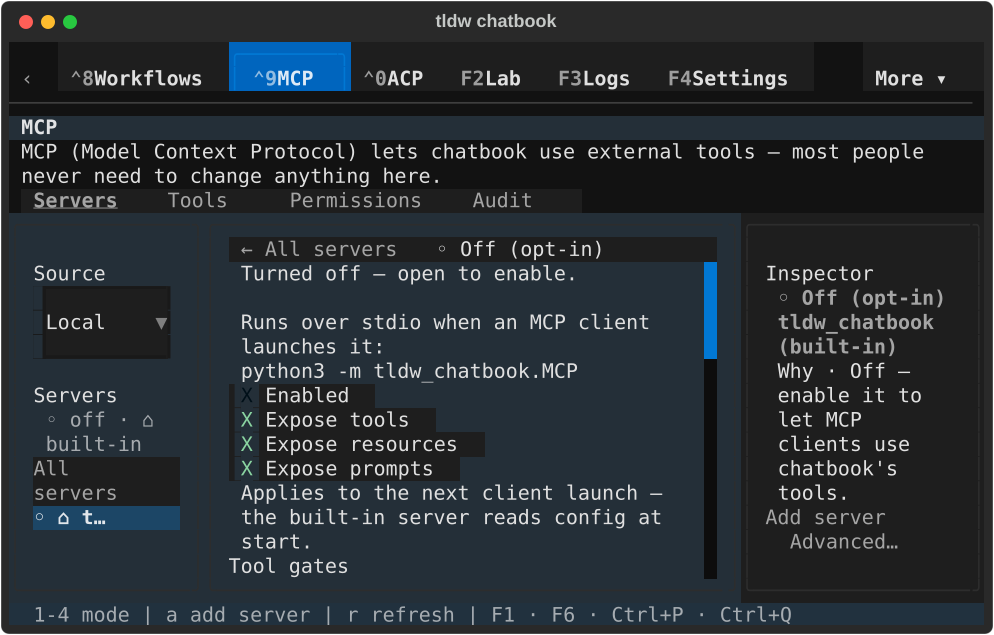
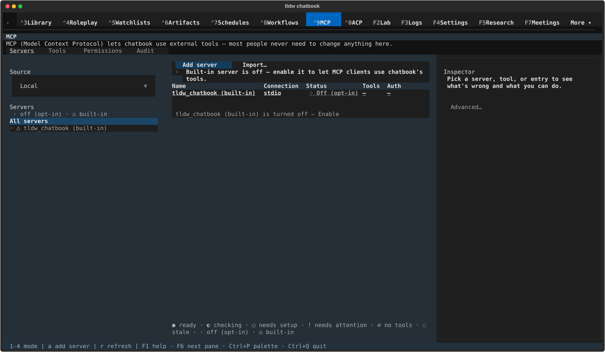
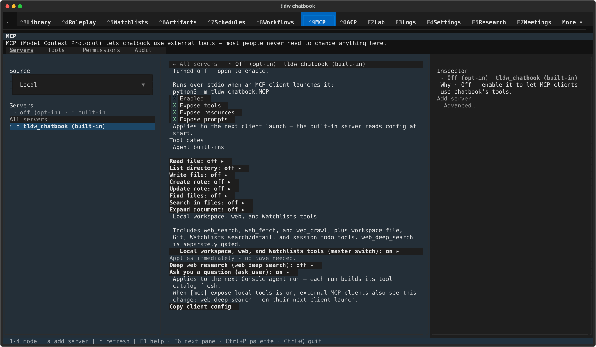
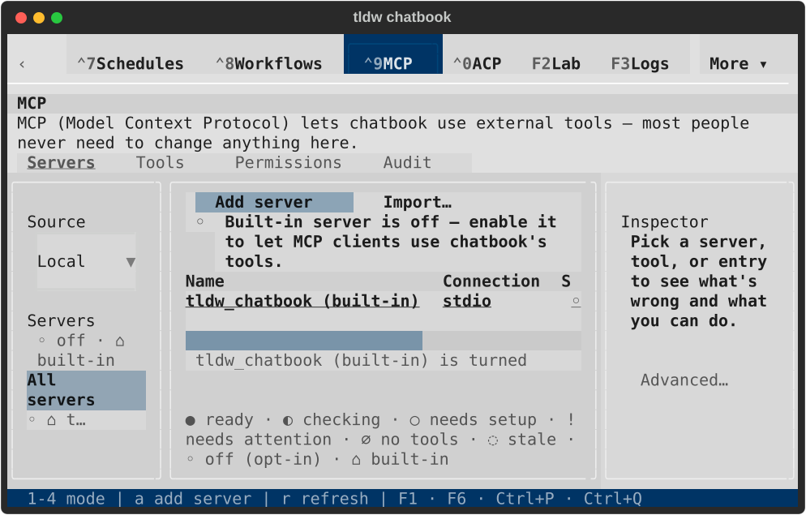
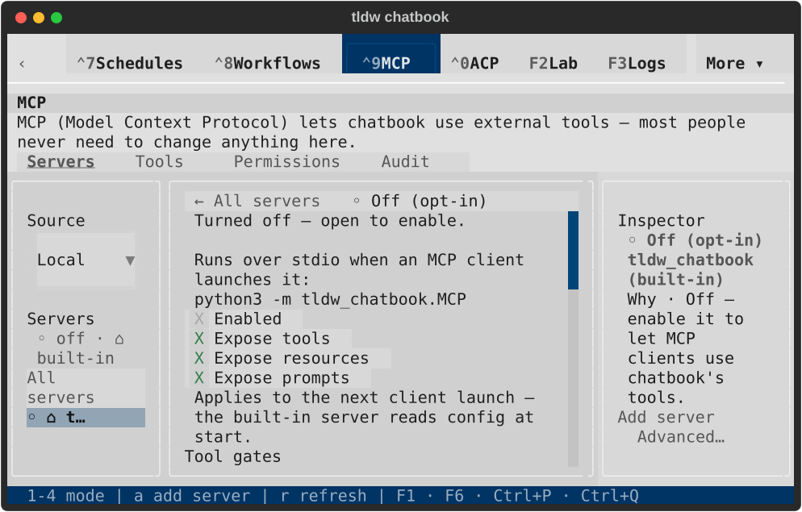
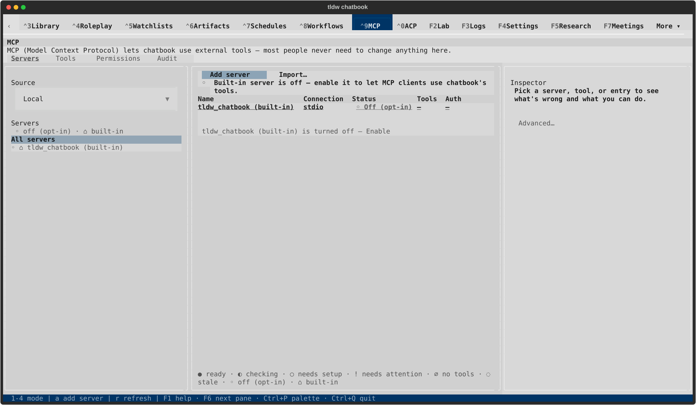
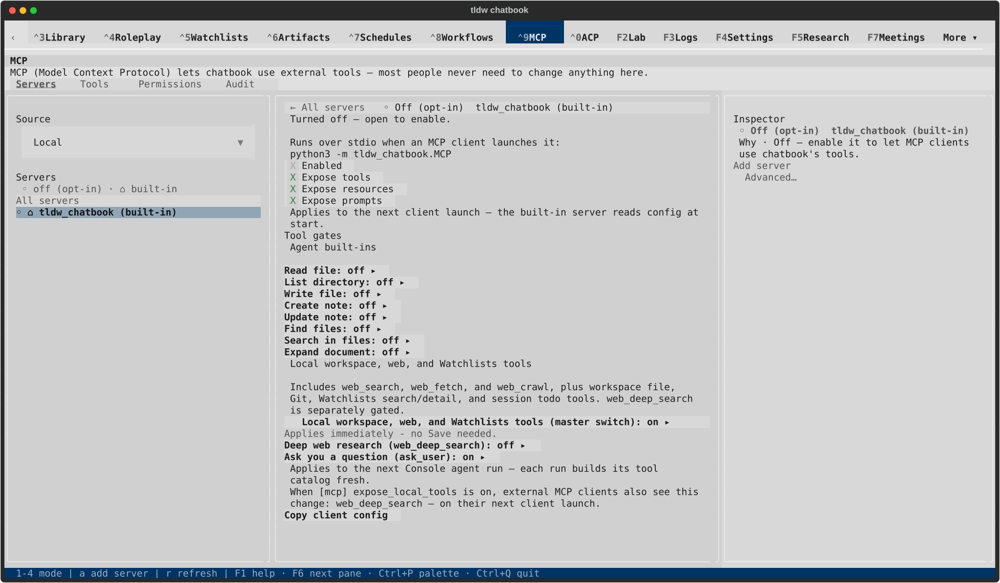

# MCP rail navigation — TASK-32812

At 80×24, the actual MCP rail viewport was narrower than Button's default
minimum width: All servers painted only All. The rail now scrolls, rows use
existing tokens for compact sizing and natural wrapping, and names truncate by
terminal cells with a visible ellipsis. Counts and readiness remain visible.
Source retains its complete label alongside the new scrollbar.

Names and tooltips use literal Rich Text, including names truncated inside
markup-like tags. Ordinary same-catalog refresh and resize update existing
controls so keyboard focus stays with the server. Each row control owns its
exact server key; delayed presses from removed controls cannot target a new row
that reused the numeric ID. Structural source/scope/list changes still recompose
with the existing mouse-capture guard; this does not claim focus restoration
across replacement catalogs.

## Targeted evidence

**119 cases pass** in the [final scoped run](final-targeted.txt), with the two
explicit exclusions below. This includes the six new regressions, existing
rail and compact-readability cases, table-selection checks, token/component
governance and generated-CSS validation.

The six new cases use the actual three-pane shell for dark/light paint at
80×24, 100×30, 120×40 and 170×48 as applicable. They cover CJK, combining
characters, literal markup, four-digit counts, last-row pointer/keyboard access,
no-refocus resize/refresh, a 1→64→1 same-size scrollbar transition and unrelated
focus preservation. Small rail harnesses separately reproduce refresh focus
loss and a delayed press on a replaced row.

- [Original five failing cases](initial-red.txt) establish clipped rows and
  retargeted delayed presses. [Focused refresh red](focus-red.txt) establishes
  loss of the existing server control.
- [Literal-label failure](literal-label-failure.txt) caught a truncated closing
  tag being parsed as markup. The initial zero-line-padding attempt was rejected
  by Textual's parser ([log](stylesheet-attempt-failure.txt)); the fix uses the
  button's built-in line padding. A test-edit indentation error
  ([collection log](test-collection-failure.txt)) and the first scrollbar
  fixture's wrong query parent are retained as harness failures.
- The [initial 121-case run](initial-targeted.txt) had 115 passes and six failures:
  two wrong-parent fixture failures, two Source-label regressions repaired by
  compact padding, and the two existing boundaries below.
- The full destination-tour harness failed with `raw_source_selection_changed`
  before UI construction. It was not requalified here. The CSS allowlist ratchet
  found 26 declarations; [baseline comparison](css-ratchet-baseline.json)
  reproduces the identical set at `9a4ba3cef3`, with unchanged test/offender file
  hashes. Both cases are explicitly excluded from the final scoped run.
- [Independent review](independent-review.txt), [Ruff](ruff.txt),
  [Backlog validation](backlog-check.txt), [diagnostic inventory](diagnostic-inventory.txt)
  and generated-sheet checks record the bounded review. No full suite ran.

## Native visual evidence

Run `/private/tmp/tldw-32812-native-001`, PID 95609, used the real app, LinuxDriver and
TTY streams with the real private catalog. Dark/light at 80×24 and 170×48 each
fully painted All servers, selected an exact server and pressed `r` while its
row stayed focused. The same control/focus remained through subsequent terminal
resizes. All eight captures were rendered and visually inspected.

[Result](native-result.json), [lifecycle](lifecycle.json) and
[capture hashes](capture-manifest.json) pin the runner and source: normal return,
exit 0, process absence before terminal closure, reacquired instance lock, ten
healthy private databases, zero conversations/messages, unchanged default files
and permission profiles, and no error/fault log entries.

| View | All servers | Exact server after refresh |
| --- | --- | --- |
| Dark 80×24 |  |  |
| Dark 170×48 |  |  |
| Light 80×24 |  |  |
| Light 170×48 |  |  |

The [previous compact capture](../2026-09-18-mcp-table-selection/textual-dark-80x24-cleared-after-refresh.svg)
records the original All servers clipping. The new gallery qualifies navigation
and row paint; long catalogs/Unicode use controlled mounted projections. Compact
Servers table columns and detail actions remain outside this repair, including
the horizontally clipped overview visible in these captures. No
external server connection or tool execution is qualified.

## Integration and remaining review

All applicable [remote checks on saved head 9a4ba3cef3](prior-head-checks.json)
passed, including Fast Lane, six GGUF checks, UI latency and derived artifacts.
Fresh checks are required on this repair's pushed head. PR2707 remains draft,
open and subject to its own visual review and merge approval.

The [MCP ledger](../../reports/2026-09-18-mcp-review.md) retains Inspector
currentness/schema/drafts, Servers gates/lifecycles and Audit/Permissions flows.
The [component ledger](../../reports/2026-09-17-design-system-completion-audit.md)
retains the broader review and the newly recorded CSS consolidation debt.
ADR required: no; routine repair under ADR-150 and ADR-161.
