# Restored MCP review native gallery

Current PR2727 integration on merged dev `65d79cc2b7`. All 16 native captures were rendered and inspected. Both action labels are keyboard-reachable; the existing long-path wrapping and post-review guidance remain follow-up UX work. See [conflict choices, qualification and limits](CURRENT-DEV-REVIEW.md). Final visual approval is pending.

[Original historical gallery](HISTORICAL-GALLERY.md).

## Dark · 120x40

### Review beginning

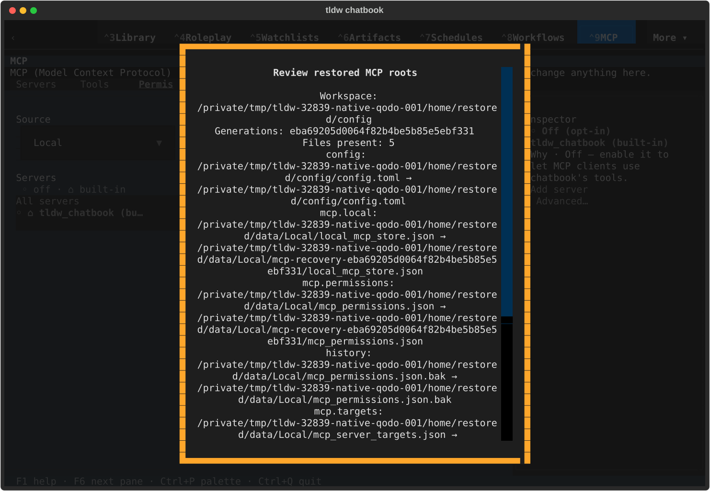

[Terminal text](integration/native/textual-dark-120x40-review.txt)

### Cancel reachable

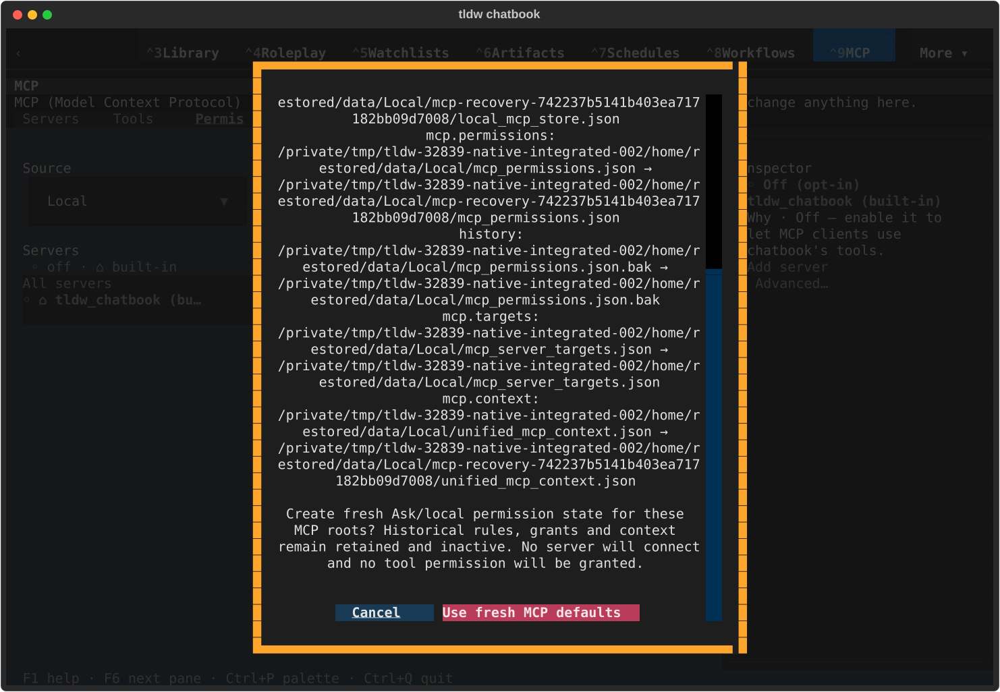

[Terminal text](integration/native/textual-dark-120x40-cancel-control.txt)

### Confirm reachable

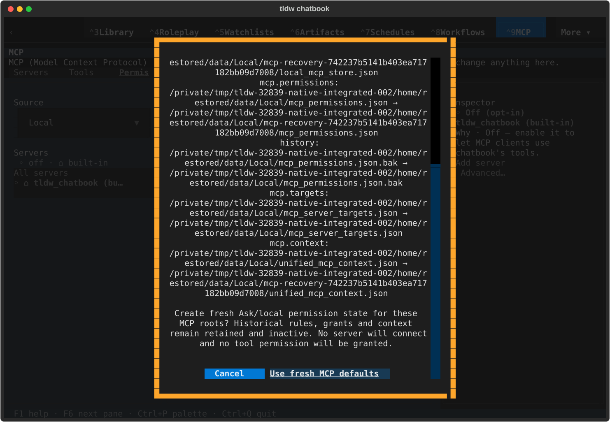

[Terminal text](integration/native/textual-dark-120x40-confirm-control.txt)

### Fresh Ask/local defaults

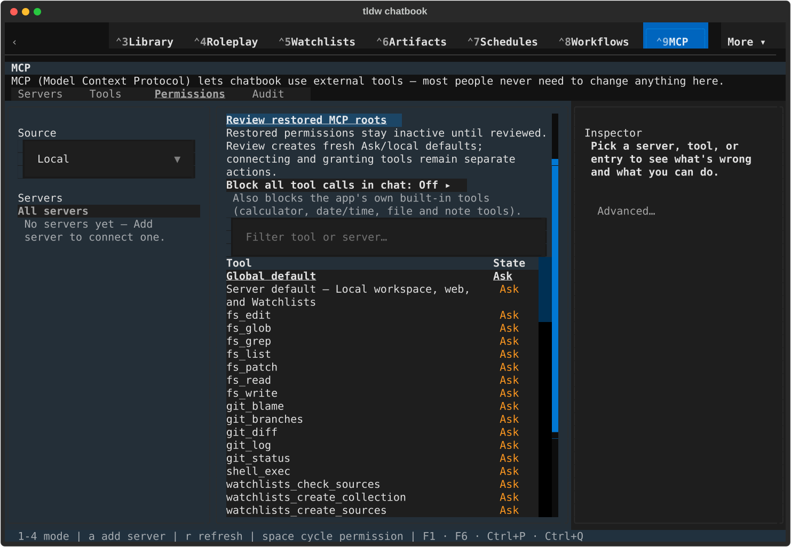

[Terminal text](integration/native/textual-dark-120x40-fresh-defaults.txt)

## Dark · 170x48

### Review beginning

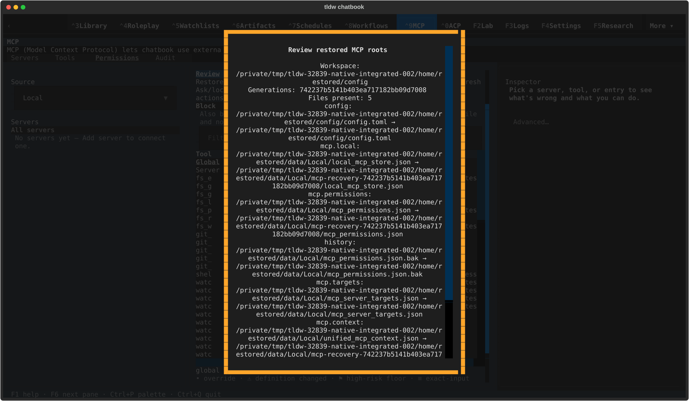

[Terminal text](integration/native/textual-dark-170x48-review.txt)

### Cancel reachable

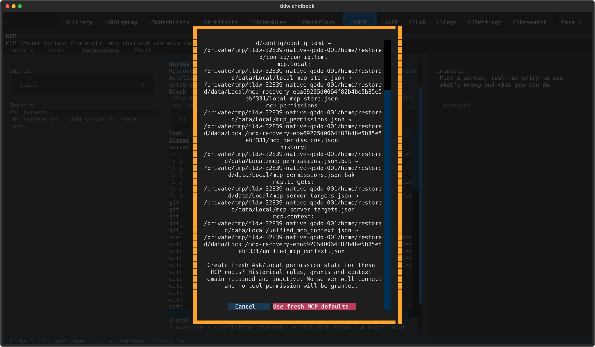

[Terminal text](integration/native/textual-dark-170x48-cancel-control.txt)

### Confirm reachable

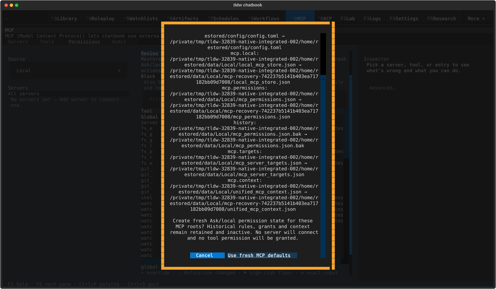

[Terminal text](integration/native/textual-dark-170x48-confirm-control.txt)

### Fresh Ask/local defaults

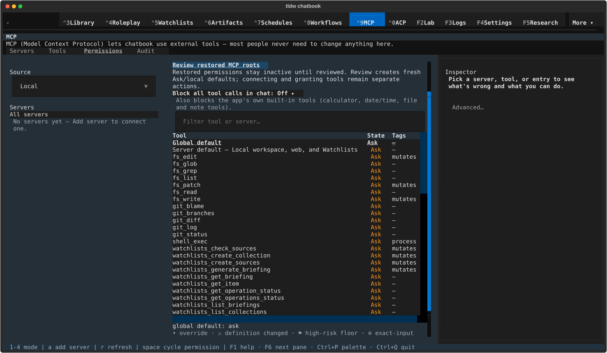

[Terminal text](integration/native/textual-dark-170x48-fresh-defaults.txt)

## Light · 120x40

### Review beginning

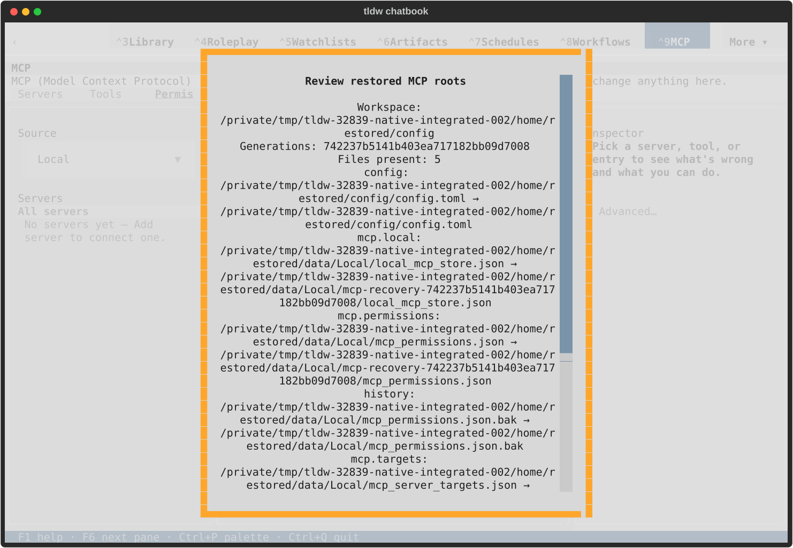

[Terminal text](integration/native/textual-light-120x40-review.txt)

### Cancel reachable

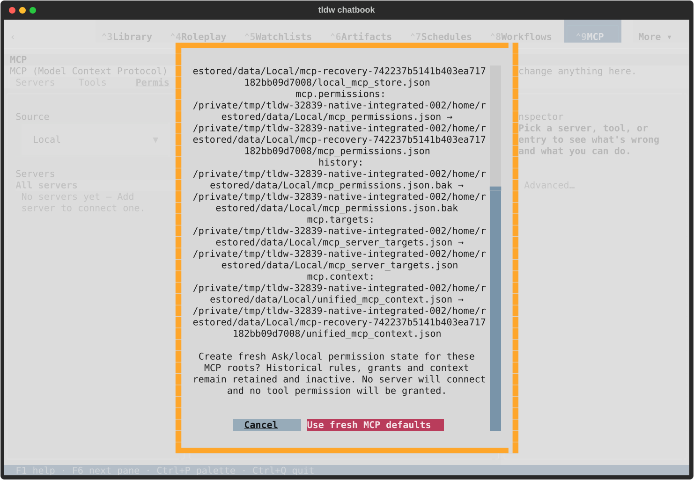

[Terminal text](integration/native/textual-light-120x40-cancel-control.txt)

### Confirm reachable

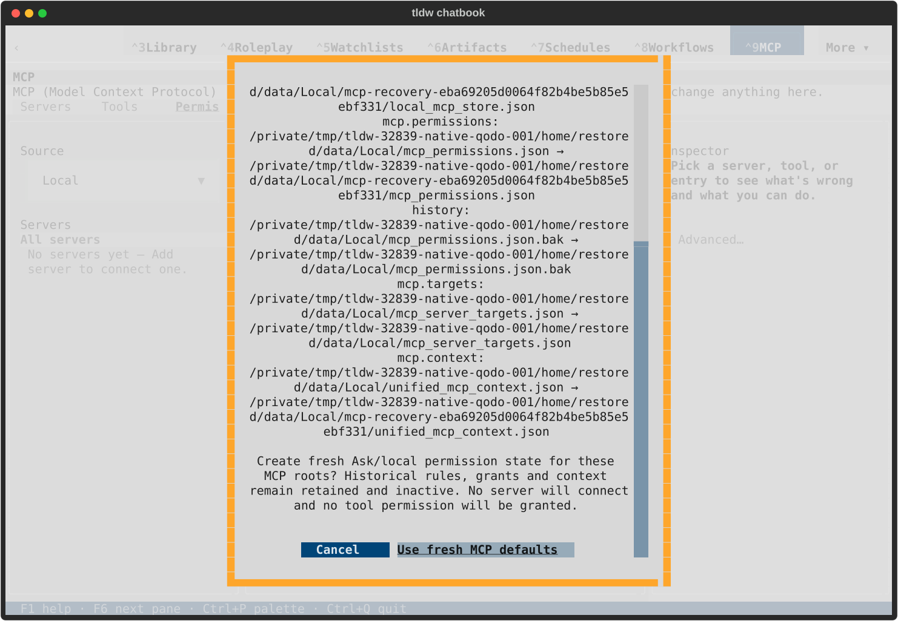

[Terminal text](integration/native/textual-light-120x40-confirm-control.txt)

### Fresh Ask/local defaults

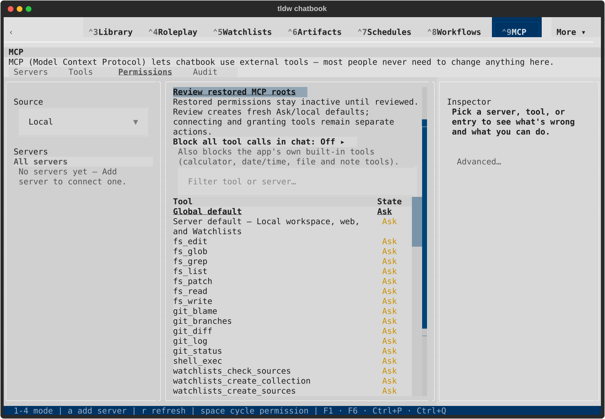

[Terminal text](integration/native/textual-light-120x40-fresh-defaults.txt)

## Light · 170x48

### Review beginning

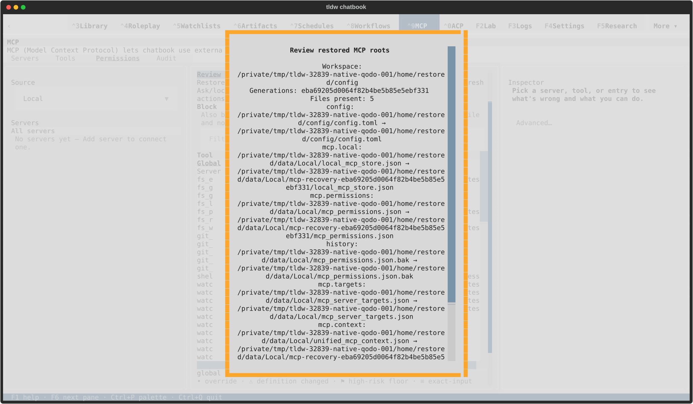

[Terminal text](integration/native/textual-light-170x48-review.txt)

### Cancel reachable

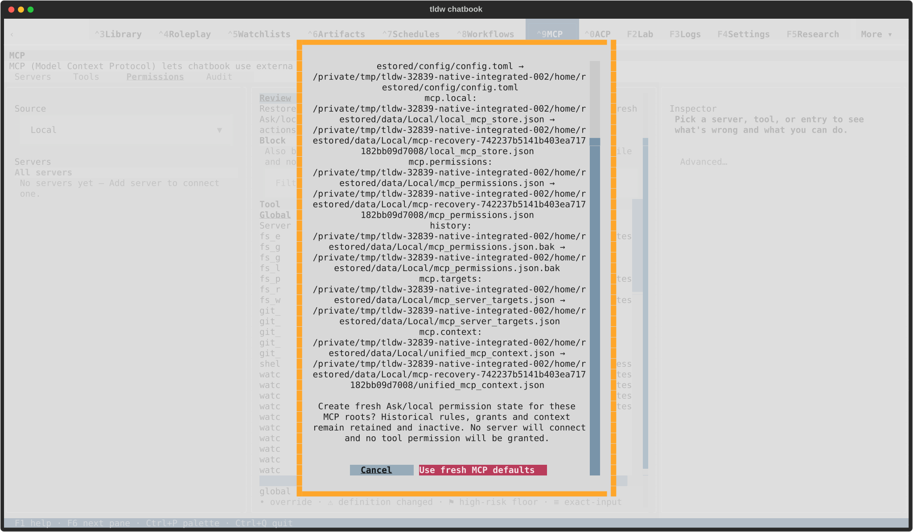

[Terminal text](integration/native/textual-light-170x48-cancel-control.txt)

### Confirm reachable

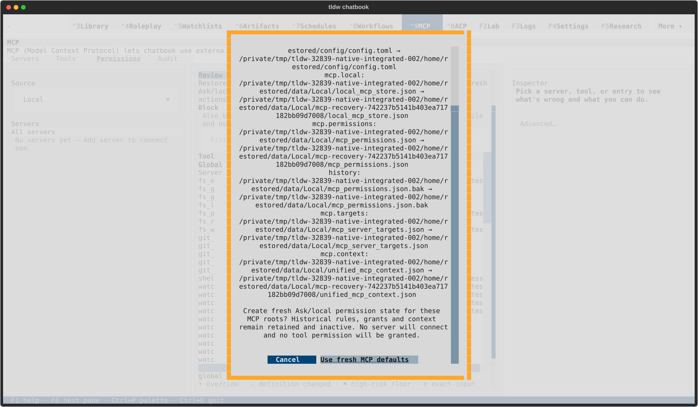

[Terminal text](integration/native/textual-light-170x48-confirm-control.txt)

### Fresh Ask/local defaults

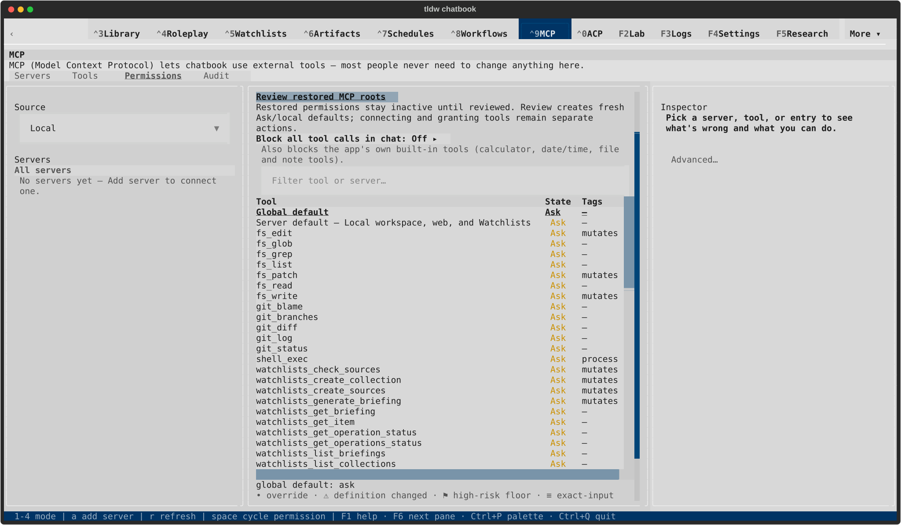

[Terminal text](integration/native/textual-light-170x48-fresh-defaults.txt)
