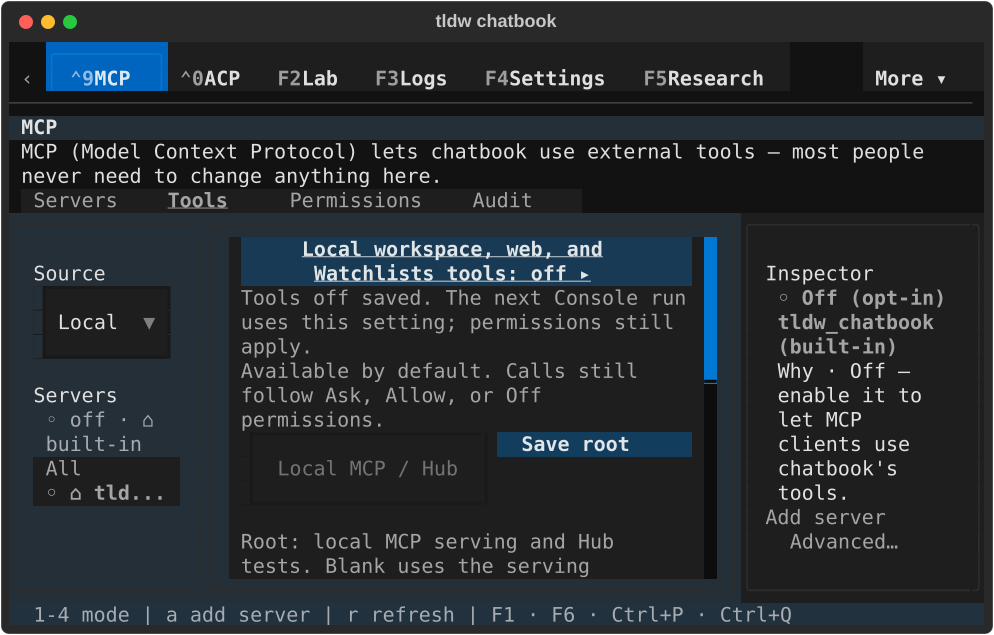
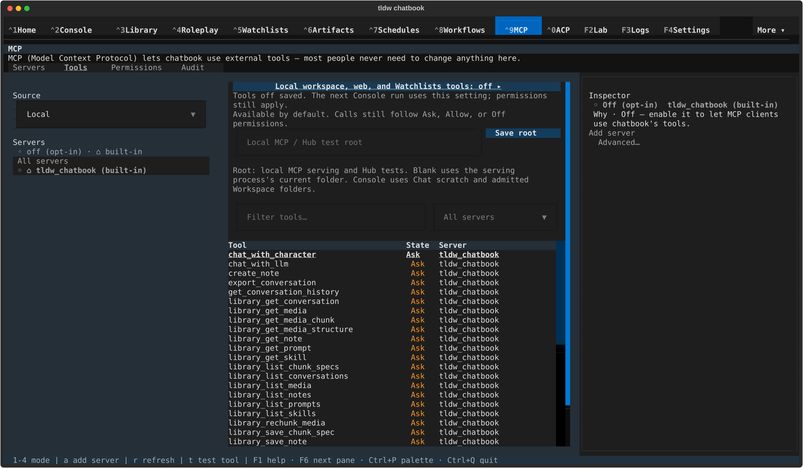
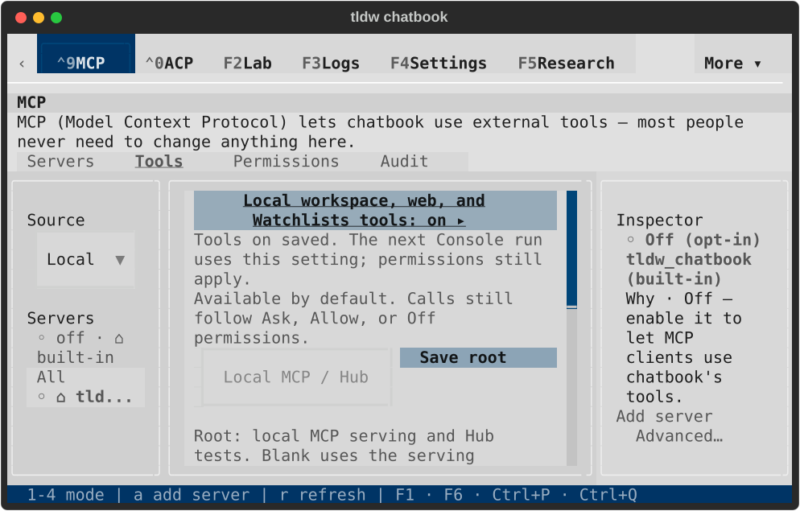
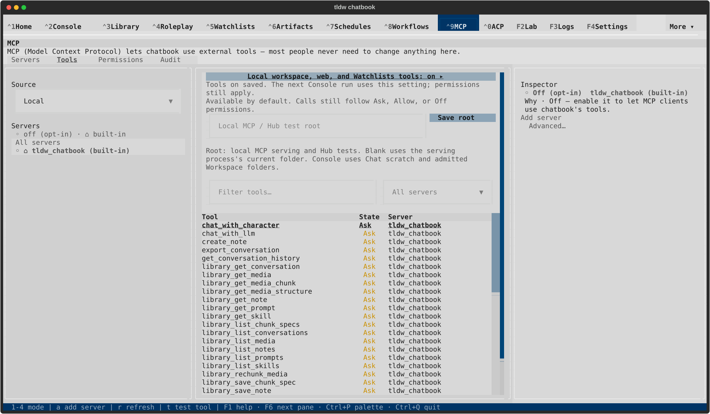

# MCP Workbench status lifetime — TASK-32795

Local-setting status polling now waits for a fully mounted, attached canvas and
stops projecting once its Workbench or canvas is pruning. Deferred root receipts
remain available, and the projection stamp includes canvas identity so a
replacement Tools canvas receives an already displayed receipt. The existing
ADR-169 save owner, ordering, authority and persistence contracts are unchanged.

## Targeted evidence

There are **79 distinct passing cases** across the 60-case scoped run and the
final 28-case complete root/lifecycle replay. Counts overlap and are not additive.
The final replay includes 11 deterministic lifecycle cases: pre-compose polling,
receipts before/during canvas-only and whole-Workbench removal, receipt replay,
and deferred initial dispatch. No full suite was run.

- [Initial red](lifecycle-red.txt): four `NoMatches` failures on the prior source,
  with valid root draft identities, at actual pre-compose and post-detach seams.
- [Receipt replay red](receipt-replay-red.txt): unchanged root receipt lost when
  just its canvas was replaced; this prompted the canvas-identity stamp.
- [60-case run](targeted-60.txt) and [final 28-case replay](final-root-lifecycle-28.txt).
- [Independent review](independent-review.txt): final bounded review has no
  remaining actionable finding.
- [Static checks](static-checks.txt): new files and changed functions format;
  no introduced Ruff findings. Workbench and its older test module retain 65
  and 4 baseline Ruff findings respectively. New files and the master test
  module are clean. Backlog IDs/path validation passes across 4,146 tasks.
- [Diagnostic inventory](diagnostic-inventory.txt): unchanged, verified.

The [first green attempt](invalid-root-fixture-attempt.txt) exposed a harness
mistake: a root receipt used `draft_identity=None`, which only master receipts
permit. Corrected historical root identities were used for the retained red
and final passing runs; production validation was not weakened.

An adjacent test ended while its save observer's rail recompose was still
mounting children. This reproduced on the [prior source](prior-head-select-teardown.txt);
[instrumentation](select-teardown-boundary.txt) found Select Mount dispatch with
`pruning=True` and `mounted=False`. The test now drains the deferred render after
its worker finishes ([isolated pass](select-settled-render.txt)). This qualifies
that test's settled-render boundary, not a generic Textual Select shutdown fix.

## Native evidence

Run `/private/tmp/tldw-32795-native-001`, PID 79706, used the real app, LinuxDriver,
TTY rendering streams, private services, keyboard activation and configuration
writes. Each dark/light 80×24/170×48 cell toggled tools off, visited Settings,
returned to MCP with the saved receipt, toggled on and reloaded. All eight
captures were rendered and visually inspected: focused labels and complete
receipts remain readable, with compact content scrolling normally.

[Native result](native-result.json), [lifecycle receipt](lifecycle.json) and
[capture hashes](capture-manifest.json) record exact source/runner identity,
normal app return, exit 0, process absence before terminal closure, lock release,
11 healthy private databases, zero conversations/messages, unchanged default
files and permission profiles, and no error/fault log entries.

The native journey qualifies real navigation, save receipt rendering and normal
shutdown. Deterministic compose/prune timing and root replay are mounted-test
evidence. No connected external server or tool execution was exercised.

| View | Saved off after return | Saved on after reload |
| --- | --- | --- |
| Dark 80×24 |  |  |
| Dark 170×48 |  |  |
| Light 80×24 |  |  |
| Light 170×48 |  |  |

## Remaining CI and review

Prior head a66d462f56 [Fast Lane run](https://github.com/rmusser01/tldw_chatbook/actions/runs/35366444746)
failed three cases: startup polling, selected-server tool-detail clearing and
rail-server finding-detail clearing. [CI log](prior-head-ci-failure.txt).
The [local replay](remaining-inspector-failures.txt) passes startup and still
fails both inspector cases. They remain open for the next inspector review;
this repair does not claim a green PR. All six GGUF checks and UI latency passed
on that prior head. New-head checks must run after this repair is pushed.

See the [MCP ledger](../../reports/2026-09-18-mcp-review.md). PR2707 stays draft
and requires its own visual review and merge approval.
