# PR #2707: final visual and conflict review

**Awaiting owner approval; the PR remains draft and unmerged.**

The proposed production result is `863e56b5e9`: PR `157b19ee9f` plus dev
`53b56384cc`. The closeout commit adds evidence and test cleanup only.
[Checks, source hashes and limits](README.md).

## What was selected in the conflict

| File | PR side retained | dev side retained | Result |
| --- | --- | --- | --- |
| `backlog/docs/lessons-testing-evidence.md` | All existing PR lessons, byte for byte | Complete watcher-selection/worker-completion lesson | Both additions; nothing discarded |

[Read the PR additions](conflict-kept-pr.md) · [Read the dev addition](conflict-kept-dev.md)
· [Exact conflict proof](conflict-proof.json).

There were no manual code or stylesheet conflict choices. The Console screen,
native gateway tests, MCP workbench tests and diagnostic inventory merged
automatically and were checked for preserved behavior.

## Current integrated visual result

The sixteen images below were inspected after rendering. The focused Steps value,
Import action and complete MCP gate labels remain visible in both sizes/themes.
Scrollable neighboring descriptions can extend beyond the viewport; these are
focused-control checks, not a claim that every pane fits without scrolling.

### textual-dark, 80x24

**Console Steps focused**

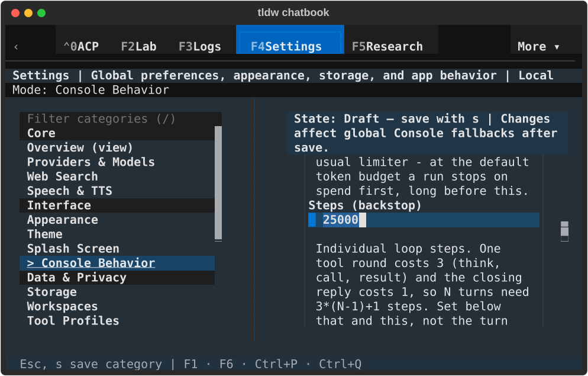

**Tool Profiles Import focused**

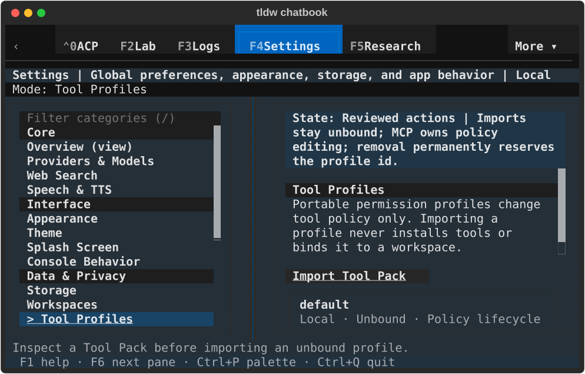

**Deep research saved on**

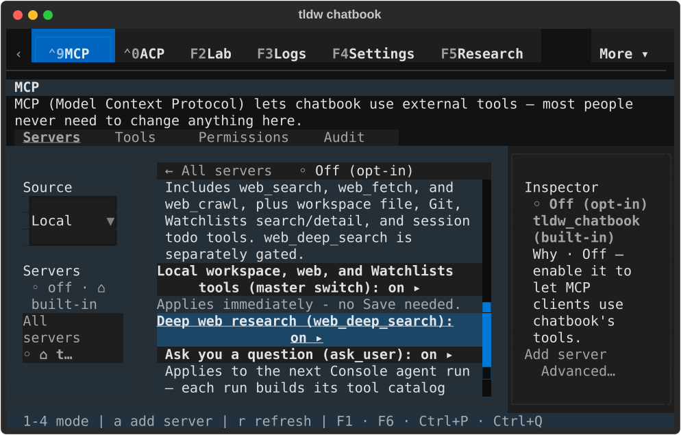

**Ask user focused; Deep research restored off**

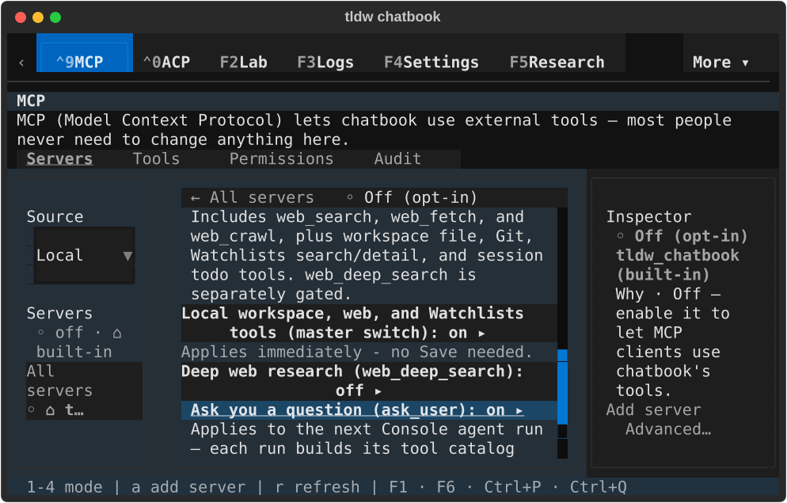

### textual-dark, 170x48

**Console Steps focused**

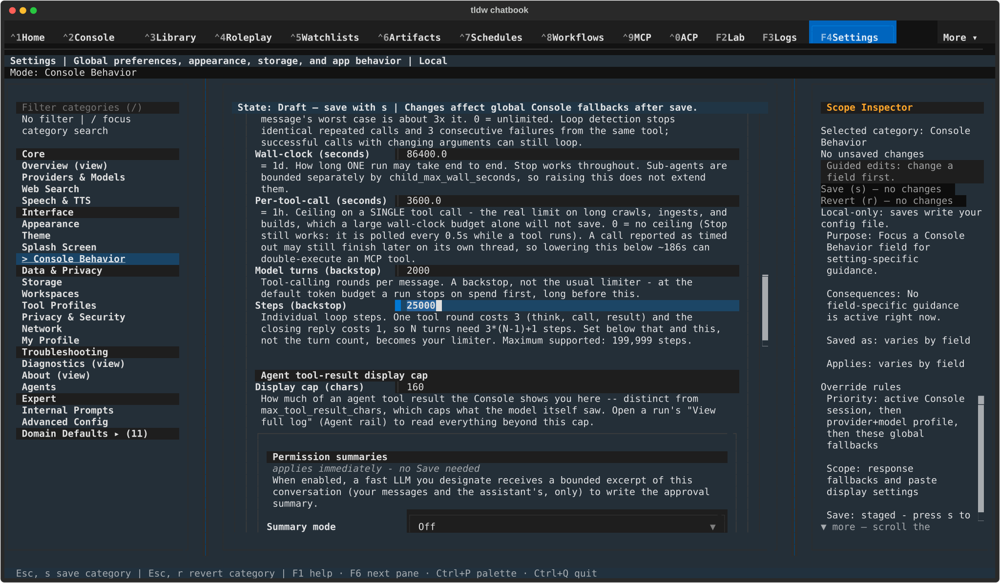

**Tool Profiles Import focused**

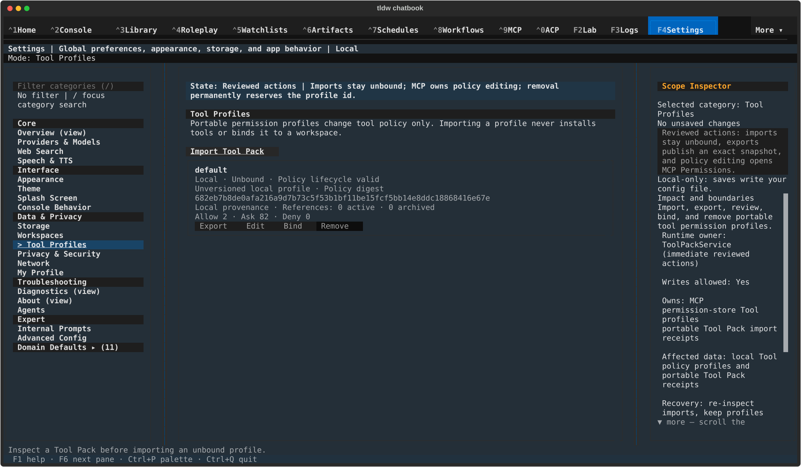

**Deep research saved on**

**Ask user focused; Deep research restored off**

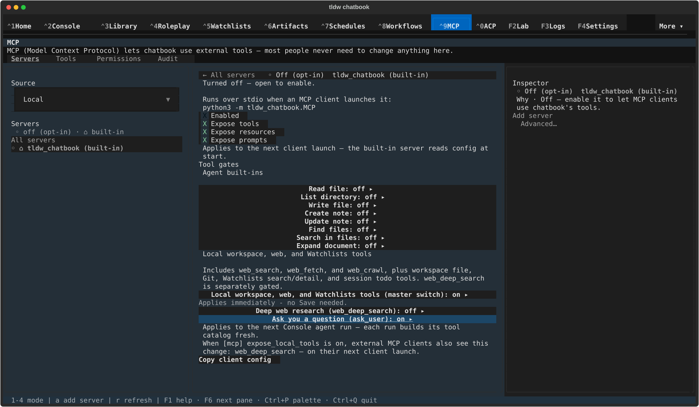

### textual-light, 80x24

**Console Steps focused**

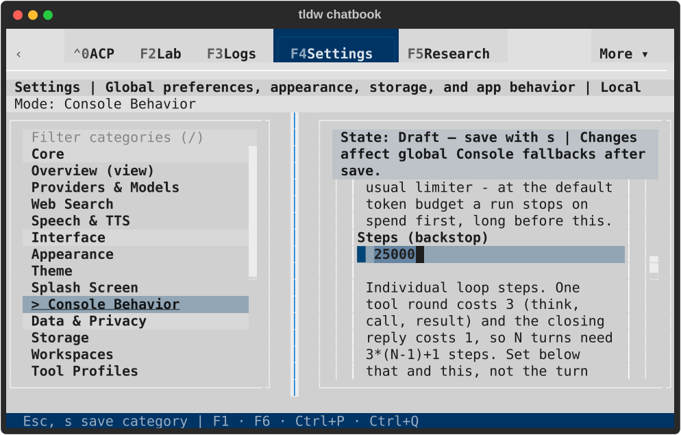

**Tool Profiles Import focused**

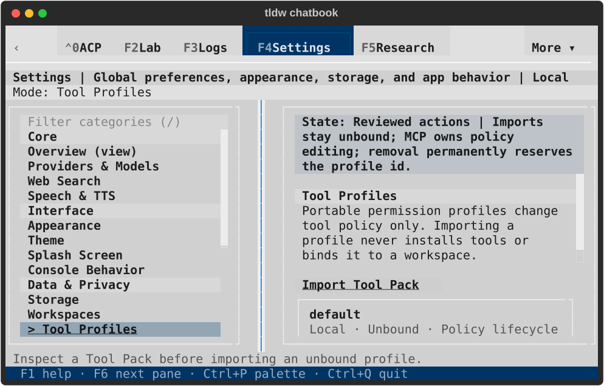

**Deep research saved on**

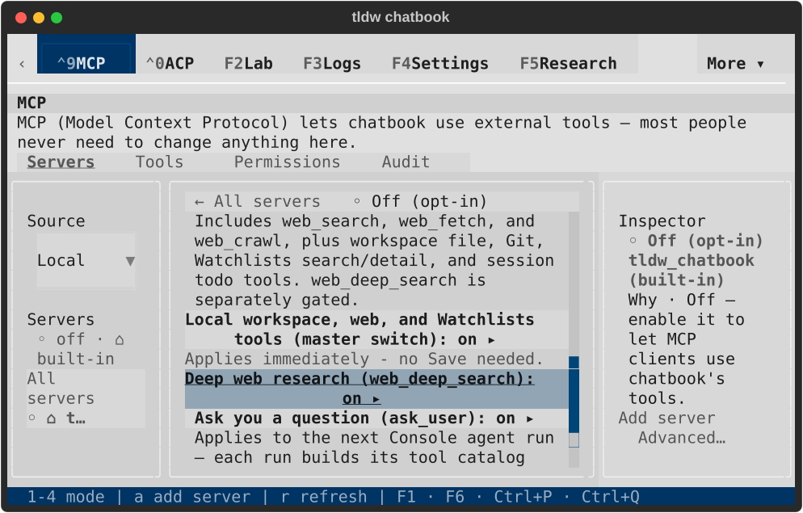

**Ask user focused; Deep research restored off**

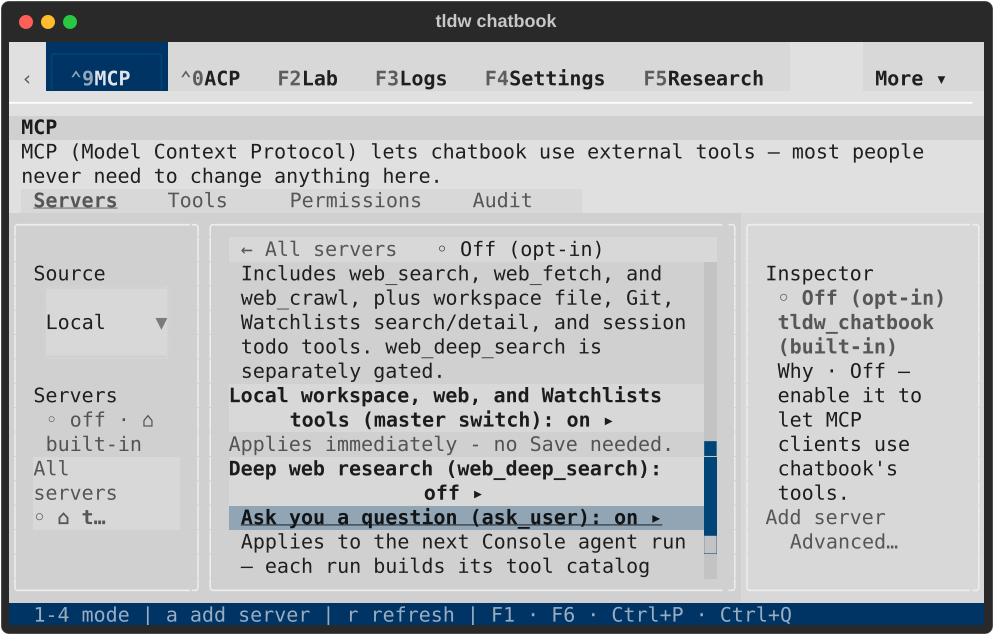

### textual-light, 170x48

**Console Steps focused**

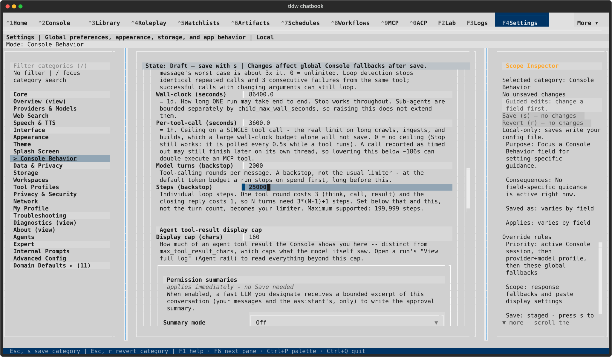

**Tool Profiles Import focused**

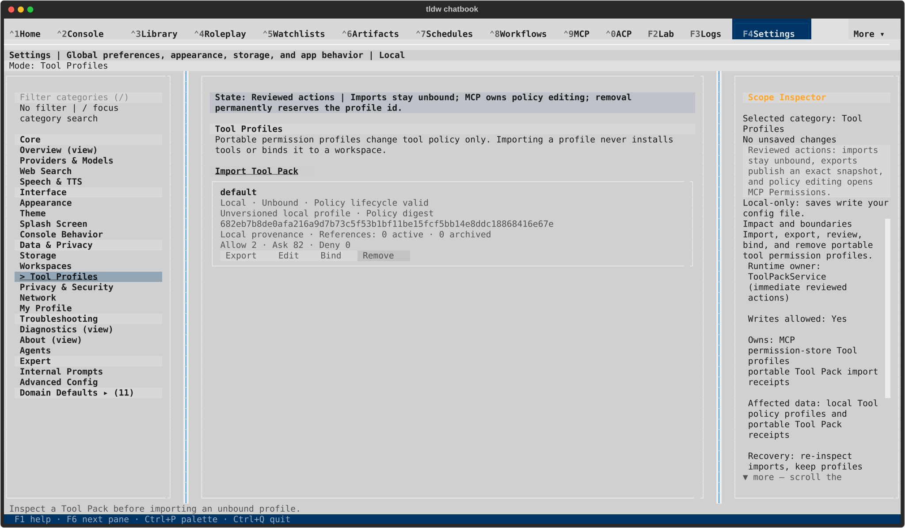

**Deep research saved on**

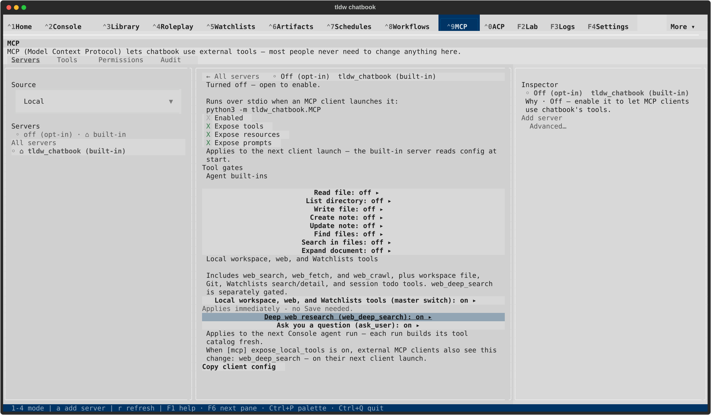

**Ask user focused; Deep research restored off**

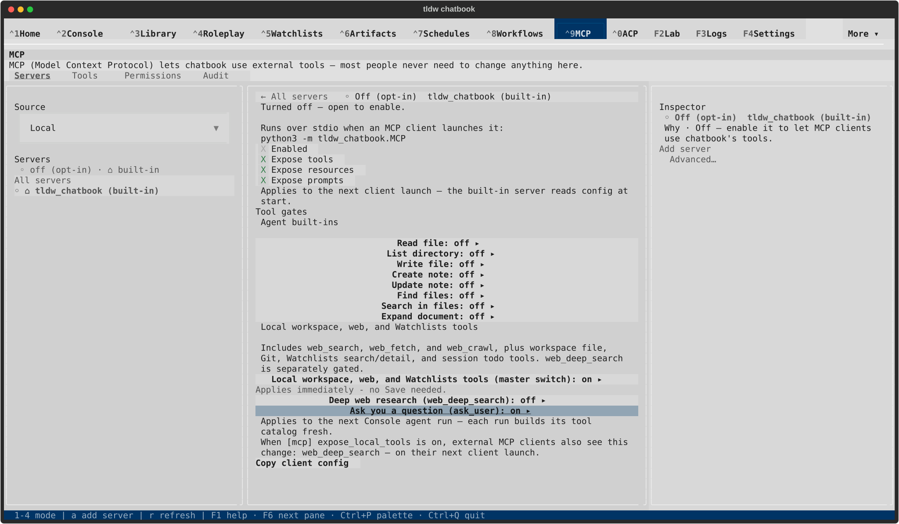

## Other reviewed PR visuals

These retained galleries show earlier bounded reviews; each receipt identifies
its original source and scope. They were not recaptured by the closeout replay.

- [Workspace assistant defaults](../2026-09-17-settings-workspace-assistant/README.md)
- [Workspace lifecycle](../2026-09-17-settings-workspace-lifecycle/README.md)
- [Tool Profile focus and recovery](../2026-09-18-tool-profile-focus/README.md)
- [MCP root persistence](../2026-09-18-mcp-root-settings/README.md)
- [MCP permission reflow](../2026-09-18-mcp-permission-reflow/README.md)
- [MCP selection and inspector clearing](../2026-09-18-mcp-table-selection/README.md)
- [Console Appearance](../2026-09-18-console-appearance/GALLERY.md)
- [Roleplay recovery](../2026-09-18-roleplay-recovery/GALLERY.md)
- [Shared dialog alignment](../2026-09-18-dialog-action-alignment/GALLERY.md)

Approval is for this PR's integrated result. The remaining destinations and the
preserved MCP inspector prototype continue in follow-up PRs after this merge.
