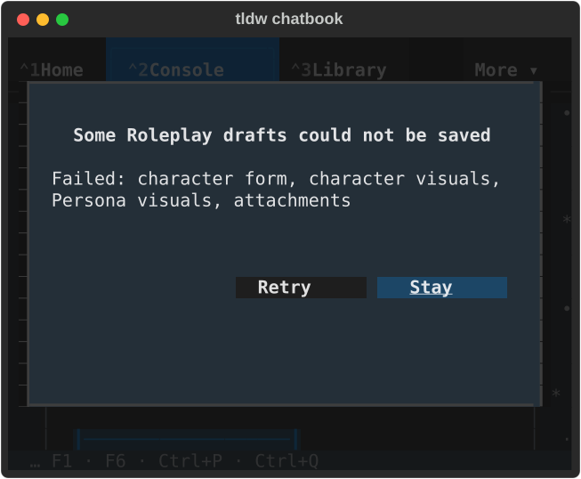
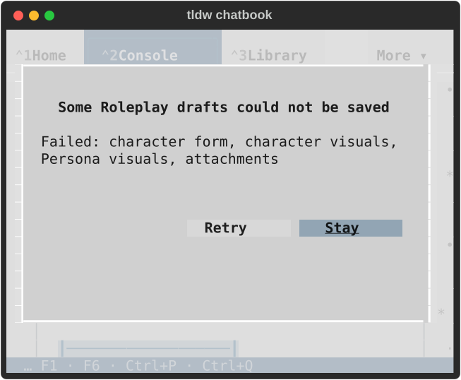
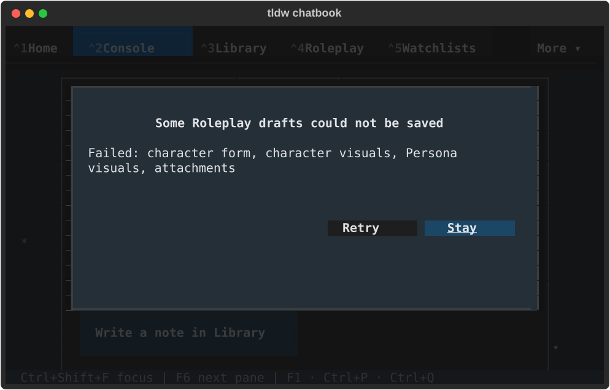
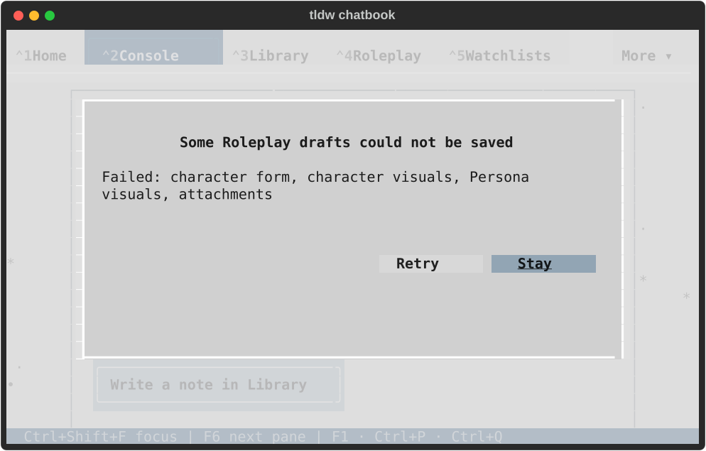
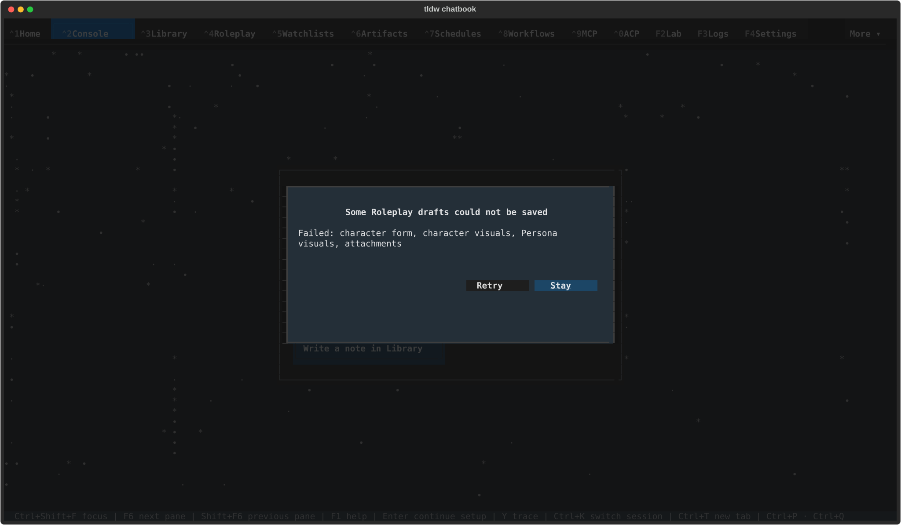
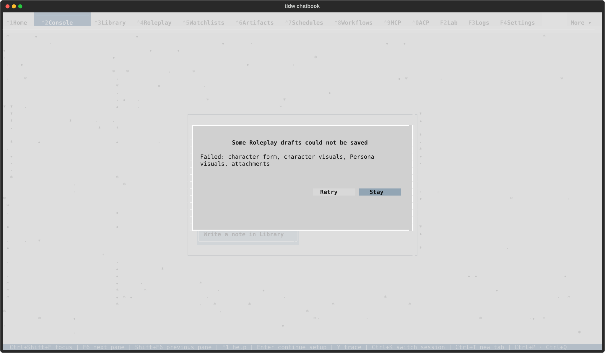

# Roleplay draft recovery visual review

Six native Textual captures from the final source, inspected in dark/light at 52×20, 80×24 and 170×48. The full title, all four failed domains, Retry and focused Stay are visible. Buttons follow the trailing edge and preserve keyboard and pointer behavior.

The modal was opened directly in a private TldwCli process. This gallery does not claim the normal partial-save entry route or actual save-worker execution; the mounted workflow receipt states those separate bounds.

| Size | Dark | Light |
| --- | --- | --- |
| 52x20 |  |  |
| 80x24 |  |  |
| 170x48 |  |  |

[Original unstyled compact capture](../2026-09-18-css-consolidation/native/textual-dark-80x24-roleplay-recovery.svg) · [Verification](README.md) · [Source-bound native receipt](native/result.json) · [Lifecycle checks](lifecycle-001.json)
