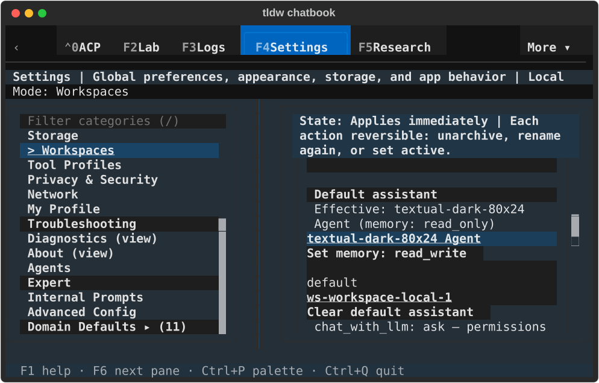
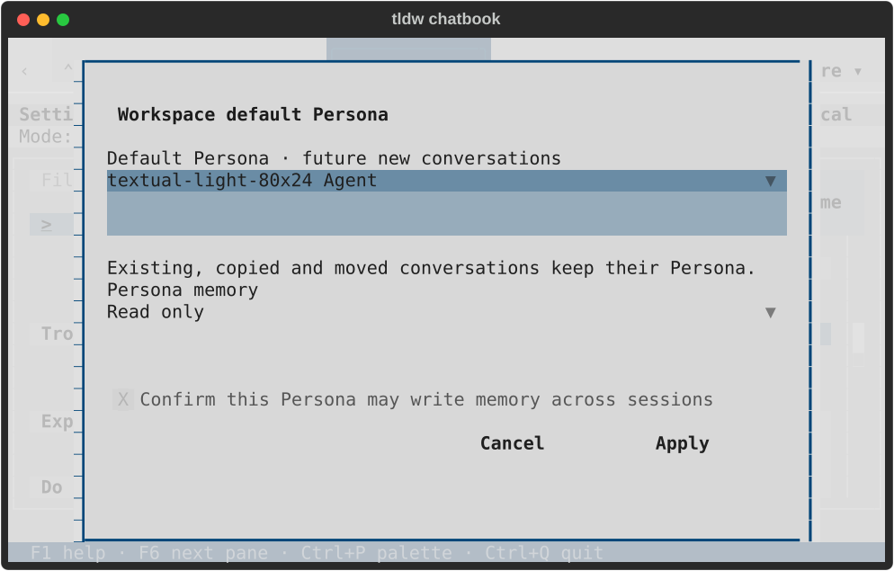

# TASK-32777 — Cold workspace Persona provisioning

Cold Settings → Workspaces → Create now waits for the existing Tool Profile
initialization before creating an automatic Persona and saving its references.
The guard remains fail-closed. Empty startup stays lazy; an eligible unfinished
backfill initializes the same service. Cancelling the modal leaves shared app
initialization running and cannot create a workspace later.

## Verification

115 distinct targeted cases passed; two optional dependency cases skipped.
No full test suite or provider requests were run.

| Scope | Result | Log |
| --- | --- | --- |
| Cold creation, backfill, cancellation, failure and explicit choices | 8 passed | [Cold regressions](cold-regressions.txt) |
| Nested-screen completion and changed form values | 2 passed | [Review cases](review-cases.txt) |
| Startup wiring, provisioning and Tool Profile guard | 60 qualified: 55 initial passes, 5 passes after fixture isolation | [Initial run](related-initial.txt), [isolated cases](startup-private-profile.txt) |
| Existing modal, Console handler, Persona choices and deferred imports | 36 passed | [Creation checks](creation-regressions.txt) |
| Startup import and UI-ready budgets | 9 passed, 2 optional skips | [Budget checks](startup-budget.txt) |

The first regression attempt had a fixture constructor error and exercised no
product behavior ([log](red-fixture-error.txt)). Correcting it produced five
expected failures and three passes on the old code ([red run](red.txt)).
Five existing startup cases changed profile roots after collection and failed
before their assertions; the existing `private_profile_test` wrapper now gives
each its own process. Their original bodies, fixtures and assertions are intact.

Scoped Ruff and formatting pass for the modal, new tests and native runner.
The adapted startup file retains two existing S102 diagnostics; app.py retains
491 existing diagnostics with none added ([comparison](app-lint.json)). Newly
added app methods pass isolated formatting. The diagnostic inventory refresh
records exactly two added warnings, both containing only exception type names
([statement review](diagnostic-review.txt)); no sink topology changed.
Import budgets remain 669/686 and
1022/1022; no ceiling was increased. Independent review found no blocker.

## Native evidence

Final run: `/private/tmp/tldw-32777-native-002`, PID 78000. The real LinuxDriver
ran in an owned tmux terminal with private HOME/config/data. Both rendering
streams were TTYs. The first dark 80×24 cell was cold; the other three exercised
the initialized service at dark/light 80×24 and 170×48. Tool Profiles was never
opened. Each creation saved one real Persona, a `ws-<workspace-id>` permission
profile and the exact references in a separately reopened WorkspaceDB. The
saved default also reopened visibly, and cancelling that view preserved it.

All twelve SVGs were rendered and visually inspected; all twelve terminal
captures are included. Focused choices and names are readable in both themes,
and keyboard actions were checked in the compositor before activation. Compact
forms scroll to reach actions. No styles or token values changed.

[Native results and exact source hashes](native-result.json),
[lifecycle receipt](lifecycle.json), and [capture hashes](capture-manifest.json)
record normal keyboard shutdown, exit 0, absent PID before terminal closure,
11 healthy databases, no durable conversations/messages, reacquired instance
lock, no error/fault log output and unchanged default-file fingerprints.
Run001 also passed and exited normally; its [earlier receipt](pre-final-run001-lifecycle.json)
is retained because final logging lint cleanup changed source hashes before run002.

## Visual review

| Theme / size | Automatic choice | Saved Settings state | Reopened default |
| --- | --- | --- | --- |
| Dark 80×24 — cold | [Create](textual-dark-80x24-automatic.svg) | [Saved](textual-dark-80x24-saved.svg) | [Reopened](textual-dark-80x24-reopened.svg) |
| Dark 170×48 | [Create](textual-dark-170x48-automatic.svg) | [Saved](textual-dark-170x48-saved.svg) | [Reopened](textual-dark-170x48-reopened.svg) |
| Light 80×24 | [Create](textual-light-80x24-automatic.svg) | [Saved](textual-light-80x24-saved.svg) | [Reopened](textual-light-80x24-reopened.svg) |
| Light 170×48 | [Create](textual-light-170x48-automatic.svg) | [Saved](textual-light-170x48-saved.svg) | [Reopened](textual-light-170x48-reopened.svg) |

The fix follows ADR-079, ADR-097 and ADR-139. It does not reprovision historical
unbound rows after a previously completed backfill, and it does not qualify the
broader Tool Profiles management UI or Persona management workstream.
