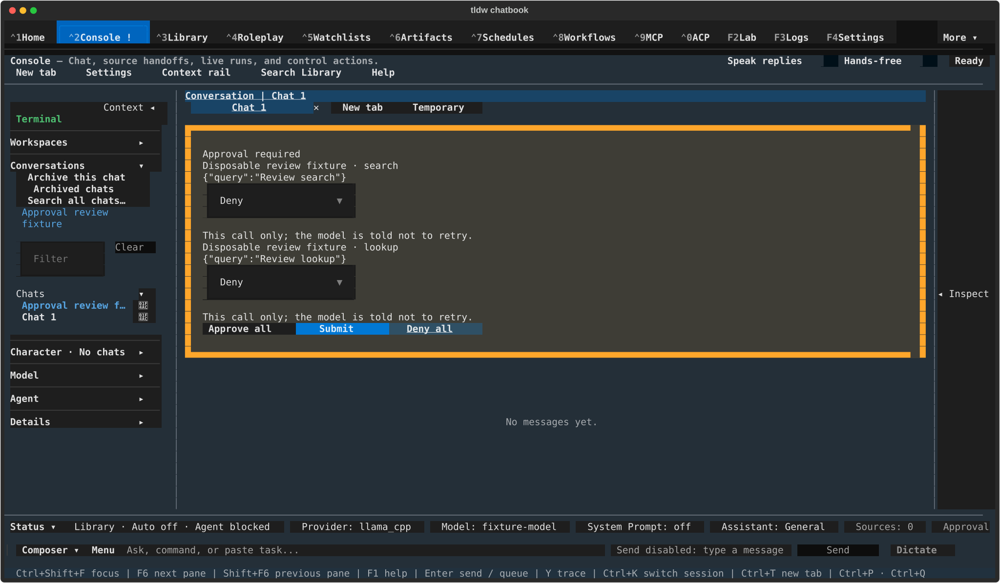
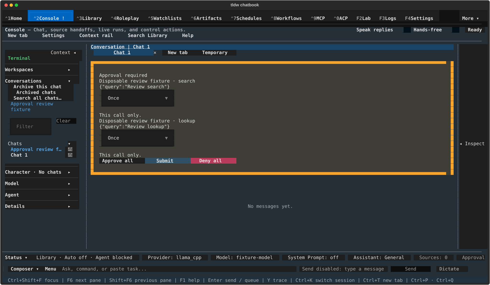
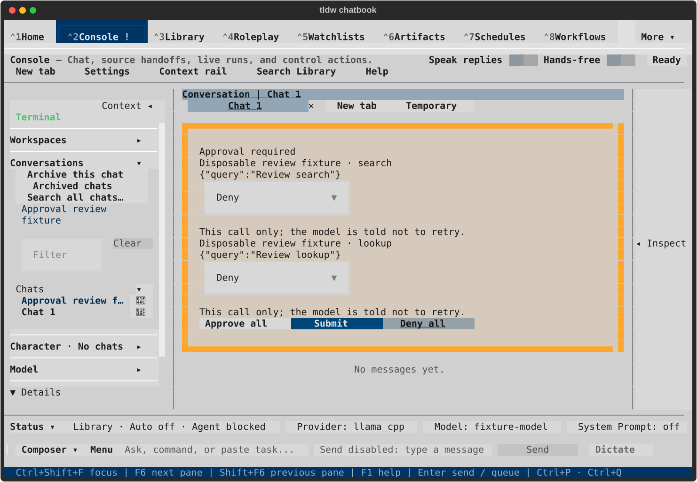
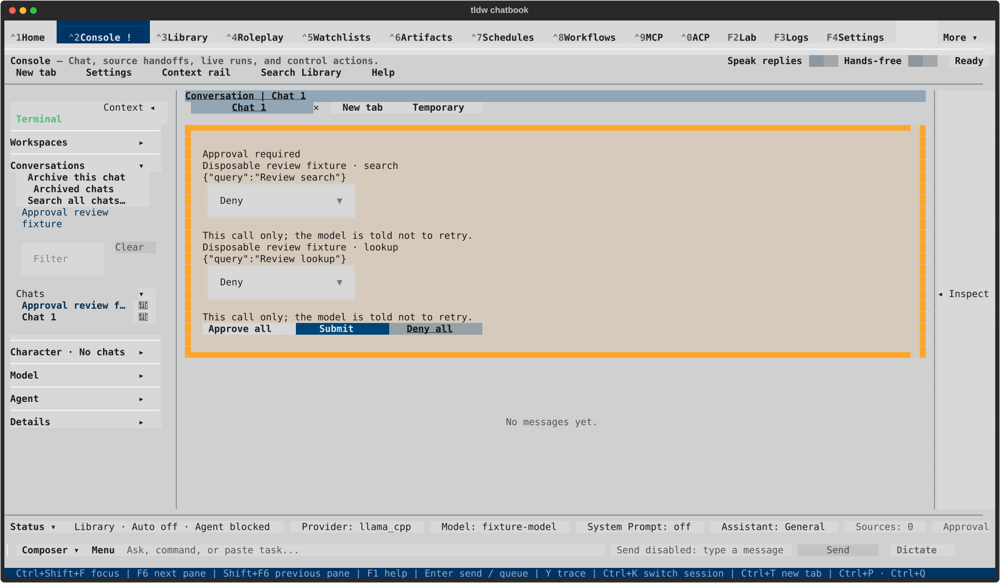
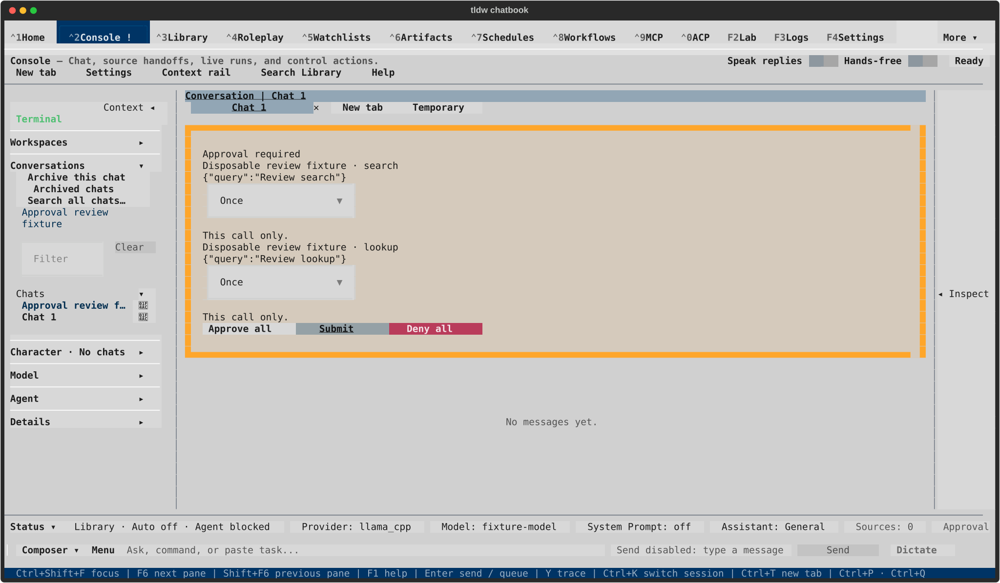

# Console approval actions — visual review

TASK-32841; isolated native run 003. The existing layout and scopes are preserved.
Each pair shows Deny all changing both rows, then Approve all setting both to Once
with Submit focused. Keyboard Submit subsequently resolves those exact call IDs.
No tool/provider is dispatched. [Evidence and limits](README.md).

These captures are ready for owner review; this PR remains draft and unmerged.

## textual-dark — 120x40

After Deny all

Approve once choices; Submit focused

## textual-dark — 170x48

After Deny all

Approve once choices; Submit focused

## textual-light — 120x40

After Deny all

Approve once choices; Submit focused

## textual-light — 170x48

After Deny all

Approve once choices; Submit focused

