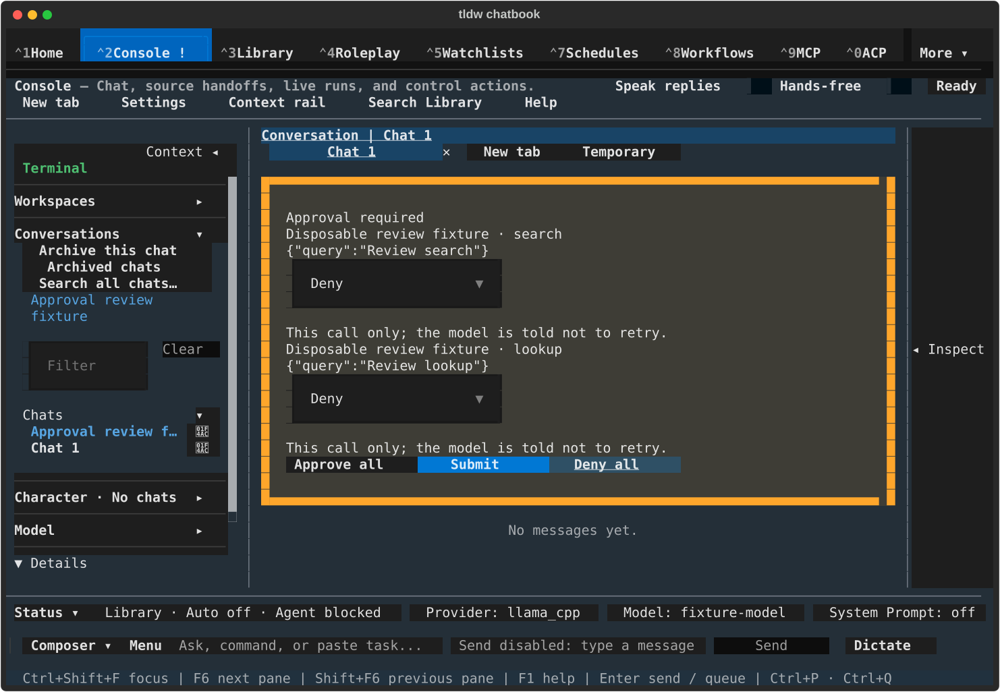
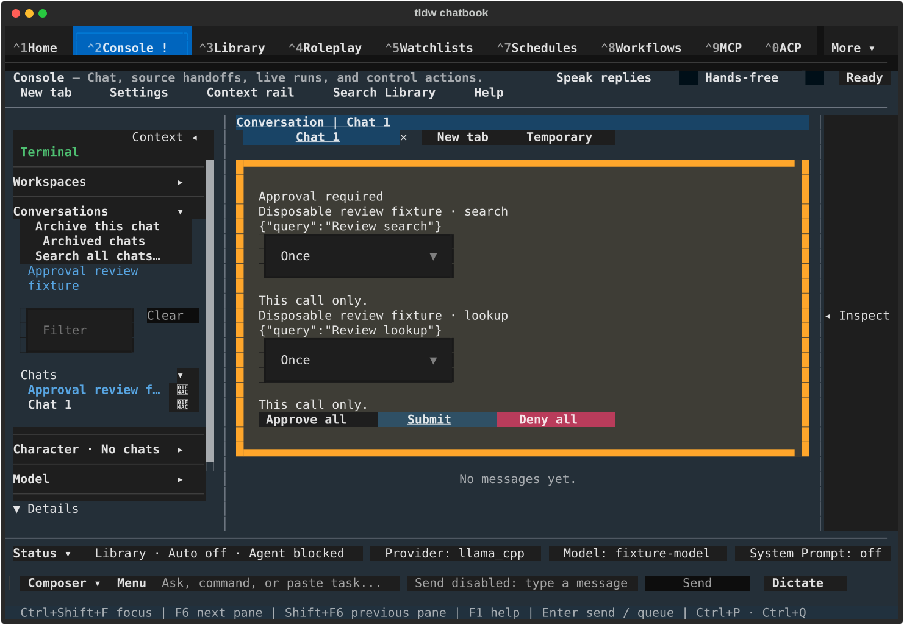
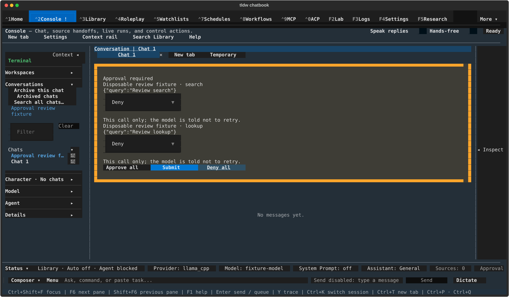
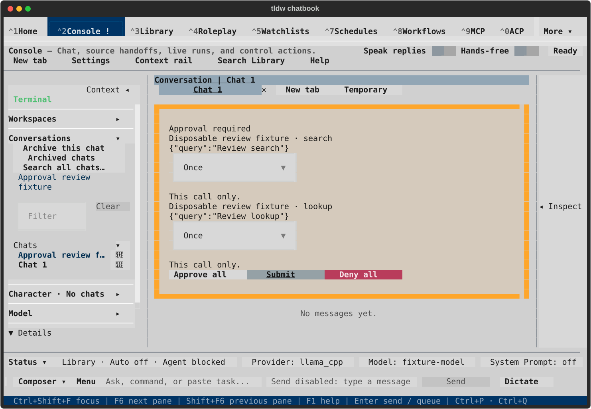
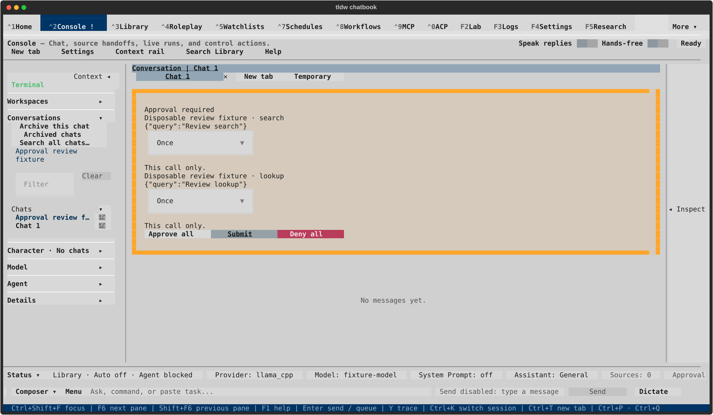

# Console approval actions — visual review

TASK-32841; approved closeout native run 001 on dev `d1a0649cd2`. The existing layout and scopes are preserved.
Each pair shows Deny all changing both rows, then Approve all setting both to Once
with Submit focused. Keyboard Submit subsequently resolves those exact call IDs.
No tool/provider is dispatched. [Evidence and limits](CLOSEOUT.md).

The owner approved the Console gallery and merge. These refreshed captures keep
those controls unchanged; upstream dev updates the main navigation only. Final
current-head CI and review still gate the authorized merge.

## textual-dark — 120x40

After Deny all

Approve once choices; Submit focused

## textual-dark — 170x48

After Deny all

Approve once choices; Submit focused

## textual-light — 120x40

After Deny all

Approve once choices; Submit focused

## textual-light — 170x48

After Deny all

Approve once choices; Submit focused

