# Permission navigation visual review

Both “Change in Permissions” controls use the existing layout. Each capture shows the focused source control, or the selected destination after Enter. Permissions remain unchanged.

[Verification and scope](README.md)

## textual-dark · 120x40

Tool details control

Blocked Test Tool control

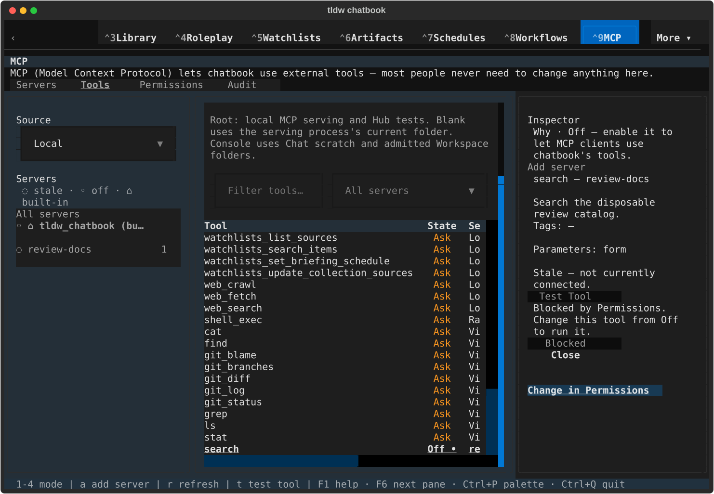

Selected Permissions destination

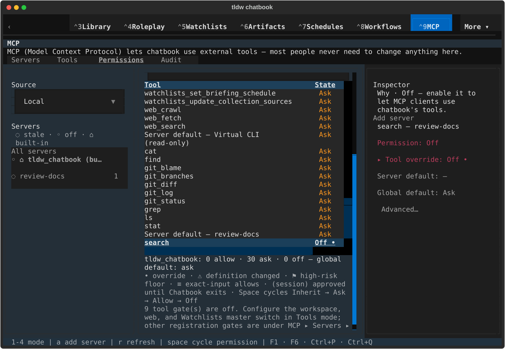

## textual-dark · 170x48

Tool details control

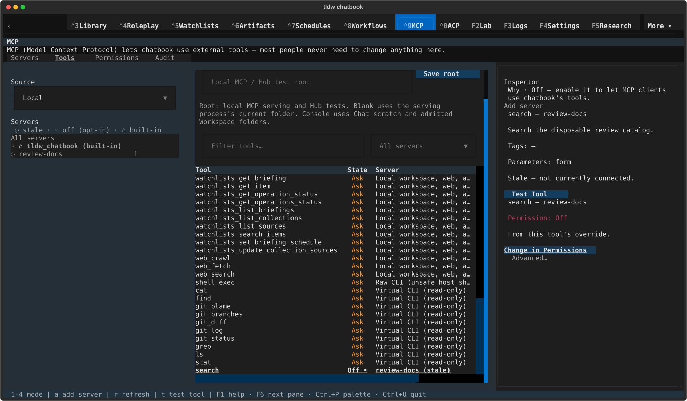

Blocked Test Tool control

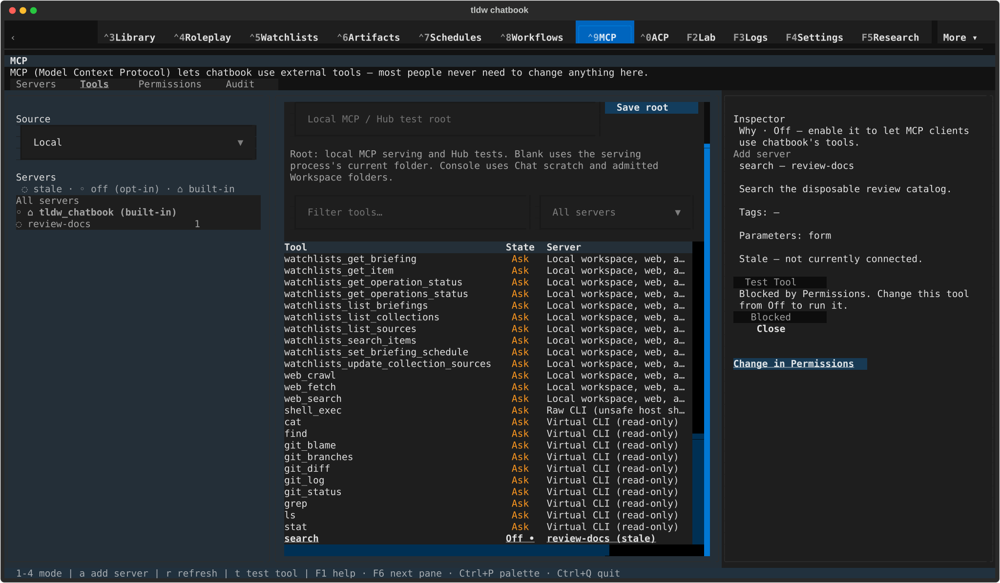

Selected Permissions destination

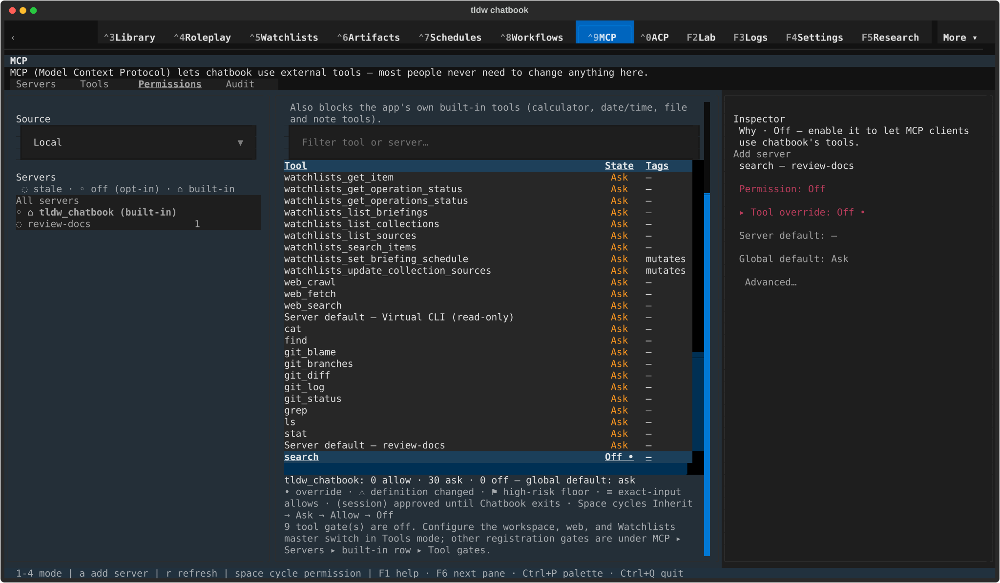

## textual-light · 120x40

Tool details control

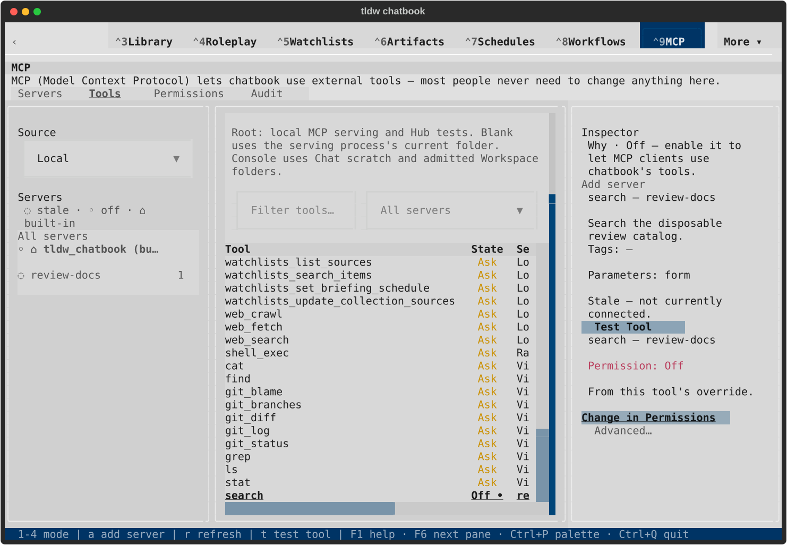

Blocked Test Tool control

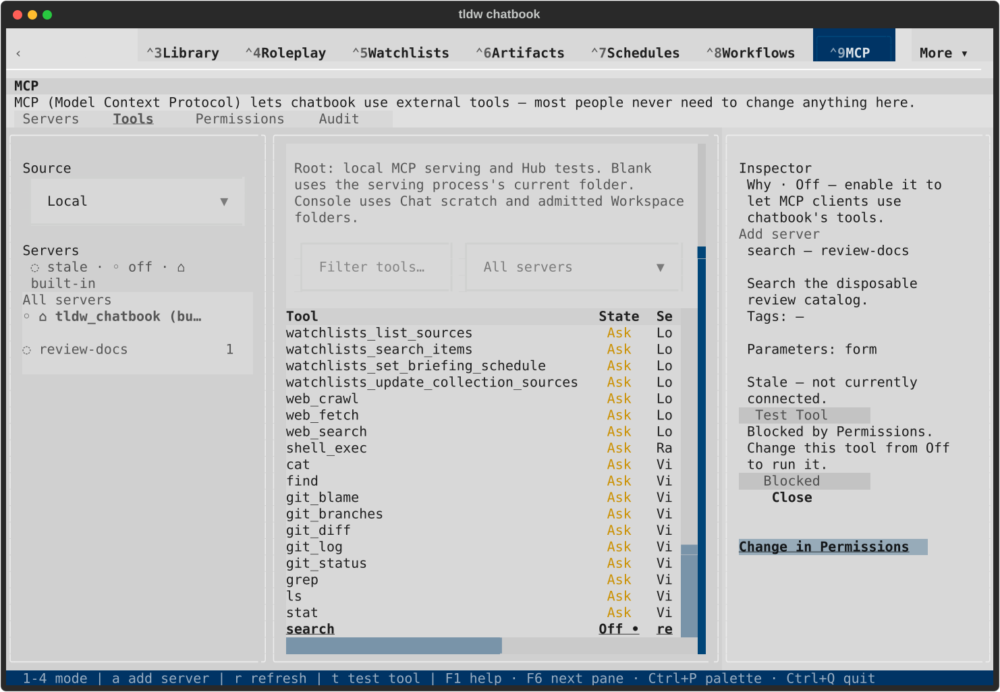

Selected Permissions destination

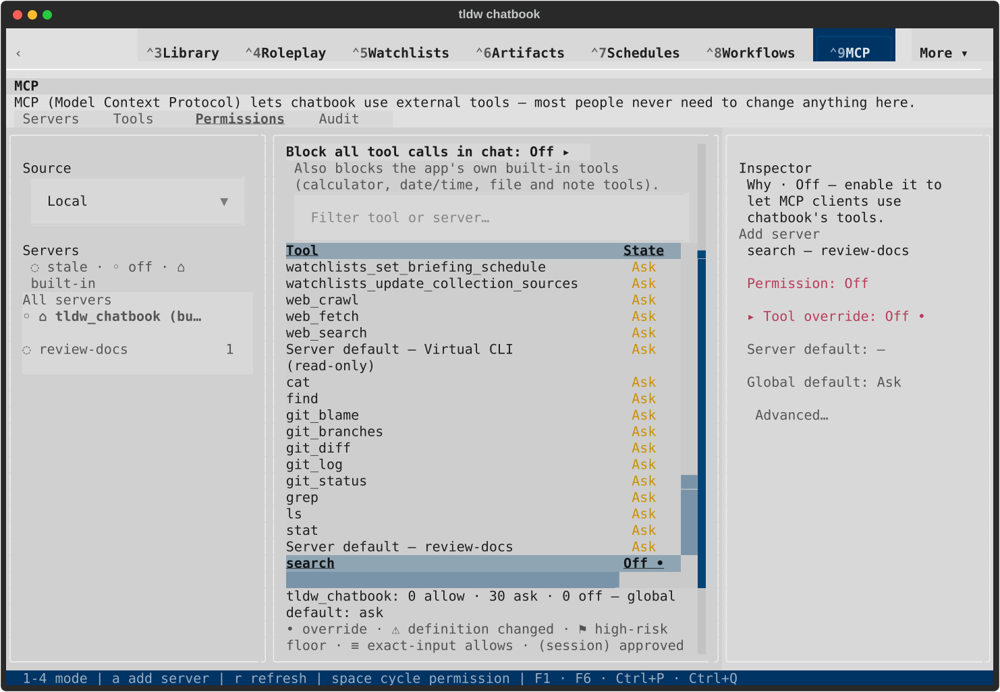

## textual-light · 170x48

Tool details control

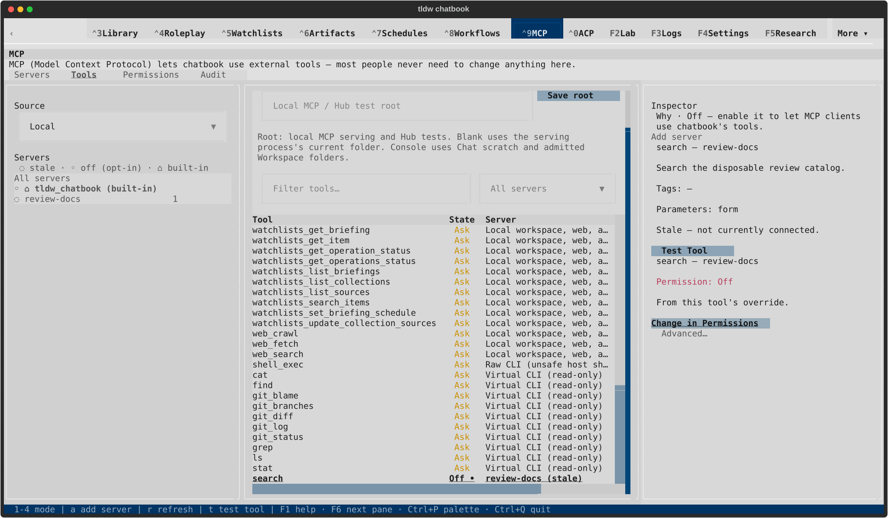

Blocked Test Tool control

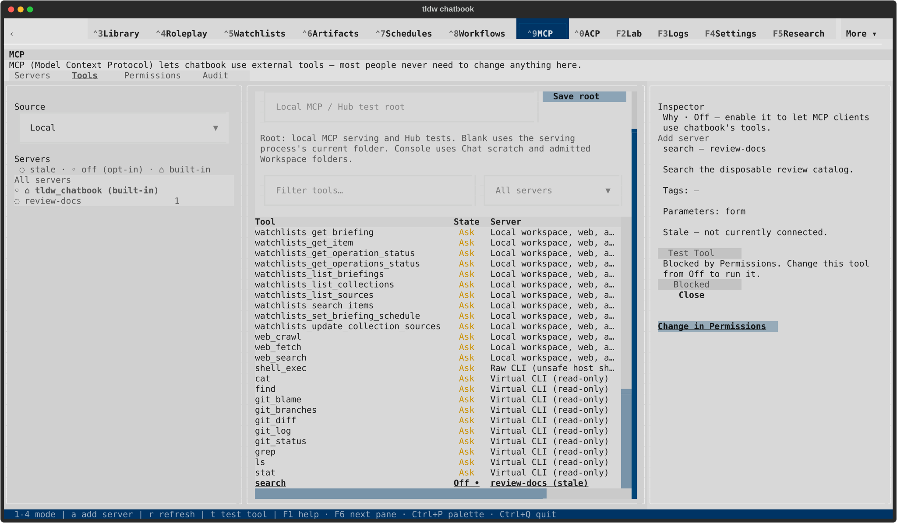

Selected Permissions destination

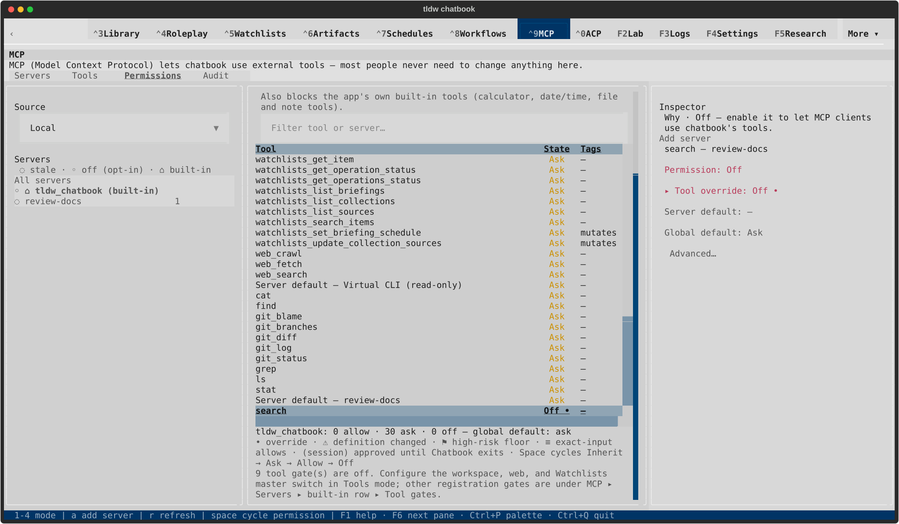
