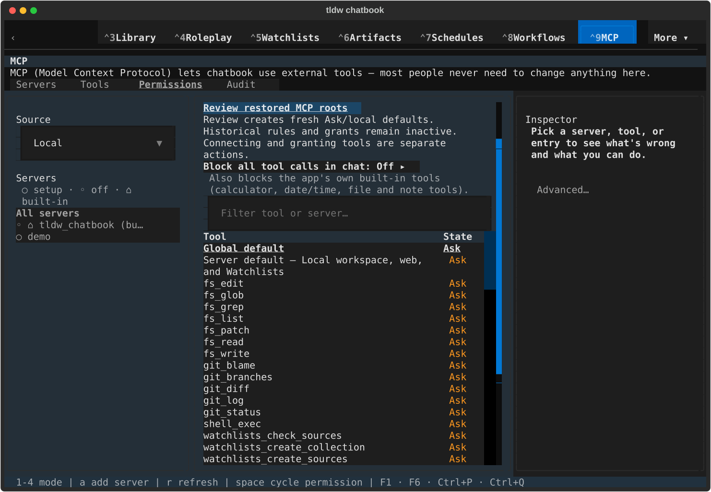
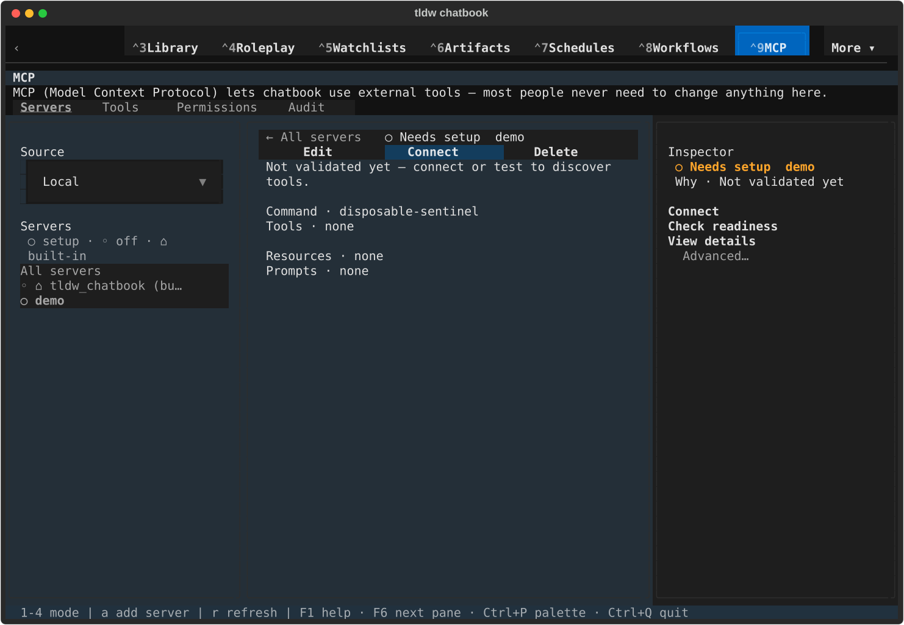
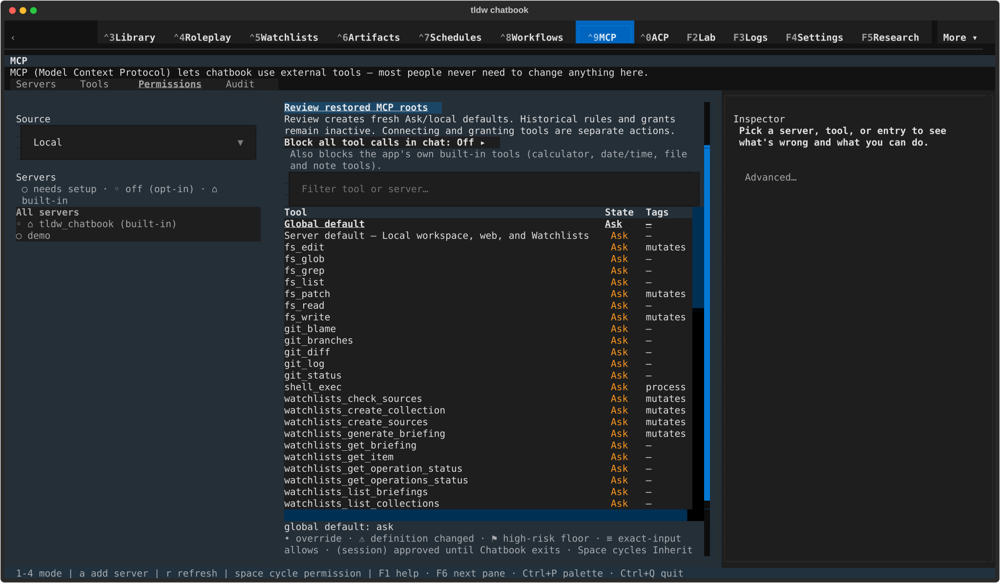
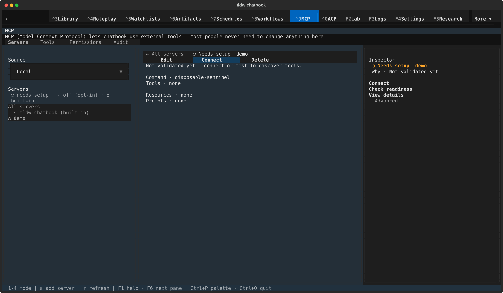
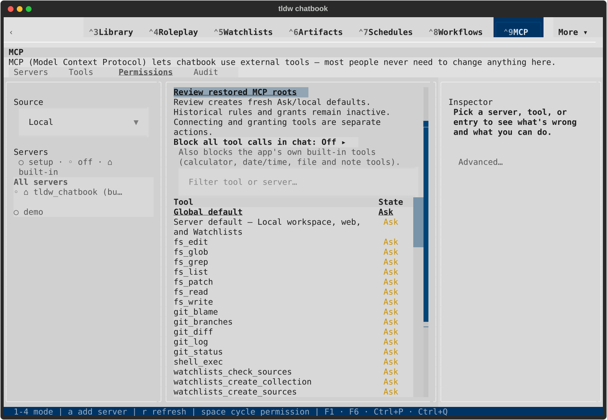
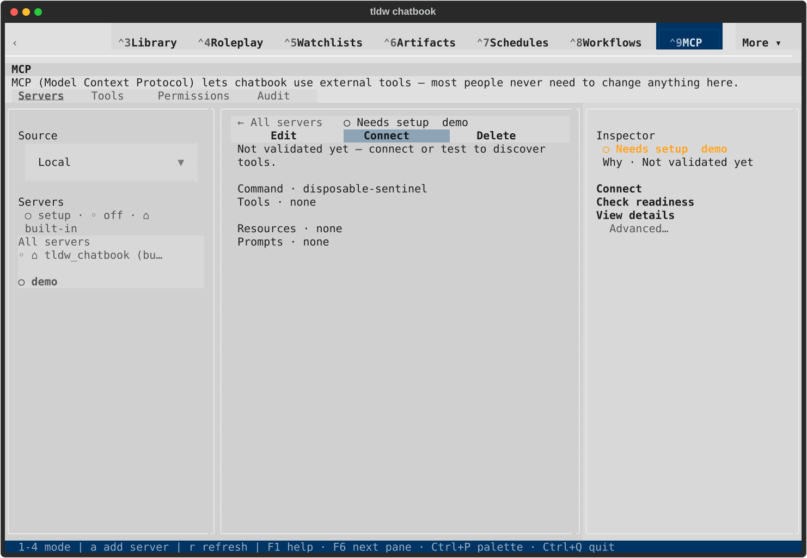
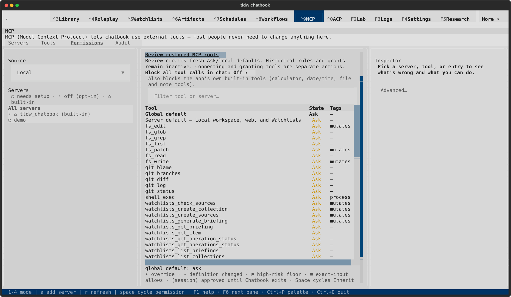
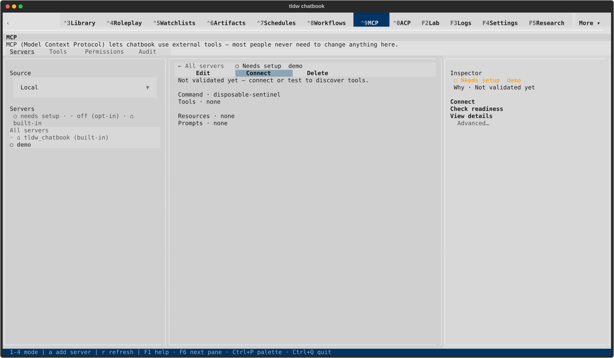

# Historical pre-integration native gallery

All eight captures were rendered and inspected. See [qualification and limits](README.md).

## Dark · 120x40

### Fresh defaults and retained-history guidance

[Terminal text](native/textual-dark-120x40-fresh-defaults.txt)

### Reviewed disconnected server

[Terminal text](native/textual-dark-120x40-reviewed-server.txt)

## Dark · 170x48

### Fresh defaults and retained-history guidance

[Terminal text](native/textual-dark-170x48-fresh-defaults.txt)

### Reviewed disconnected server

[Terminal text](native/textual-dark-170x48-reviewed-server.txt)

## Light · 120x40

### Fresh defaults and retained-history guidance

[Terminal text](native/textual-light-120x40-fresh-defaults.txt)

### Reviewed disconnected server

[Terminal text](native/textual-light-120x40-reviewed-server.txt)

## Light · 170x48

### Fresh defaults and retained-history guidance

[Terminal text](native/textual-light-170x48-fresh-defaults.txt)

### Reviewed disconnected server

[Terminal text](native/textual-light-170x48-reviewed-server.txt)
