# MCP rule actions — visual review

TASK-32866. Each sequence shows Remove focused, Re-allow after the exact-input
rule is removed, then Allow with the definition warning cleared. Another profile
keeps its rule. No tool executes. [Evidence and scope](README.md). Stacked draft;
owner visual approval is still required before merge.

## textual-dark — 120x40

Exact-input Remove focused

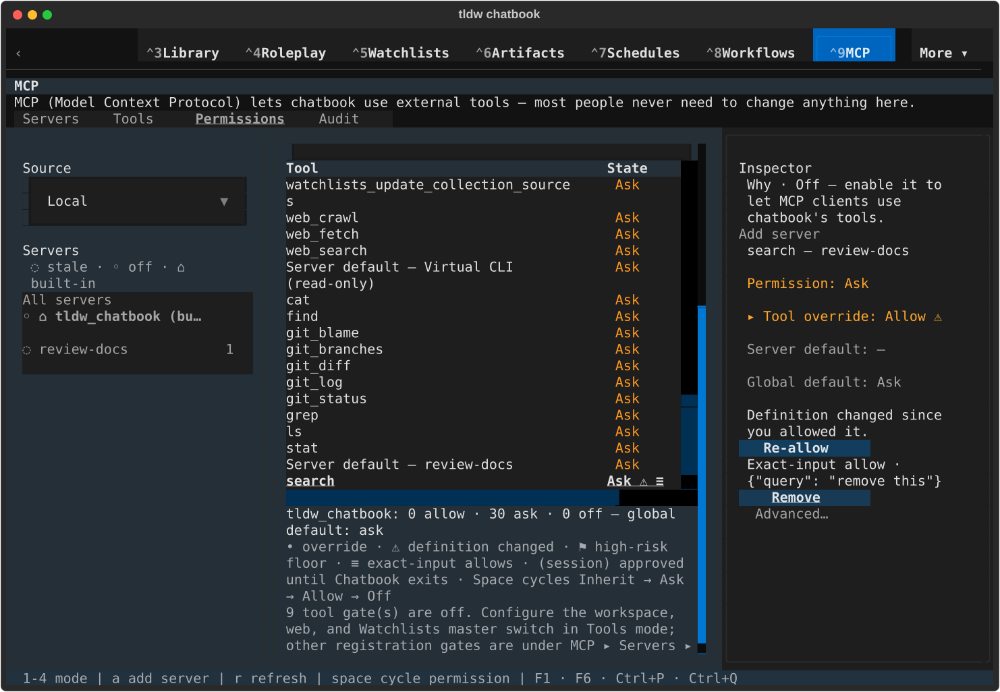

Rule removed; Re-allow focused

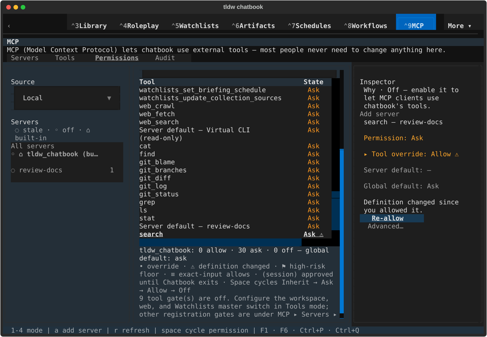

Reviewed definition allowed; warning cleared

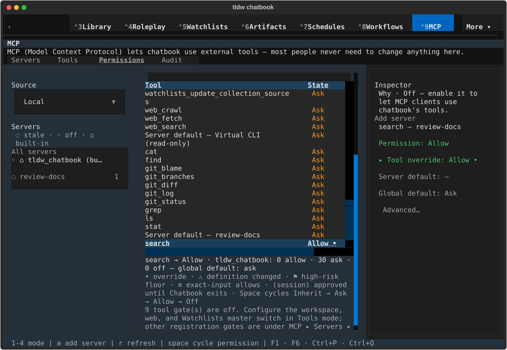

## textual-dark — 170x48

Exact-input Remove focused

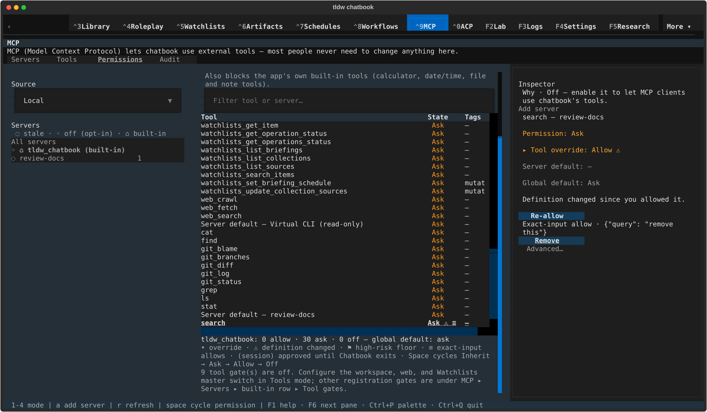

Rule removed; Re-allow focused

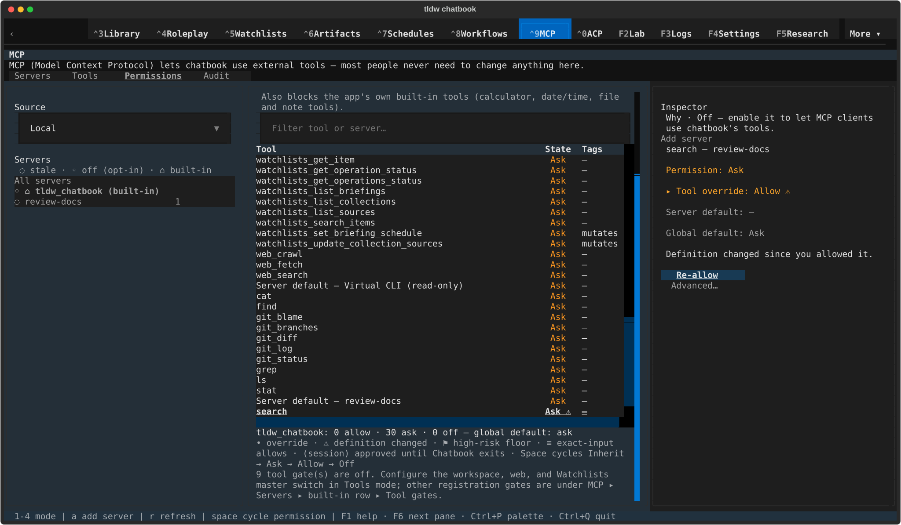

Reviewed definition allowed; warning cleared

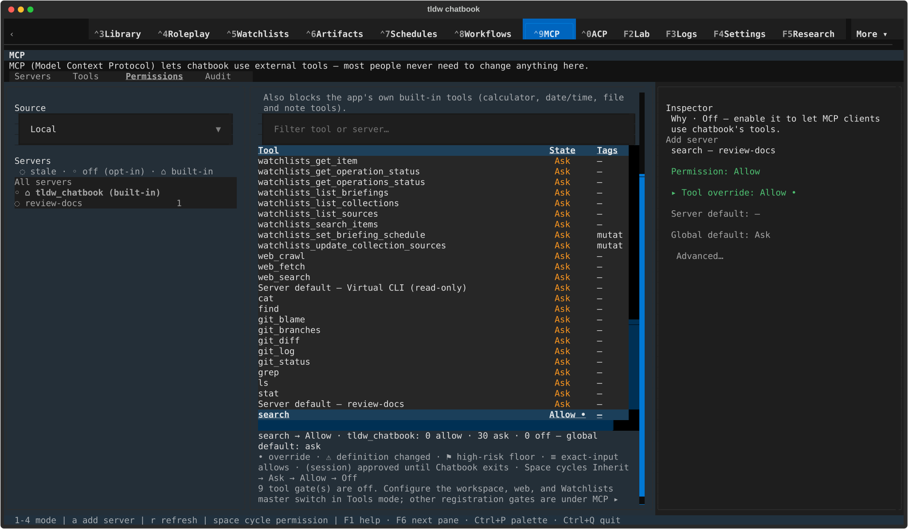

## textual-light — 120x40

Exact-input Remove focused

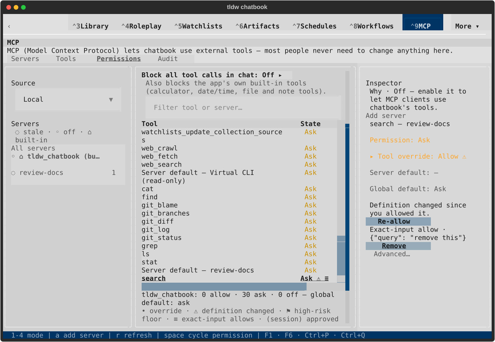

Rule removed; Re-allow focused

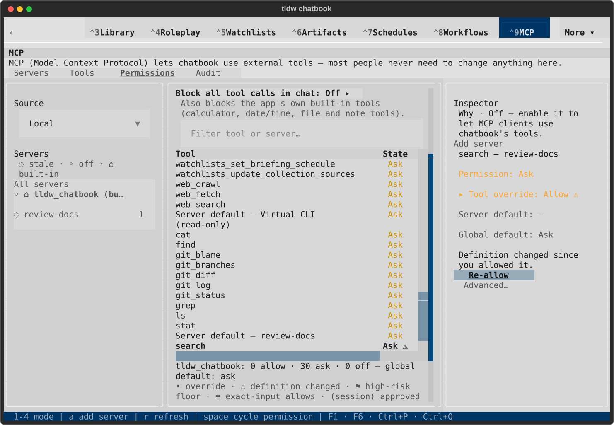

Reviewed definition allowed; warning cleared

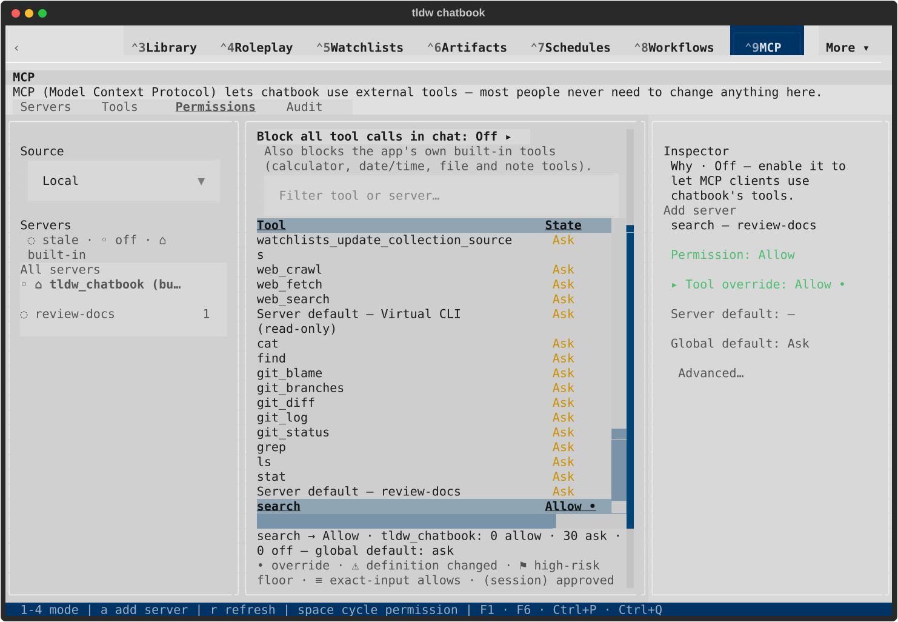

## textual-light — 170x48

Exact-input Remove focused

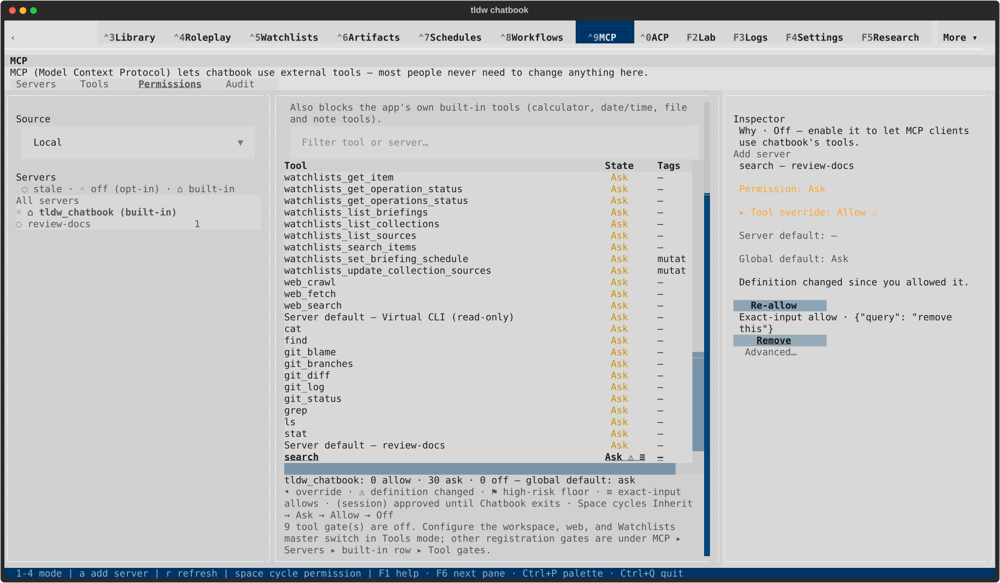

Rule removed; Re-allow focused

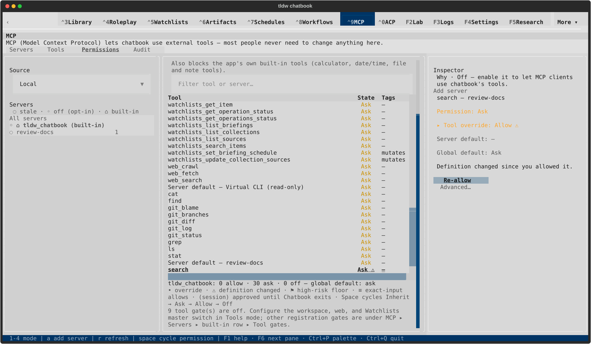

Reviewed definition allowed; warning cleared

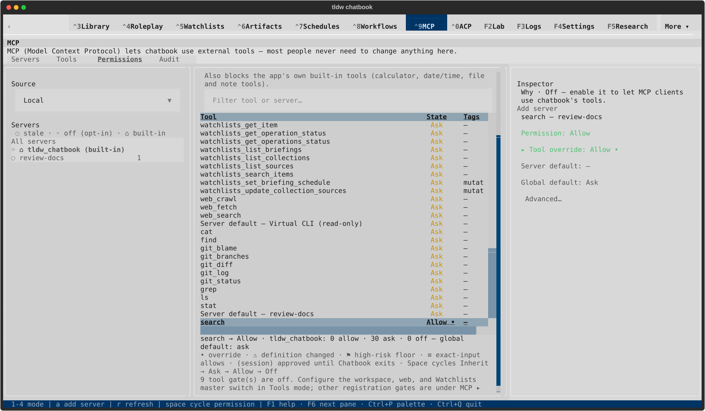
