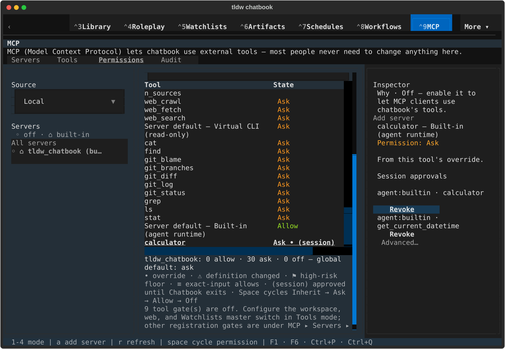
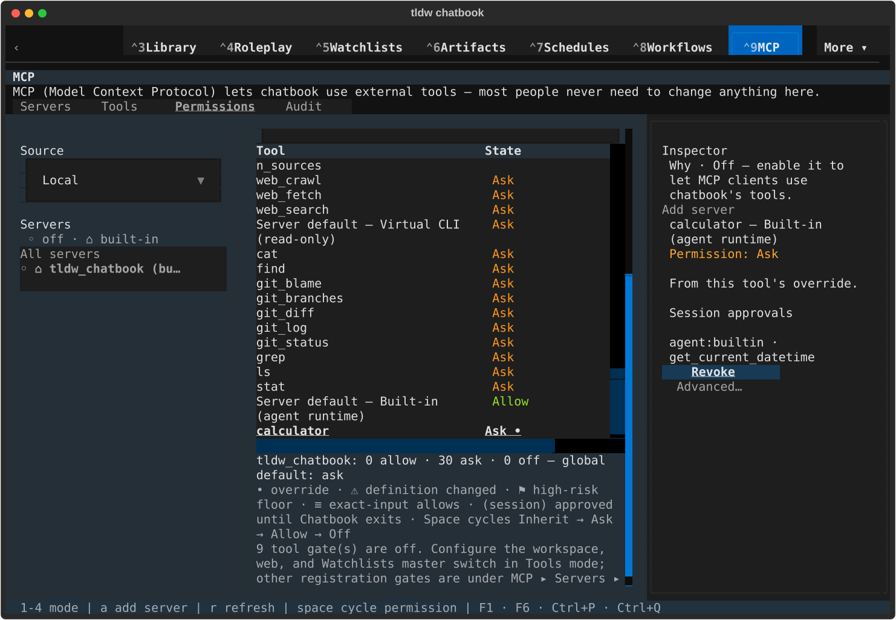
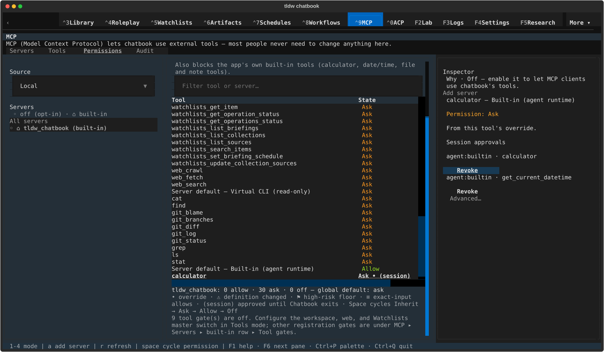
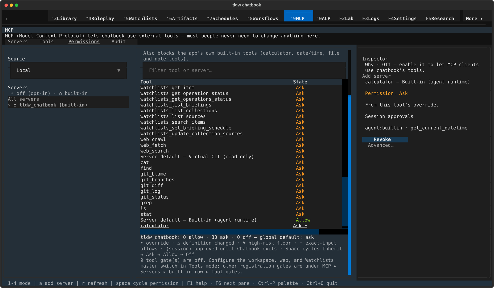
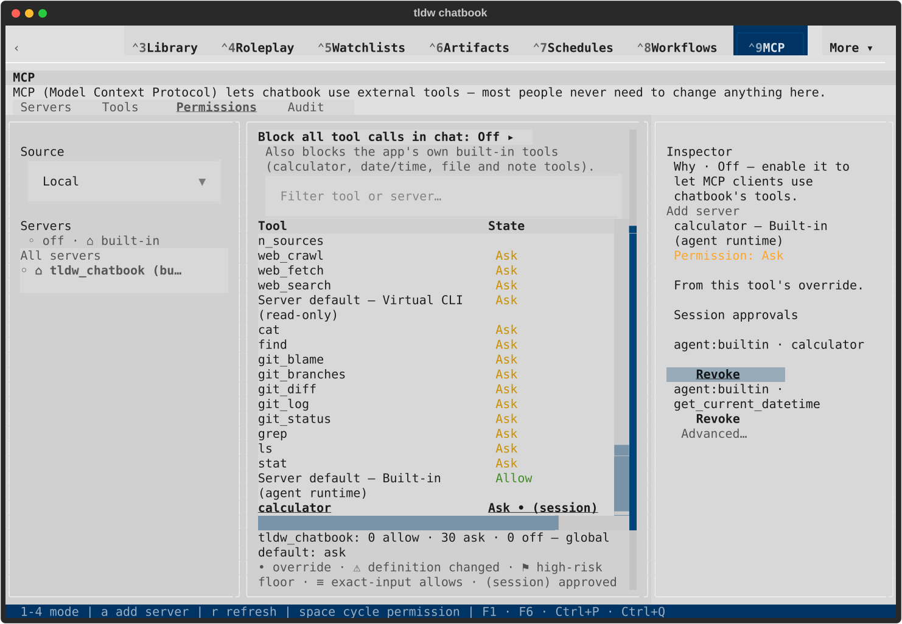
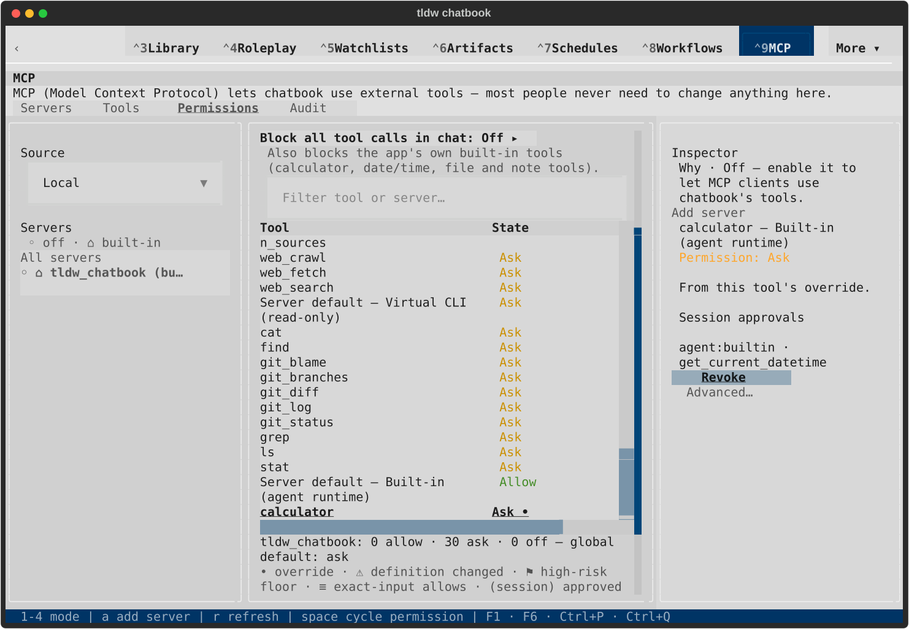
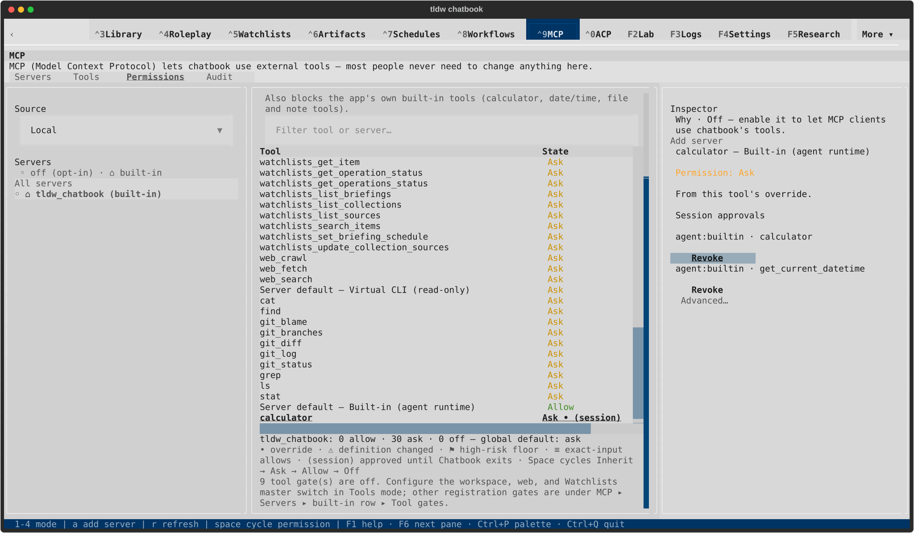
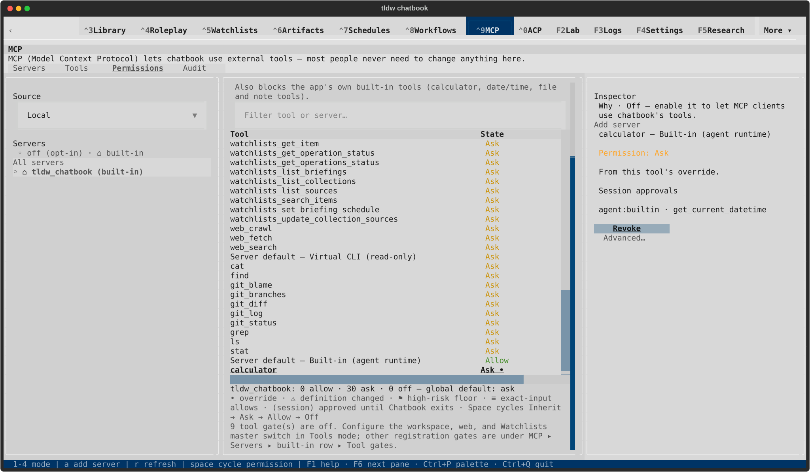

# MCP session revocation — visual review

TASK-32865. Each pair shows two session grants, then the remaining date/time
grant after keyboard revocation of calculator. The calculator matrix suffix clears
and the real runtime gate asks again; the other profile grant remains intact.
No tool executes. [Evidence and scope](README.md). Draft; owner visual approval
is still required before merge.

## textual-dark — 120x40

Calculator Revoke focused

Calculator revoked; date/time grant retained

## textual-dark — 170x48

Calculator Revoke focused

Calculator revoked; date/time grant retained

## textual-light — 120x40

Calculator Revoke focused

Calculator revoked; date/time grant retained

## textual-light — 170x48

Calculator Revoke focused

Calculator revoked; date/time grant retained

