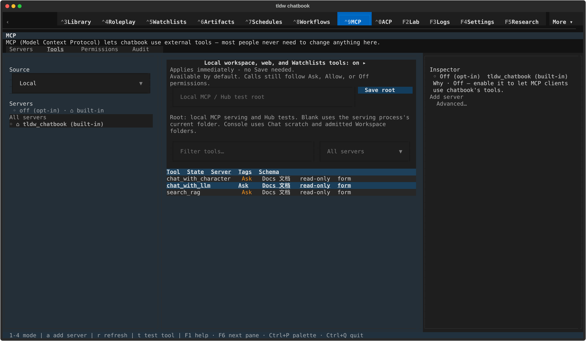
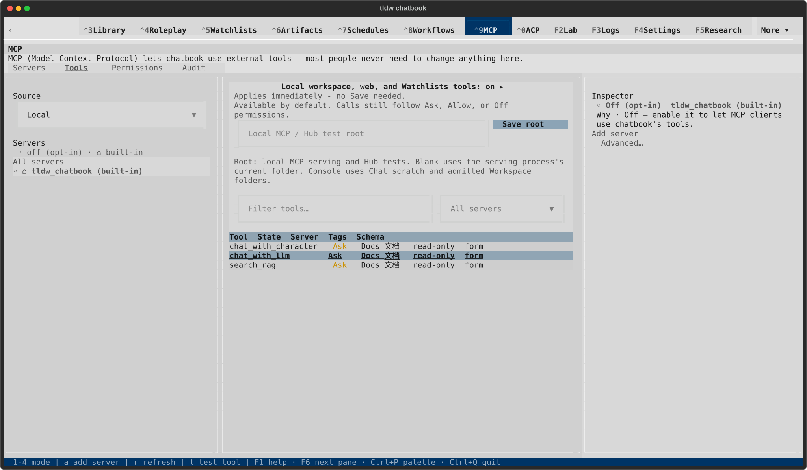
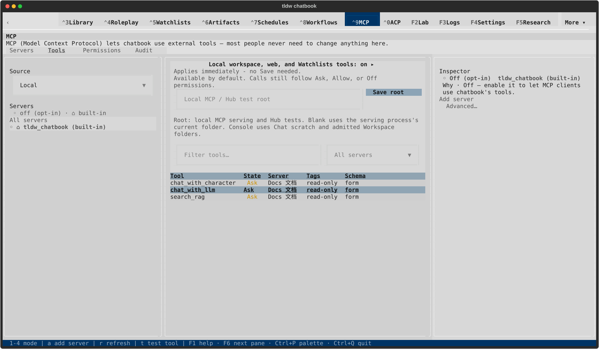
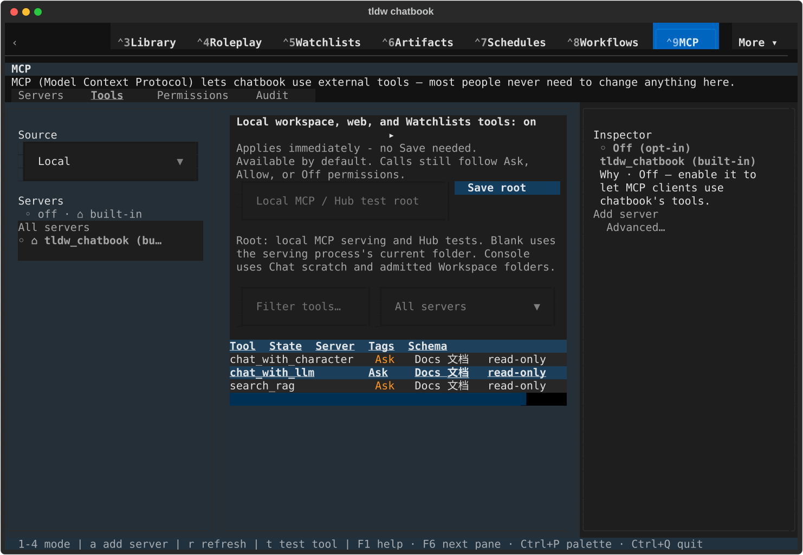
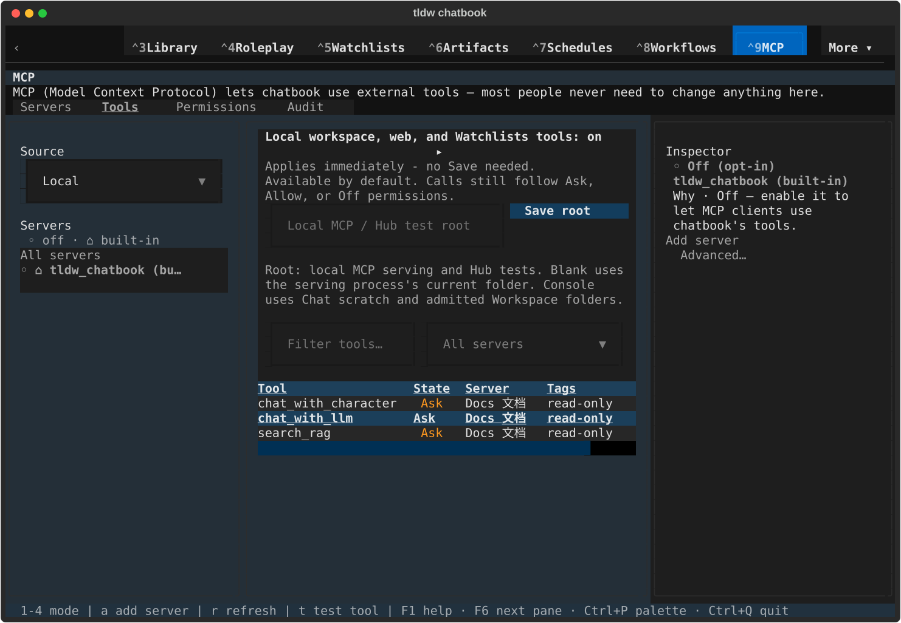
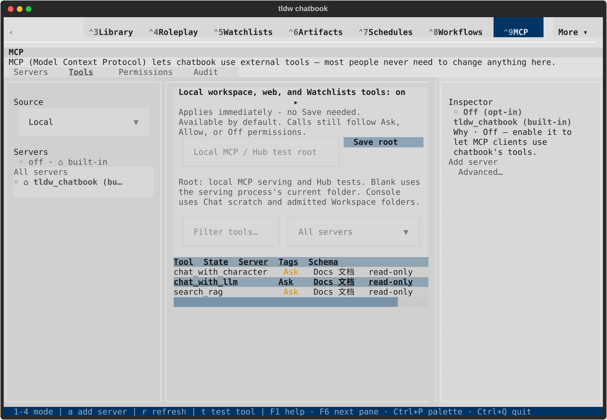
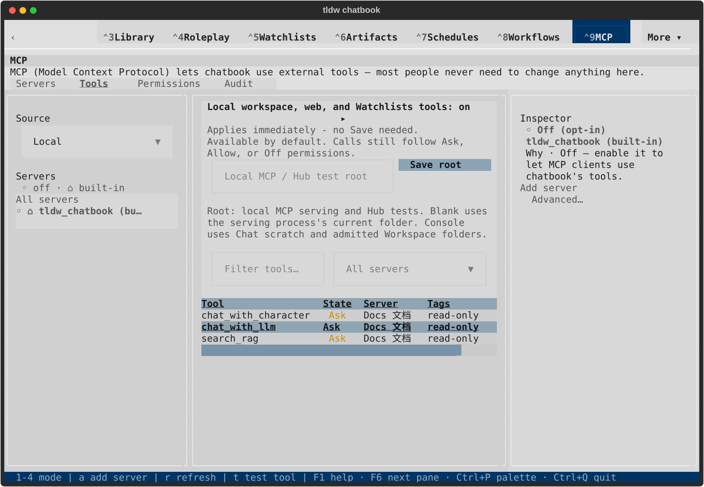

# Tools header visual review

Only the header row changes. Tool identities, values, focused selection and the
surrounding layout are retained. These are native captures, using synthetic
catalog labels and tags. The final runner checks the composed screen.

## Wide — 170×48

| Theme | Before | After |
|---|---|---|
| Dark |  |  |
| Light |  |  |

## Compact — 120×40

The Schema column retains its existing horizontal-scroll behavior.

| Theme | Before | After |
|---|---|---|
| Dark |  |  |
| Light |  |  |

[Verification and scope](README.md) · [Measured terminal/pixel differences](visual-comparison.json)

The owner approved these captures for PR2749. [Final integration](CLOSEOUT.md)
confirms the same four views remain pixel-identical on dev `b91340a5db`.

[Rebased validation](rebased/verification.json) confirms all four views remain
pixel-identical on dev `495b2c4522`; the rebase required no conflict choices.
