# Restored MCP root review — visual approval

TASK-32879. Private native LinuxDriver run; actual restored owners. At 80×24 and 170×48, the review text scrolls independently and both decisions remain visible. Each journey cancels, reopens, then explicitly confirms fresh Ask/local defaults.

This gallery is ready for owner visual review; it does not record merge approval.

## textual-dark · 80x24

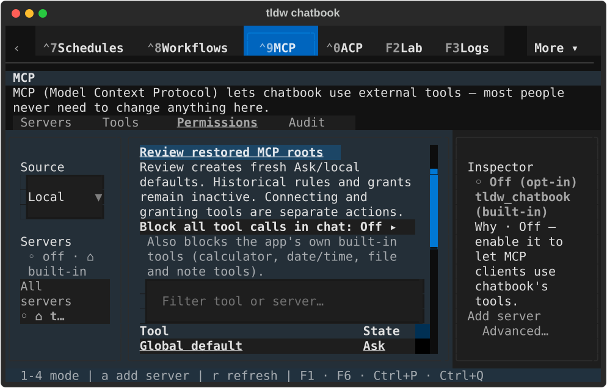

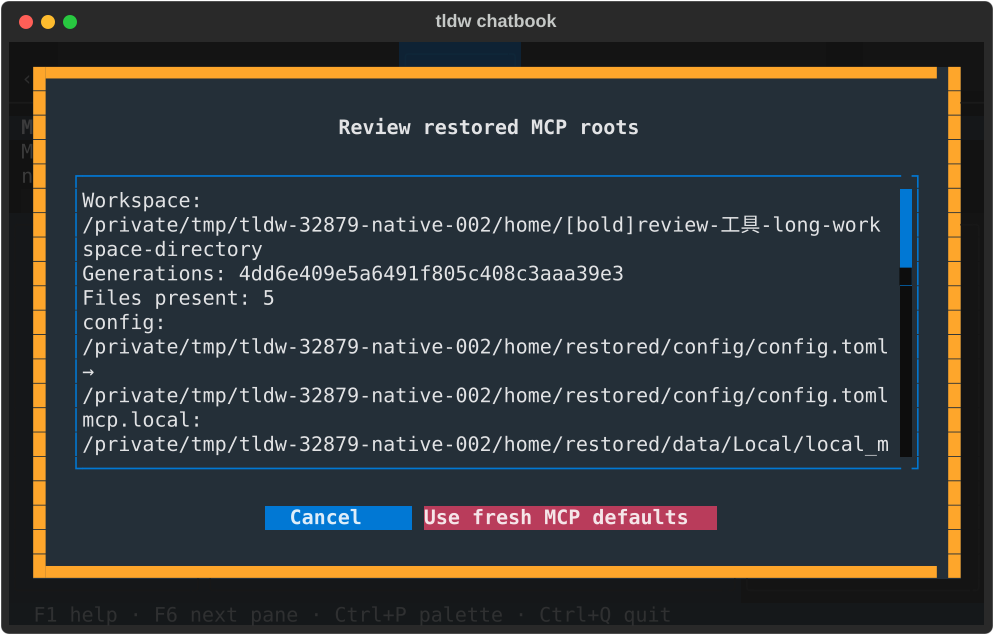

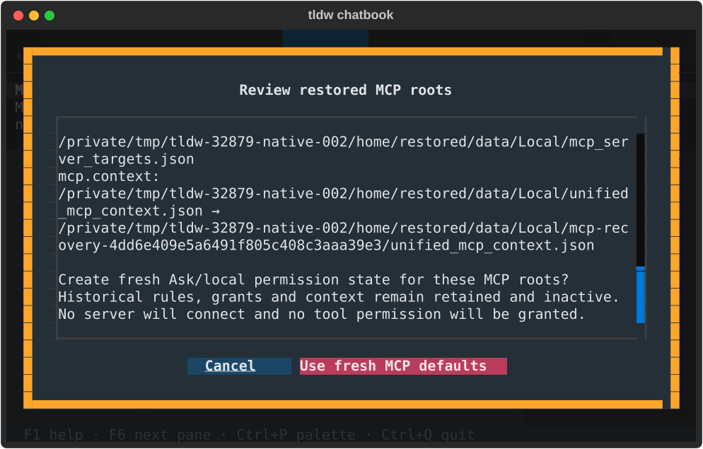

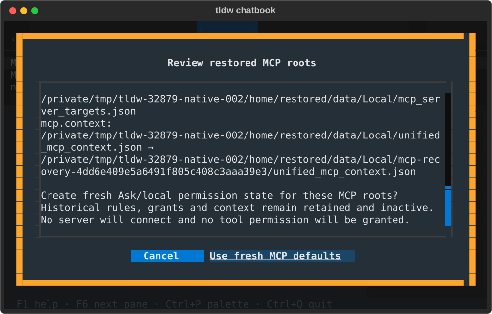

## textual-light · 80x24

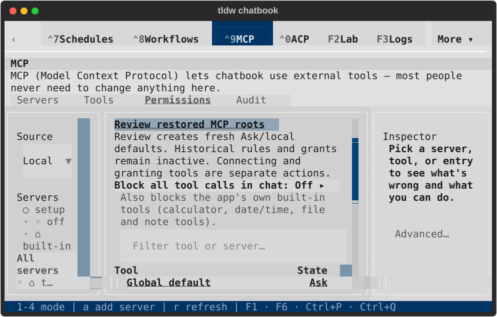

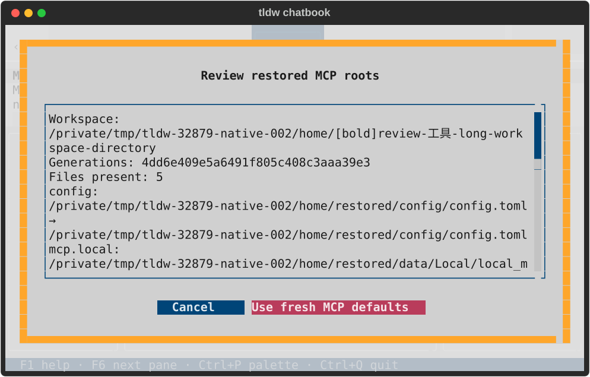

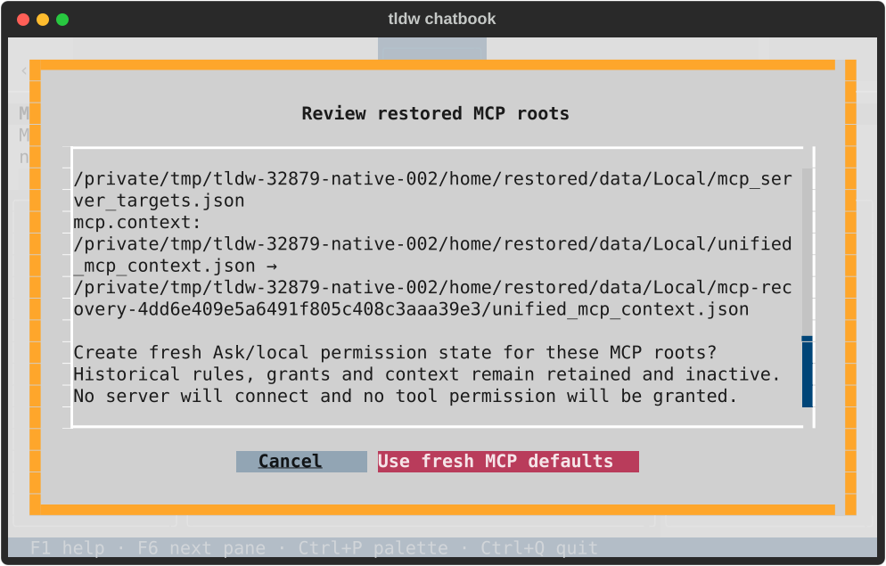

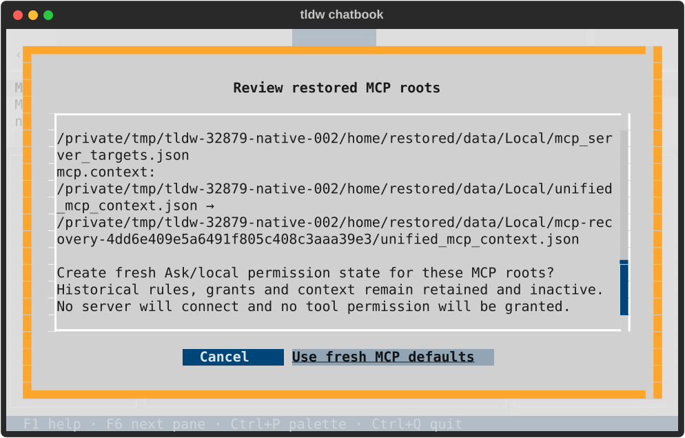

## textual-dark · 170x48

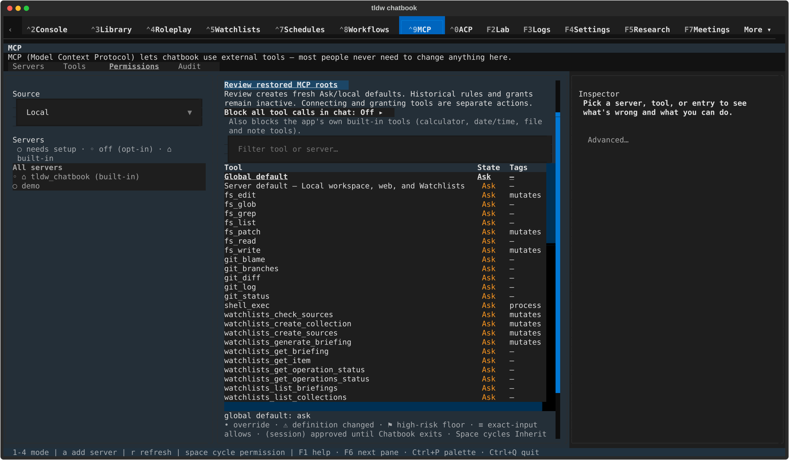

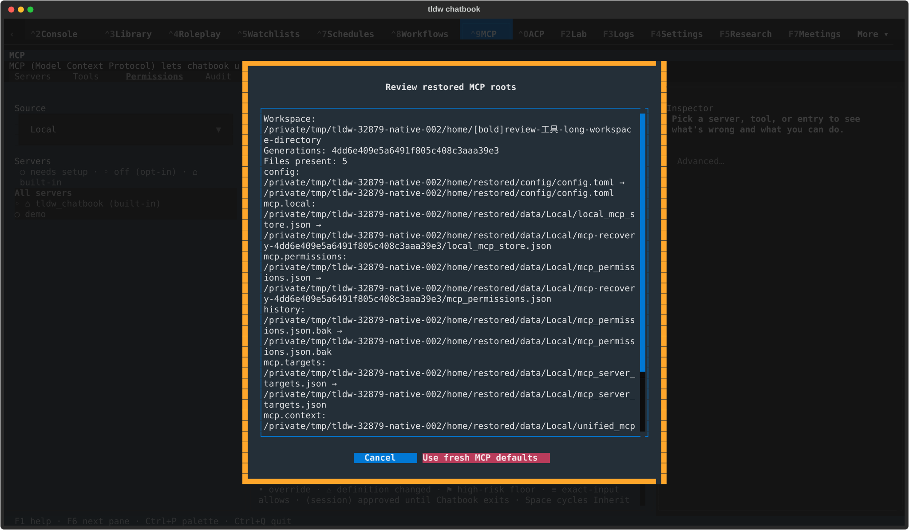

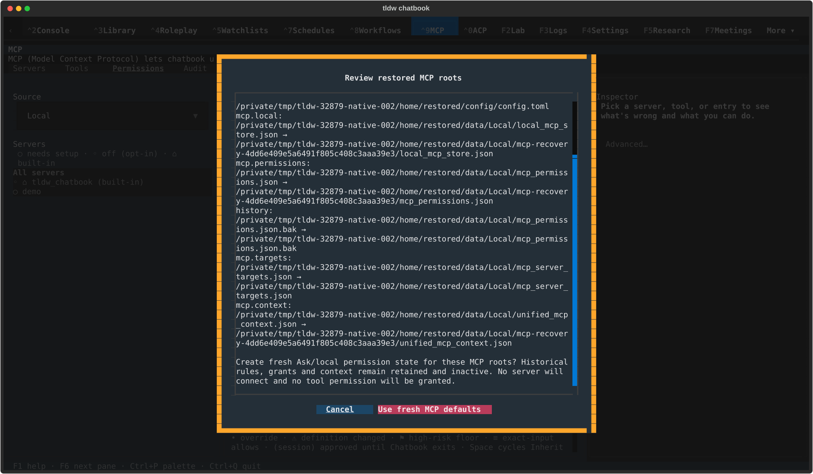

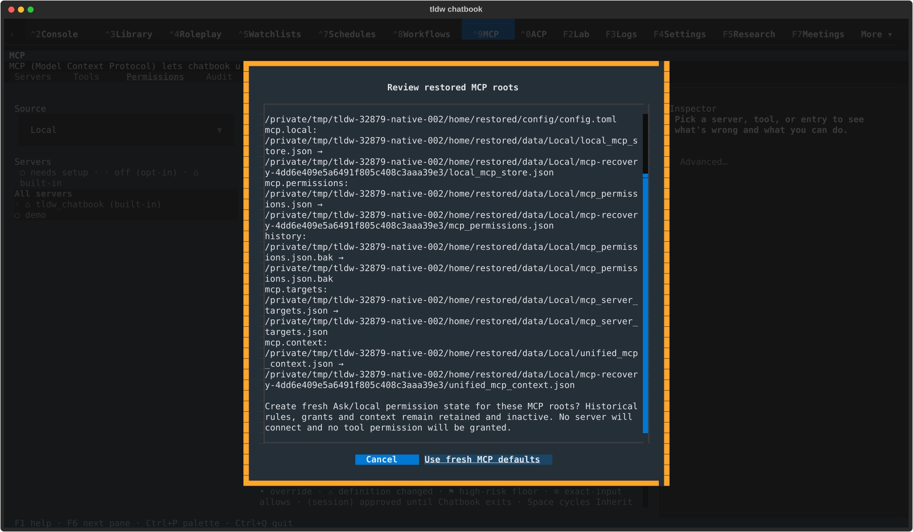

## textual-light · 170x48

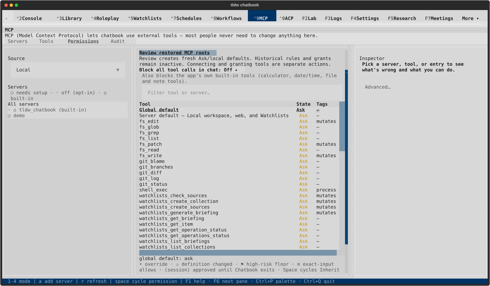

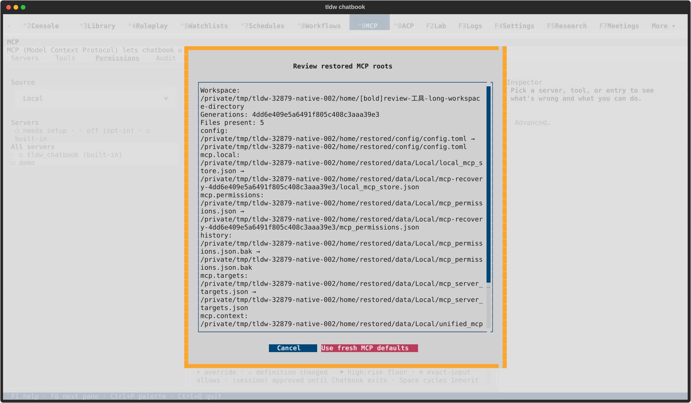

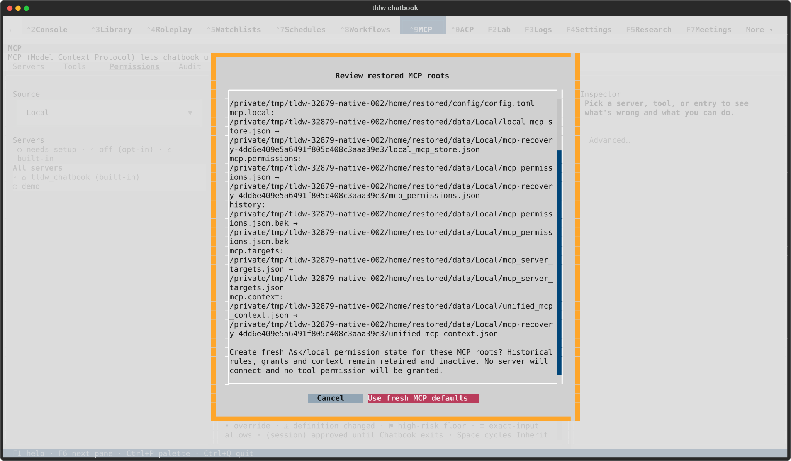

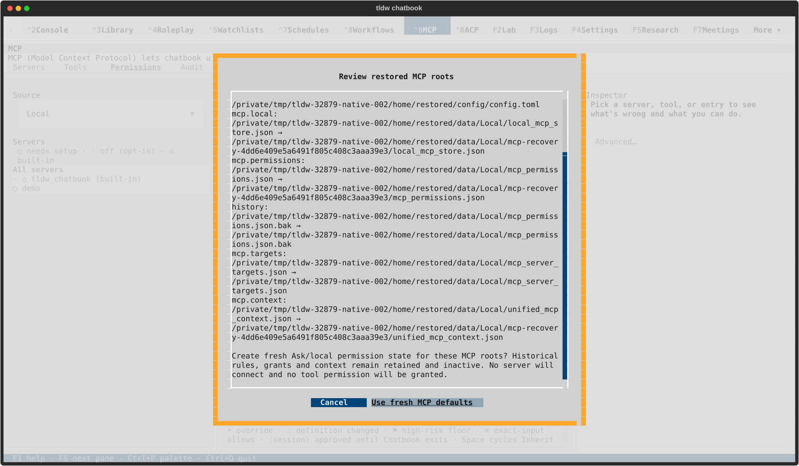
