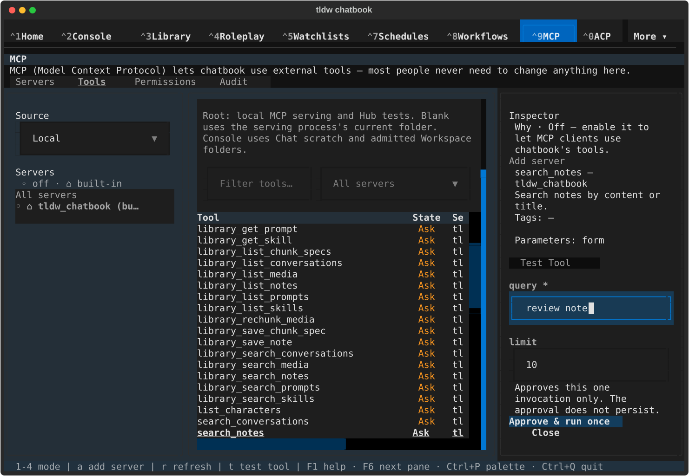
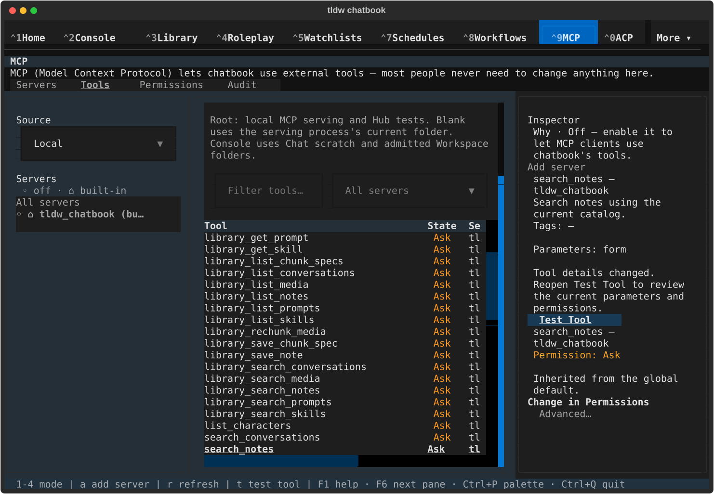
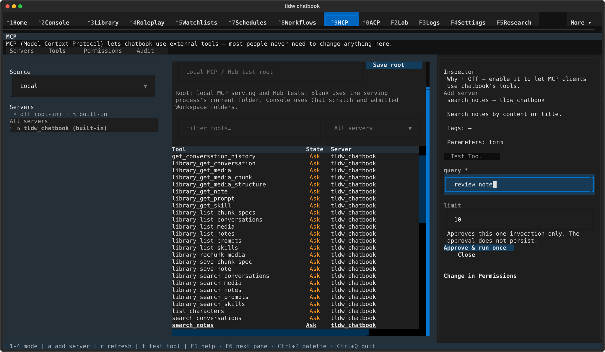
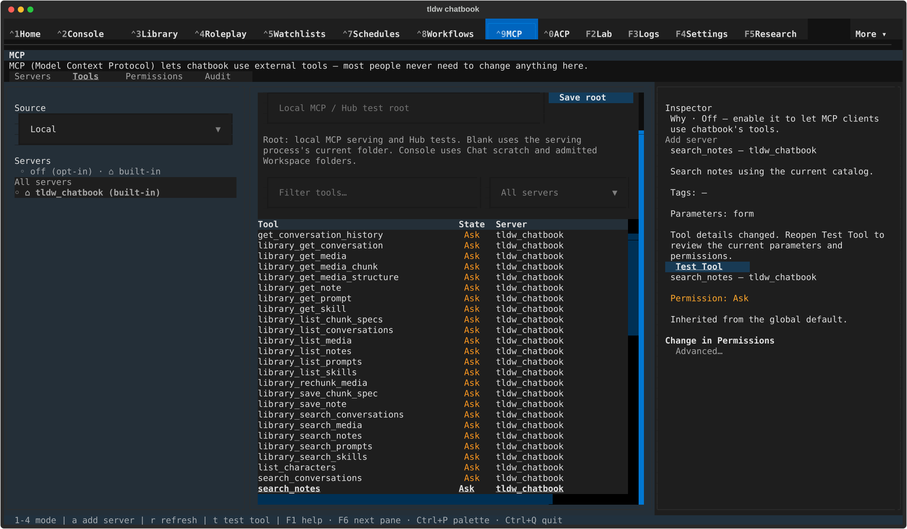
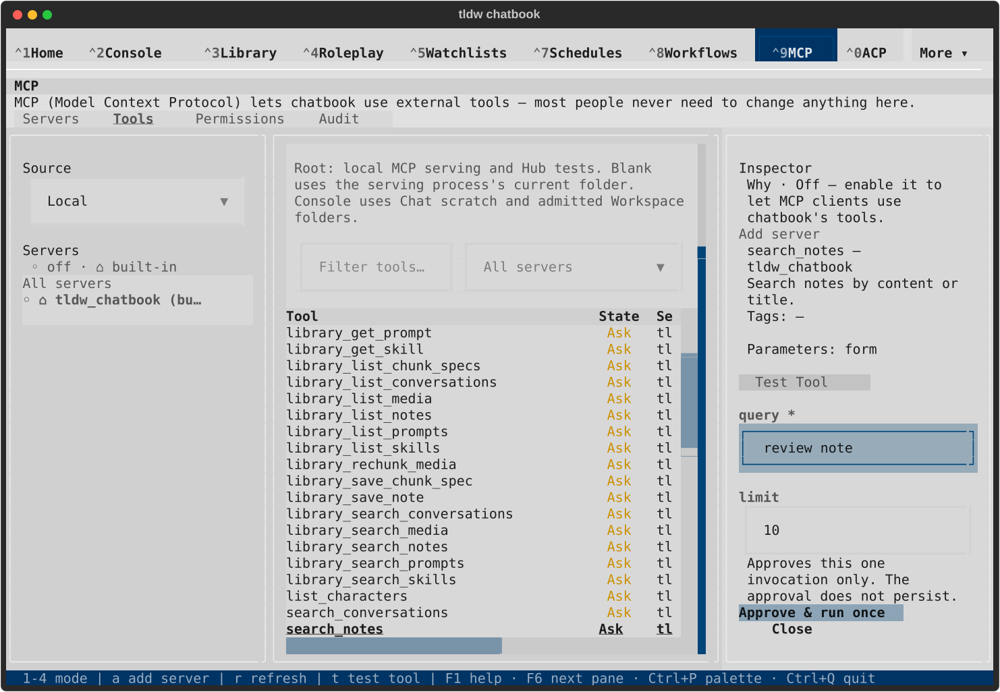
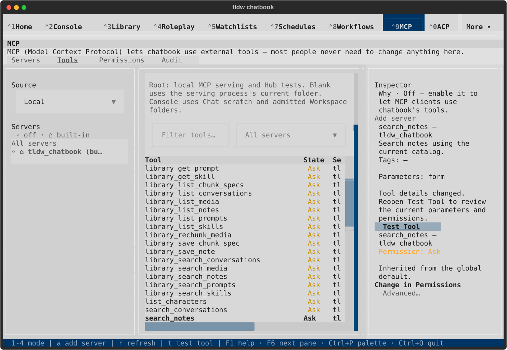
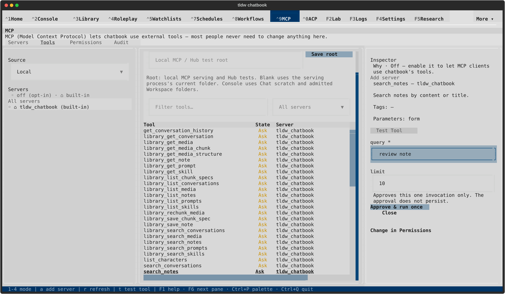
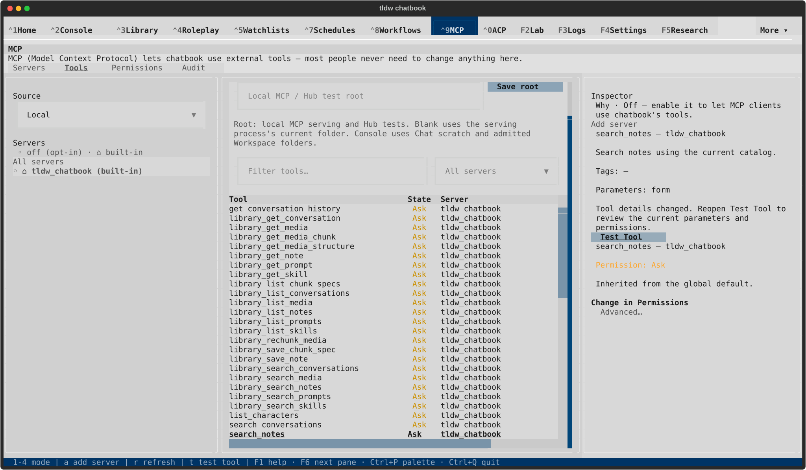

# MCP inspector refresh — visual review

The entered `review note` draft stays mounted after an unchanged refresh. A changed definition removes the old test form, updates the description and explains how to reopen it. Focus returns to Test Tool only when the user has not moved elsewhere.

These eight captures are from final native run004. No tool was executed. This is a new follow-up and still requires its own final visual approval.

## Dark — 120x40

### Unchanged refresh: draft and focus retained

### Changed definition: old form retired with guidance

## Dark — 170x48

### Unchanged refresh: draft and focus retained

### Changed definition: old form retired with guidance

## Light — 120x40

### Unchanged refresh: draft and focus retained

### Changed definition: old form retired with guidance

## Light — 170x48

### Unchanged refresh: draft and focus retained

### Changed definition: old form retired with guidance

