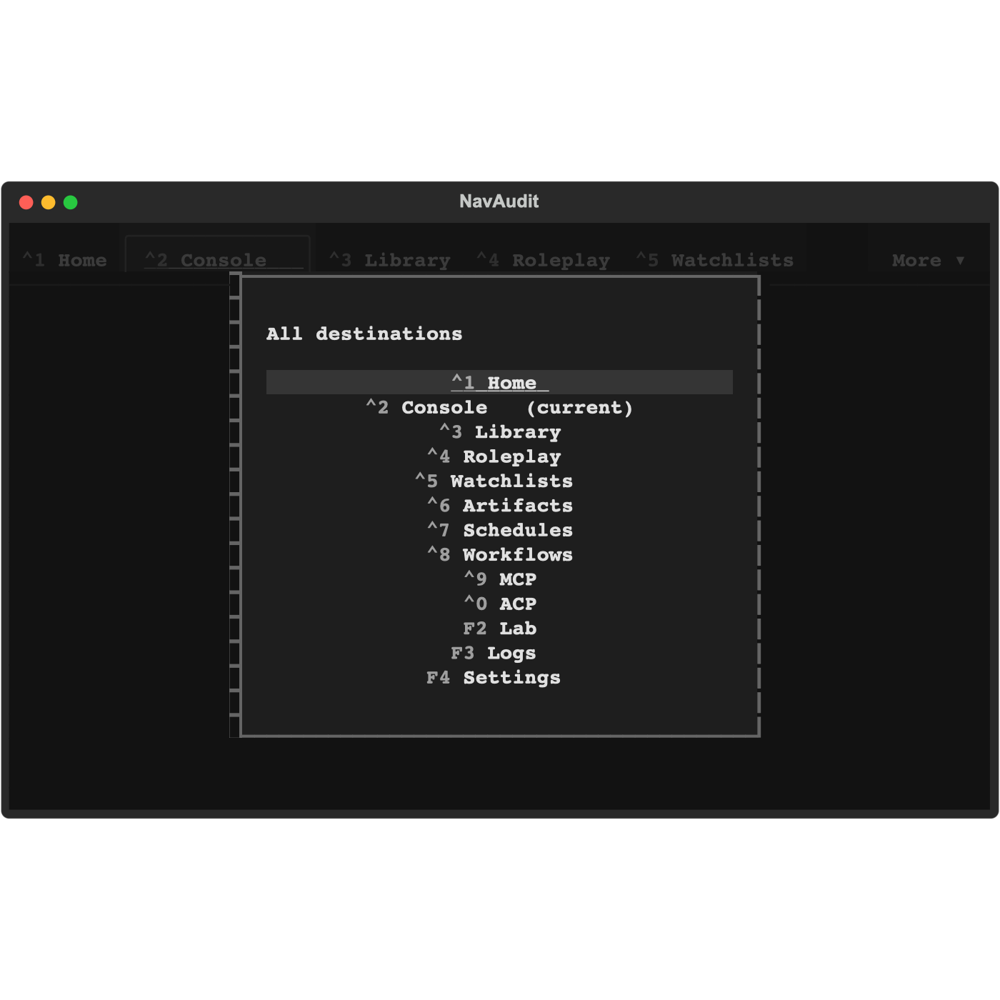
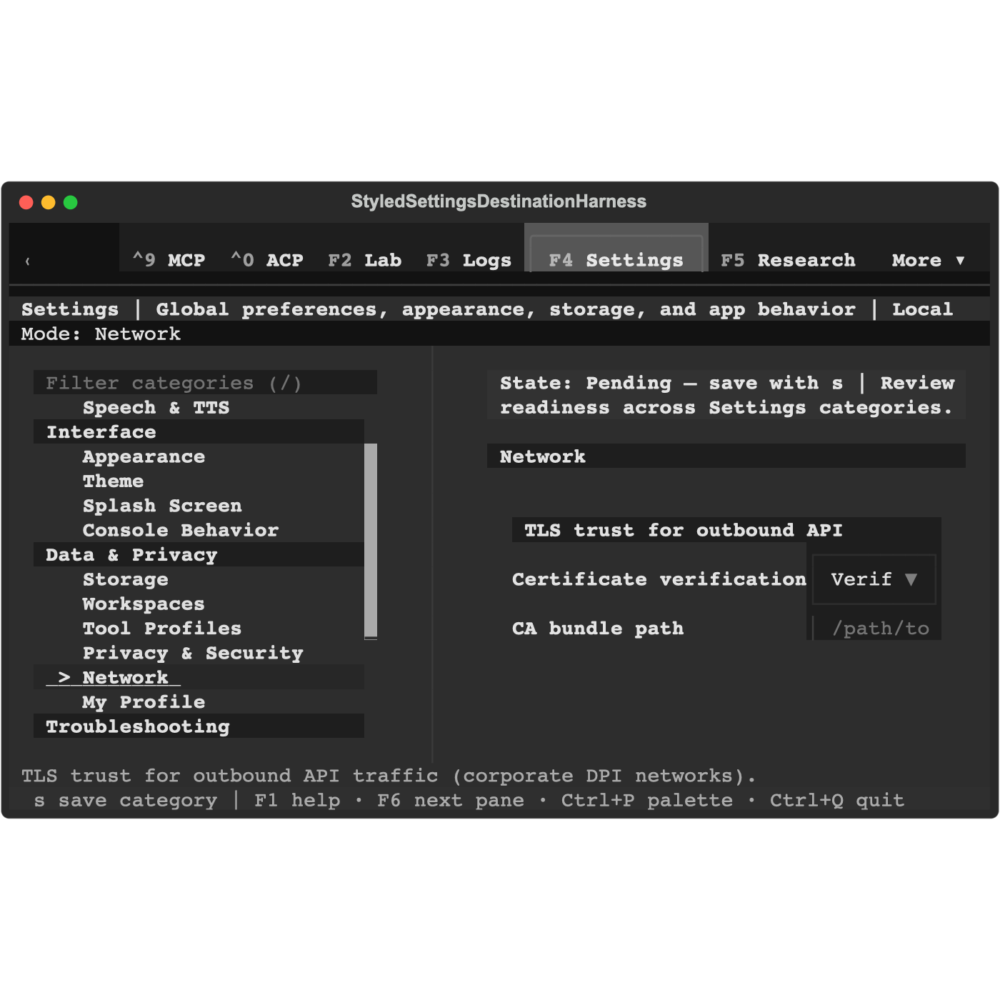
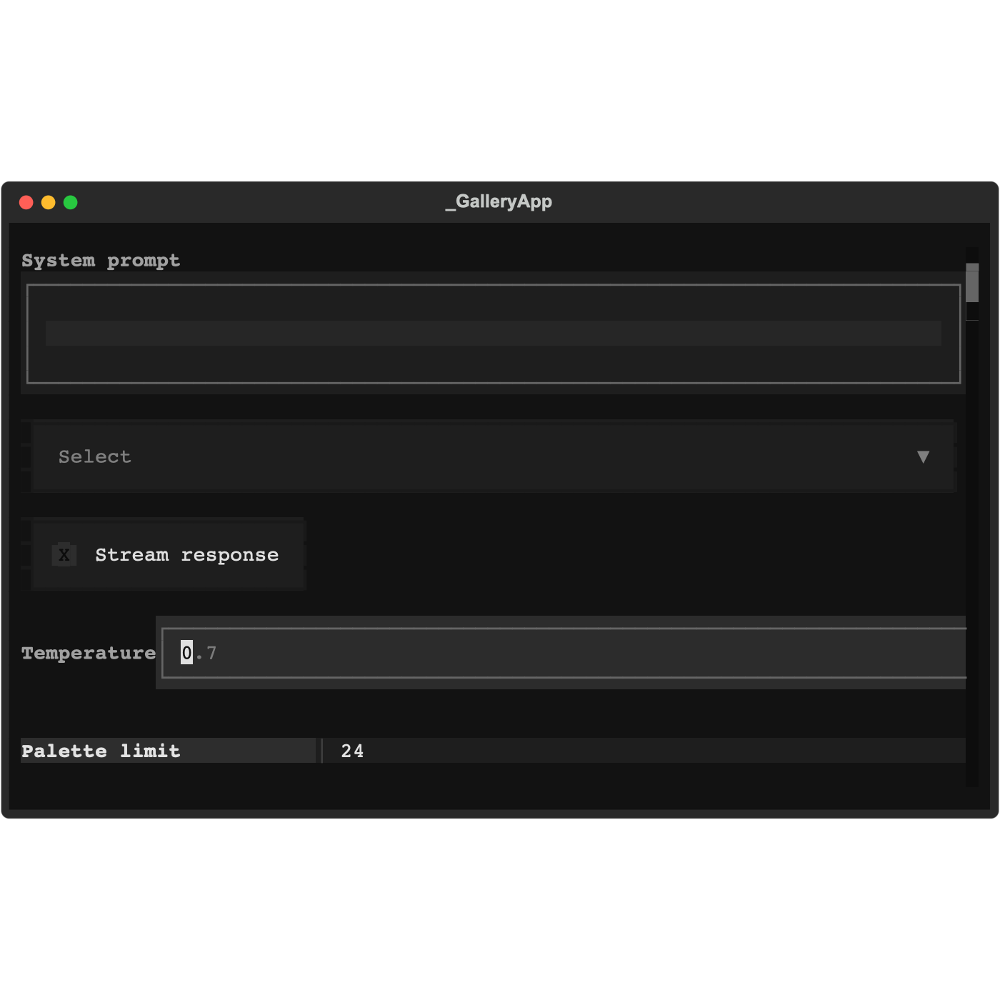

# Component-first UI audit — first pass, 2026-09-14

The first pass is complete: shared forms/buttons/dialogs, navigation/rails,
Console first-use recovery and responsive states, and representative canonical
Settings forms. Three UI defects and two integration/documentation follow-ups
are recorded below. This is a bounded audit, not a claim that every feature has
been reviewed. Production code was not changed.

## Integration verdict

**Not ready to merge into current dev.** No P0–P2 runtime/build defect was found
in the bounded implementation review, but the proposed integration has five
conflicts and must be reconciled, rebuilt and revalidated first.

- Audit baseline: `e35e6bea4634e27e8620f0c40e72c45ae7a0050d` on
  `feat/component-pattern-library`.
- Refreshed `origin/dev`: `fd30614dcdc1e6cbd39b1532769d3e10be9b12b6`.
- Common ancestor: `2ecf784d6ea41592a9d9b6b915fbe8c8c533470f`.
- Divergence: 358 dev-only commits; 77 branch-only commits. No PR exists for
  this head branch. No merge, rebase or push was performed.
- `git merge-tree --write-tree --name-only HEAD origin/dev` exited 1. Conflicts:
  `Tests/UI/test_library_file_notes_workspace.py`, `Tests/UI/test_library_shell.py`,
  `css/components/_agentic_terminal.tcss`, the modified/deleted generated
  `css/screen_agentic_console.tcss`, and generated `css/tldw_cli_modular.tcss`.
  Source modules must own the resolution; generated sheets must be rebuilt.

The implementation review used design-work base `06cc148a91` separately from the
current dev integration comparison. It found no surviving imports of deleted
modules and no unexplained same-selector value changes beyond the documented
heading deltas. [Review](../qa/2026-09-14-component-first-audit/integration-review.md)
and [trial merge](../qa/2026-09-14-component-first-audit/merge-preview.txt).

## Findings and priorities

| ID | Priority | Finding | Provenance | Backlog |
|---|---|---|---|---|
| INT-1 | P1 integration blocker | Reconcile current dev before integration | Current divergence | TASK-32591 |
| NAV-1 | P1 | More menu clips Research/Meetings and permits invisible focus at 80×24 | Same source in dev | TASK-32592 |
| FORM-1 | P2 | Settings labels leave insufficient control width at 80 columns | Same Providers/Network geometry in dev | TASK-32593 |
| FORM-2 | P2 | Gallery Temperature input overruns its row by 11 cells | New exemplar on this branch | TASK-32594 |
| DOC-1 | P3 | Catalog describes removed duplicates; branch-range whitespace debt remains | Completion documentation/hygiene | TASK-32595 |

### NAV-1 — hidden destinations in More

`UI/Navigation/nav_overflow_menu.py:39–45` caps the menu at 80% screen height;
its plain Vertical holds fifteen one-row destinations plus title, spacing and
borders. At 80×24 the menu is 44×19. Research and Meetings are outside the painted
content area. Focusing Meetings succeeds programmatically but still does not
paint its label or focus cue. At 120×40 the menu is 44×21 and every row paints.
The same-widget 120→80→120 sequence reproduces in dark and light themes.

Actual terminal reproduction: open More at 80×24, then Shift+Tab from the first
row. The last destinations remain absent. The fixed native capture and a mounted
probe agree. Direct F5/F7 shortcuts provide a workaround, so this is not classified
as a total navigation block. Current dev's menu source is byte-identical.

Expected outcome: every destination can be visibly focused and activated through
More at 80×24; keyboard traversal brings the selected row into view, and wider
layouts stay bounded. Suggested follow-up: **Impeccable adapt**, then polish.

### FORM-1 — Settings controls squeezed by fixed labels

`css/features/_settings.tcss:352–357` reserves 24 cells for each label. At 80×24,
Network's usable row is 35 cells, so its policy Select gets 11 cells and paints
`Verif` / `Cust` instead of the complete selected policy. The CA path has eight
content cells. Providers uses the same classes at
`UI/Screens/settings_screen.py:15690–15708` and `:15761–15768`; its model input
has seven content cells. Native Console → Set up provider reproduces the same
pressure in Model, Endpoint and API key rows.

The inputs still accept complete text; this is a readability/editing problem,
not proven data loss. At 120 columns the policy label paints fully. Both themes
reproduce. Network typed-path validation reports the concrete invalid-path
reason. These classes and provider/network implementations are inherited in dev.

Expected outcome: compact row composition preserves readable full policy names
and practical editable field width, while retaining label meaning and keyboard
focus. Verify Providers and Network together. Suggested follow-up:
**Impeccable adapt**, then polish.

### FORM-2 — overflowing canonical example

`Widgets/pattern_gallery.py:60–62` places an 11-cell label beside a `.form-input`
whose width is 100% of the whole row (`css/components/_forms.tcss:283`). At 80
columns the row is x=1,width=77, while the input is x=12,width=77. Its right edge
is eleven cells beyond its parent; the border clips at both 80 and 120 columns,
in both themes and in rest/focus states. The short sample value remains visible.

The catalog skeleton at `backlog/docs/component-patterns.md:123–125` also uses a
plain Container while describing an inline row. The shared full-width field is
inherited; the new example misuses it. This is a reference/example defect, not a
claim that all production forms overflow.

Expected outcome: the gallery and executable catalog example demonstrate the same
contained composition; regression checks include child containment and painted
edges. Suggested follow-up: **Impeccable layout**, then polish.

### DOC-1 — stale completion description and diff hygiene

`backlog/docs/component-patterns.md:564–569` still says two late section-header
copies remain. The chat rule is scoped, and the Stats duplicate was removed.
The text should describe the final canonical owner and scoped composition.

`git diff 06cc148a91..e35e6bea46 --check` reports eight trailing-whitespace lines:
two generated gallery SVG lines, four `_sidebars.tcss` lines and two `_tabs.tcss`
lines. This does not invalidate the earlier clean uncommitted-diff check; it does
mean that statement cannot be read as proof of a clean full branch range.
Suggested follow-up: correct the catalog and clarify/rerun the intended check.

## Coverage and positive evidence

This adapts Impeccable's technical audit to a Textual TUI. DOM/ARIA, mobile touch
sizes, native iOS/Android APIs and a web detector are inapplicable. No screen-reader
conformance or broad performance score is claimed. A numeric product health score
would imply broader coverage than this pass provides.

| Dimension | Verified in this pass | Limits |
|---|---|---|
| Keyboard/focus | Navigation active-vs-focus changes; field/button visible focus; confirmation escape; compact controls reachable | More's last rows fail visible focus; OS screen-reader behavior not tested |
| Responsive layout | 120/80 dark/light shared patterns; same-widget navigation resize; Console tests include 60–235 columns and blocked/ready/running states | Settings and gallery findings above; other destinations not deeply audited |
| Theme/contrast | Dark/light rendering; disabled button text contrast 7.25:1 / 4.72:1 with opacity 1; disabled buttons resist focus | Disabled-hover probe incomplete; invalid-field border sample is not text-contrast evidence |
| Integrity | Registry/source/build/split checks; byte budget; deleted reference census; before/after declaration comparison | Current dev merge result unvalidated |
| Performance | Boot CSS remains 609,446 B under 634,050 B limit; no new import/build defect found in scope | No startup latency, frame-rate or provider-speed claim |

Evidence runs (not a full suite):

- **113 passed**: master-shell navigation, destination rails, Console narrow layout,
  and Conversation Settings geometry/reachability.
- **24 passed, 10 deselected**: independent integration/build/split/budget checks.
- **12 passed**: forms first-round mounted matrix, provenance and existing disabled
  contrast tests. Second-round Network/validation captures completed before an
  unrelated probe-only hover selector lookup failed; that round is not counted green.
- **2 capture probes passed**: navigation dark/light at 120→80→120, recording actual
  geometry, focus identity and compositor output. Their success means capture
  completed, not that the captured defect passed a behavioral contract.
- Actual app with isolated, valid config and explicit scratch database paths:
  Console first use at 120×40/80×24, provider setup handoff, Home return, More menu,
  and light-theme Console return. No external provider request was sent. Ready/run
  state evidence comes from mounted tests, not a live model conversation.

Selected SVGs, Quick Look raster previews, structured geometry and native ANSI
captures are retained in `Docs/superpowers/qa/2026-09-14-component-first-audit/`.
Original full probe logs/source remain in ignored
`.superpowers/sdd/2026-09-14-component-audit/`. The production tree is unchanged by
this audit. Existing unrelated `tmp/` content remains untouched.

## Review sequence after these findings

1. Reconcile the design-system branch with dev and verify the merged source/build.
2. Resolve NAV-1, FORM-1 and FORM-2, then rerun their bounded dark/light/resize cases.
3. Audit Library workflows: Workspaces → Notes/Media/Conversations → Search/RAG,
   including populated, empty, loading, error, cancellation and return-focus states.
4. Review remaining Settings categories and modal patterns.
5. Continue through Roleplay, Watchlists, Artifacts, Schedules, Workflows, MCP, ACP,
   Lab, Logs, Research and Meetings, reusing shared-component findings rather than
   filing duplicate screen-level fixes.

The remaining destinations above are a sequencing recommendation, not completed
audit coverage. Each later audit should identify its actual workflow fixtures and
produce evidence-backed, atomic Backlog items. Run the Impeccable follow-ups one at
a time or together, and rerun the scoped audit after their fixes.
