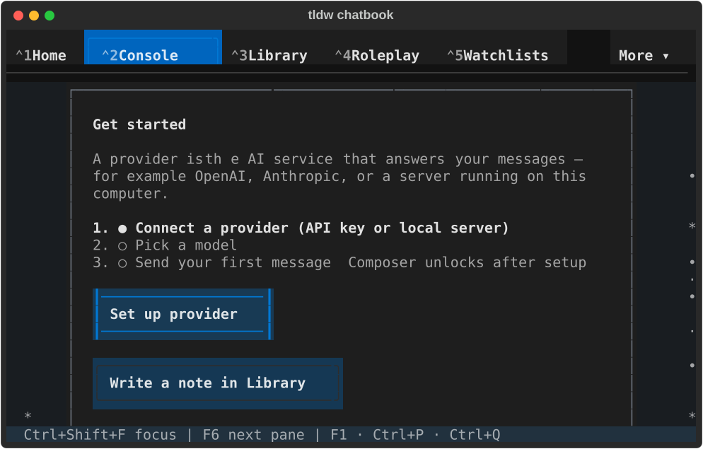
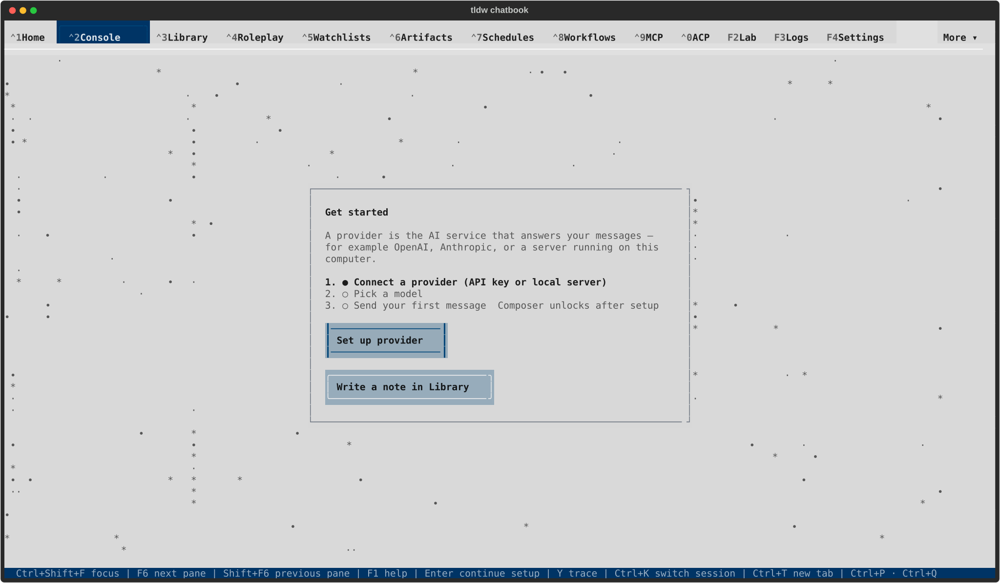
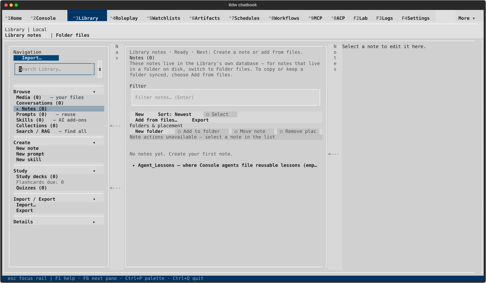

# PR #2704 — historical conflict-resolution audit

Read-only reconstruction of the four merge commits on the reviewed branch, through 96d4ca2b966e0a0f999100f6d1a1b4f1c33a7623. Subsequent Settings repairs are excluded from the conflict counts. “Ours” means first parent (component branch); “theirs” means second parent (incoming dev). This report describes the recorded results, not a new merge or runtime certification.

**Result: 20 conflicted file entries, containing 30 conflict blocks (including one modify/delete conflict).** No blanket selection of one parent was used. Both document additions were usually retained; source ownership stayed with the component branch while incoming behavior was incorporated.

| Merge | Ours | Theirs | Actual conflicts | Exact reconstruction |
| --- | --- | --- | --- | --- |
| acfdc333da | 705a39bdb8 | fd30614dcd | 5 files / 11 blocks | [conflict files only](../qa/2026-09-17-pr-2704-conflicts/acfdc333da.conflicts.diff.txt) |
| 36164f9ccc | 6e0a71dc74 | 1c0327b3bb | 12 files / 16 blocks | [conflict files only](../qa/2026-09-17-pr-2704-conflicts/36164f9ccc.conflicts.diff.txt) |
| bd5cd5aae8 | 65cc565d84 | c97a64eba5 | 1 file / 1 block | [conflict files only](../qa/2026-09-17-pr-2704-conflicts/bd5cd5aae8.conflicts.diff.txt) |
| 96d4ca2b96 | 2614d6c135 | d8fb4053f9 | 2 files / 2 blocks | [conflict files only](../qa/2026-09-17-pr-2704-conflicts/96d4ca2b96.conflicts.diff.txt) |

Original conflict diffs are preserved byte-for-byte in [this archive](../qa/2026-09-17-pr-2704-conflicts/original-conflict-diffs.zip). The readable copies normalize trailing whitespace. Parent hashes and original diff hashes are preserved in the [manifest](../qa/2026-09-17-pr-2704-conflicts/manifest.json). Original parent/result files remain retrievable from Git at those hashes. Conflict blocks below are identified by symbols, so they remain intelligible despite line movement. Generated-file conflict choices are described separately from their source owners.

## acfdc333da — first current-dev integration

| Conflicted file / block | Ours | Theirs | Recorded result and effect |
| --- | --- | --- | --- |
| Tests/UI/test_library_file_notes_workspace.py — CSS import | BUNDLED_STYLESHEET + ConsolidatedCSSApp | APP_STYLESHEETS + ConsolidatedCSSApp | Selected APP_STYLESHEETS. Also changed three workspace harness CSS_PATH values to the complete stylesheet list; tests receive lazy screen styles as well as the boot bundle. |
| Tests/UI/test_library_shell.py — CSS import | BUNDLED_STYLESHEET + ConsolidatedCSSApp | APP_STYLESHEETS + ConsolidatedCSSApp | Selected APP_STYLESHEETS and changed the rail style harness CSS_PATH accordingly. |
| css/components/_agentic_terminal.tcss — block 1, Console settings actions/error | Rules had moved out of the monolith. | Rules still lived here, including the new wide dialog tier. | Kept the removal from this file. Existing rules remain in features/_console_panels.tcss; added incoming wide tier there: width 85%, maximum 196 columns, expressed with tokens. |
| Same file — block 2, .console-region through Library source-action rules | Console/Settings/Library declarations were split into feature owners. | Large original block remained in the monolith. | Kept split ownership. Incoming changed behavior was carried into the appropriate feature sources, including three-row, bordered Console setup actions with side focus rails and Library recent-row focus borders. |
| Same file — block 3, focus-mode header and compact Console | Rules moved to features/_console.tcss. | Focus-header hiding and compact Console rules remained here. | Kept the monolith deletion and the equivalent feature-owner rules; did not reintroduce a duplicate block. |
| Same file — block 4, Settings navigation/field states | Rules moved to features/_settings.tcss. | Settings rules remained in the monolith. | Kept the split owner. Incoming Agents preset/form sizing was added in features/_settings.tcss with tokens. |
| Same file — block 5, agent progress and worktree recovery | Tokenized agent-progress actions only. | Literal action dimensions plus Console progress and new worktree confirmation/recovery rules. | Retained tokenized action rules here; retained Console progress and added worktree recovery rules in features/_console_panels.tcss. Concrete sizes include confirmation maximum 22 rows, details maximum 12 rows, recovery dialog 90% × 90%, maximum width 110. |
| css/screen_agentic_console.tcss — modify/delete | Deleted obsolete generated Console sheet. | Modified the old sheet. | **Deletion retained.** Console rules come from the feature owners included in the main bundle. Incoming source changes were transplanted before regeneration. |
| css/tldw_cli_modular.tcss — block 1, dialog vocabulary/picker focus | Promoted shared dialog vocabulary. | Picker buttons gain heavy left/right focus outlines. | Combined: retained shared dialog vocabulary and added the focus outlines in components/_dialogs.tcss; regenerated the bundle. |
| Same file — block 2, Console settings compact/wide | Rules already relocated. | Old-position compact rules and wide tier. | Regenerated from the feature owner, retaining compact behavior plus the new 85%/196-column wide tier once. |
| Same file — block 3, Settings sections/Agents/compact fields | Rules already relocated or promoted. | Old-position Settings rules, including incoming Agents sizing. | Regenerated from resolved source owners, retaining the Agents rules without restoring duplicate old-position blocks. |

The resolved `_agentic_terminal.tcss` is byte-identical to ours for this merge: additions were made in the new owners, not restored to the monolith. The [frozen incoming-declaration comparison](../qa/2026-09-14-component-integration/upstream-css-preservation.json) records the concrete upstream-to-token mappings. I also compared the committed owner-source deltas.

## 36164f9ccc — second current-dev integration

| Conflicted file / block | Ours | Theirs | Recorded result and effect |
| --- | --- | --- | --- |
| Docs/User_Guide/library/import-and-export.md — appended review stamps | Import recovery/consent and folder-picker review statements. | Wave-4 guide-verification/correction statements. | Both blocks retained, ours followed by theirs. No competing product behavior selected. |
| Docs/security/production-diagnostic-inventory.json — summary | owner_files 601; privacy calls 709; sinks 12; TASK-31551 55; TASK-492 1403; TASK-494 7762. | 611; 701; 14; 55; 1407; 7770, respectively. | **Recomputed**, neither parent: 607; 701; 14; 55; 1407; **7761**. Associated non-conflict reconciliation updates Chat/Settings digests and records the branch's extracted library_rechunk_run owner. |
| Tests/UI/test_chat_screen_sidebar_state_debounce.py — final assertion/new tests | Existing latest-toggle assertion, single-line formatting. | Same assertion plus cancellation, queued-write, refusal/retry and profile-fencing cases. | Kept the assertion and all four incoming tests. Also adapted affected tests to private-profile execution and formatted code; assertions were not replaced by a blanket skip. |
| Tests/UI/test_console_live_work_handoffs.py — harness imports | Includes _CssTrueDestinationHarness. | Imports only DestinationHarness and _wait_for_selector. | **Ours retained**, preserving production-style handoff tests. Additional private-profile decorations are integration fixes, not a competing import choice. |
| backlog/docs/lessons-live-verification.md — first block | Terminal stream/profile/exit lessons. | Dismissed-modal lifetime lesson. | Both retained. A new private recovery-HOME incident was added separately above them. |
| Same file — second block | Active-screen notification-overlay lesson. | Verification-stamp and durable-citation lessons. | Both retained, ours followed by theirs. |
| backlog/docs/lessons-testing-evidence.md — first block | Exact-width resize and subsequent branch lessons, through CSS selector parsing. | Callback/file observation and other incoming testing lessons. | Both retained. A new private-profile parent-fixture lesson was added separately. |
| Same file — second block | Saved Browse identity and subsequent branch lessons, through provider settings ownership. | Changed-string test selection and subsequent incoming lessons, through surrogate-safe JSON extraction. | Both retained, ours followed by theirs. |
| tldw_chatbook/UI/Screens/chat_screen.py — sidebar initialization | No three new synchronization fields at this location. | asyncio.Lock(), revision 0, persistence-error None. | **Theirs retained:** all three fields initialize before loading sidebar state can trigger its watcher. Existing branch debounce initialization remains. |
| tldw_chatbook/Widgets/Console/console_bounded_section.py — measured height update | Remove h-* classes; annotated set_styles(height=native_height); request_reconcile(). | Inline styles.height assignment; _wait_for_reconcile_layout(). | **Combined:** keep class removal and annotated set_styles; replace request_reconcile() with _wait_for_reconcile_layout(). Incoming settled-layout timing is preserved within the branch's style contract. |
| tldw_chatbook/Widgets/Library/library_file_notes_workspace.py — mode/path refresh | border-none class and manually update exact path Static. | Inline border reset and _fit_path_surfaces(). | **Combined:** keep border-none; use _fit_path_surfaces() instead of the manual exact-path block. Incoming fitting behavior is preserved without reintroducing inline fixed styling. |
| css/components/_agentic_terminal.tcss — block 1, Notes through Console terminal styles | Large block already relocated. | Older monolithic block plus incoming Notes changes. | Kept split ownership. Transplanted changed Notes declarations into features/_library.tcss and _library_panels.tcss; no duplicate monolithic block retained. |
| Same file — block 2, recent ingest/create/compact Notes | Rules already relocated. | Recent-ingest and compact Notes/lasting-status blocks remained here. | Kept the deletion from this file and resolved behavior in Library source owners. The final monolith is byte-identical to ours. |
| css/screen_agentic_library.tcss — block 1, note title/keywords | Tokenized title + original keywords selectors. | Adds #library-note-context-keywords, using literals. | **Combined in source and regenerated:** all three selectors, tokenized dimensions; the live Info keywords field also receives the shared focus treatment. |
| Same file — block 2, create viewport/duplicated compact block | Tokenized viewport dimensions with compact geometry owned elsewhere. | Literal viewport dimensions followed by a large duplicate compact block. | Retained tokenized viewport height 1fr, minimum 0, vertical auto scrolling and hidden horizontal overflow; regenerated the compact rules from the feature owners once. |
| css/tldw_cli_modular.tcss — Notes compact section/lasting status block | Rules split away from this old location. | Duplicated Notes section and lasting-status rules at the old location. | Regenerated bundle retained the split ownership; incoming Info metadata auto-height is kept in its owner instead of the shared one-row selector. |

Behaviorally meaningful incoming Notes CSS retained: task-action minimum width 61 (0 in compact mode), compact keywords rows/labels/inputs, readable Delete color, heavy focus borders on Preview/Info, left-aligned body H1, one-row ellipsized location, and full-height Info metadata. The [frozen preservation receipt](../qa/2026-09-17-component-current-dev/css-preservation.json) compares 45 changed declarations after expansion; its result is zero mismatches. That receipt is historical evidence, not a new native run.

## bd5cd5aae8 — Interface integration

| Conflicted file / block | Ours | Theirs | Recorded result and effect |
| --- | --- | --- | --- |
| Docs/User_Guide/library/import-and-export.md — after queue actions | Import focus/draft preservation on resize and GGUF recovery behavior. | Parakeet runtime/model setup, verified model installation, and native/remote clipboard guidance. | **Both retained**, resize/GGUF guidance followed by Parakeet/clipboard guidance. This merge had no production-code conflict. |

The numerous Interface screenshots, test outputs, lifecycle manifests, QA receipt changes, and additional fixes visible in this merge's full remerge diff are **not conflict choices**. They were recorded as integration/qualification work alongside the one documentation resolution.

## 96d4ca2b96 — local transcription diagnostics

| Conflicted file / block | Ours | Theirs | Recorded result and effect |
| --- | --- | --- | --- |
| Docs/security/production-diagnostic-inventory.json — TASK-494 total | 7762. | 7771 (dev's different source inventory). | **Recomputed 7763**: branch's 7762 plus the single incoming diagnostic call. Neither full parent inventory was selected. The app.py entry (404 calls; digest fb8f6d46c94108fcdab2) merged automatically from incoming dev. |
| backlog/docs/lessons-testing-evidence.md — appended lesson blocks | Branch exact-width/selector-parsing lessons. | New TASK-32758 parent-side STT logging lesson. | **Both retained**, with the STT lesson after the branch block. |

`app.py`, Tests/Library/test_stt_failure_diagnostics.py, the Logs guide and TASK-32758 task merged automatically. The app delta relative to ours exactly matches incoming c97a64eba5→d8fb4053f9 except line positions. The final inventory equals ours plus that incoming app entry and one total call. Rail native captures predate this STT merge; no new native or model-inference result is implied.

## What this comparison excludes

- Auto-merges are not human ours/theirs decisions. They normally disappear from `git show --remerge-diff`, which compares Git's reconstructed merge with the recorded merge result.
- A remerge diff can also contain extra edits made while completing a merge. The four full reconstructions contain respectively **49, 83, 81, and 7** additional file entries without a reconstructed conflict. Their exact names are in the manifest; they include QA artifacts, source transplants, harness adaptations, generated-file rebuilding, and task/receipt updates.
- Source transplants into clean feature files are necessary parts of resolving the CSS relocation conflicts, but those destination files did not themselves conflict.
- This audit identifies what was selected; it does not certify every imported feature or subsequent Settings repairs. The reconstruction did not change source or merge state. Git used temporary objects for read-only remerge reconstruction; the conflict diffs, manifest and this report were subsequently saved in the PR for review.

## Visual inspection of the integrated UI

These are the recorded native captures for the second integration, not newly generated before/after images. They show the resolved Console and Library layouts at compact and wide sizes. The [QA receipt](../qa/2026-09-17-component-current-dev/README.md) defines the exact tested source and limitations. Later Interface, rail and Console/Storage work has separate receipts in the [completion ledger](2026-09-17-design-system-completion-audit.md).

| Console, compact dark | Library Notes, compact dark |
| --- | --- |
|  |  |

PR #2704 remains draft. Merging the PR into dev requires the user's green light after visual review.
