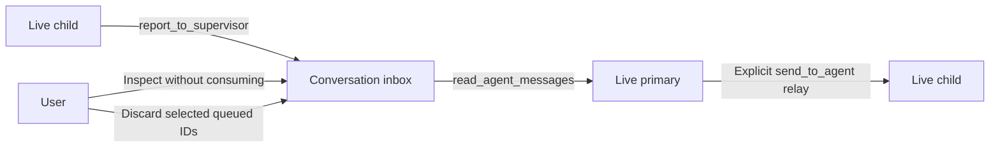

# Scoped agent messaging implementation review — 2026-09-10

Status: implementation and review complete. All three task reviews passed; the combined review's sole actionable finding was fixed and its scoped re-review approved with zero new findings. This report covers TASK-32489–32304, implementing the accepted [ADR-136](../../../backlog/decisions/136-scoped-child-progress-and-supervisor-relay.md) and [implementation plan](../plans/2026-09-10-scoped-agent-messaging.md). Changes remain uncommitted.

## Current behavior

Live threaded children can call `report_to_supervisor`; an authorized live primary can call `read_agent_messages` and explicitly relay a report with existing `send_to_agent`. Child capabilities carry immutable source identities. Children cannot collect from the parent inbox or use sibling steering through generic catalog fallback. Automatic readers collect only their exact work chain; manual readers may collect older reports in the same conversation.

The runtime owns bounded, conversation-scoped inboxes. Finishing a child revokes its sender while retaining accepted reports independently of handle pruning. Session close and runtime disposal invalidate queue owners before cancellation. Navigation preserves queues. A stale capability cannot access a replacement inbox with the same conversation ID.

Admission checks body and complete serialized-envelope limits before mutation. Collection returns whole reports within both the messaging limit and the consumer's effective tool-result limit. A head report that cannot fit is retained for explicit user discard. Pending capacity is released by collection/discard; the child run's lifetime allowance is never refunded.

| Limit | Bound |
| --- | --- |
| Report body / serialized envelope | 2,000 / 4,000 characters |
| Child pending | 8 reports / 16,000 body characters |
| Child lifetime | 32 reports / 64,000 body characters |
| Conversation pending | 32 reports / 64,000 body characters |
| Runtime pending | 256 reports / 512,000 body characters |
| One collection | 4 whole reports / 8,000 serialized characters, further bounded by the consumer |

## Review findings and dispositions

| Finding | Evidence | Disposition |
| --- | --- | --- |
| Native denied reader results skipped the deferred no-progress check. | Three regressions reproduced fresh denial, restored-first denial, and mixed-tool cycles; refusals left the queue untouched but could issue extra model requests. | Fixed. A shared check runs after ordinary and native failure-result persistence/history handling. Only a trusted positive collection resets cycle history. Independent fix review approved. |
| Multiline report bodies were not painted by the selection widget. | A real Textual compositor assertion caught `SelectionList` retaining only the first line of its prompt. | Fixed. Report selection is separate from a literal scrollable detail pane; full multiline body and control/markup behavior pass rendered tests. |
| Idle navigation counts could remain stale despite a correct count projection. | The rendered navigation check required count changes to trigger the existing navigation refresh. | Fixed. Body-free count-change polling triggers the existing navigation refresh; model collection and navigation away/return pass rendered tests. |
| Console screenshot harness omitted the production component styles. | Parent inspection saw missing modal geometry; source check confirmed the harness lacked the modular bundle. | Fixed in the test harness. Final wide/narrow captures use production styles and synthetic ready-provider configuration; prior unstyled captures are excluded. |
| Conversation navigation badge was clipped while a global text assertion passed. | The global assertion matched the separate Agent action. A row-specific compositor assertion reproduced the missing badge. | Fixed. Compact `Progress: N` occupies its own row line without a second wrapping pass; both terminal sizes pass the row-specific assertion and show the badge. |
| UI test owner lacked the database required by wake recovery. | Eight existing fleet-panel failures were present before messaging UI changes; a real database-backed control restored an unchanged original summary assertion. | Fixed in affected fleet/controller test fixtures using the existing real database helper; original assertions pass and production recovery is unchanged. |
| New test lint failed despite a reported clean gate. | The saved Ruff JSON recorded `SIM102`; the initial implementation report and ledger incorrectly claimed zero introduced findings. | Corrected with a mechanical short-circuit-preserving condition flattening, fresh clean checks, an enforced failure exit in the comparison wrapper, and explicit evidence correction. Scoped re-review approved; no new findings. |
| Saving a temporary conversation strands its progress queue. | A real submit→threaded child report→Save probe leaves the old inbox occupied; the next primary collects zero and closing the saved session leaves pending capacity behind. Normal first-send persistence passes the control. | Fixed with a stable native progress owner. Real Save/rollback/cancel/close, live producer/reader, shared-session, and rendered regressions pass. Independent scoped re-review approved. |
| Delayed submissions could bind a replacement progress owner under a reused native session ID. | A gated actual submit queued the bridge callable before state replacement; the old submission then made five scripted provider calls against successor state. A separate pre-binding gate exercises replacement during preparation. | Fixed by capturing expected ownership before controller preparation/scheduling and checking it at bridge entry and inbox binding. Both regressions pass; independent scoped re-review approved. |
| Dependency and pytest cleanup warnings remain in targeted output. | Requests reports an installed dependency compatibility mismatch; pytest reports a stale unrelated garbage-directory cleanup error. | Existing environment limitation; no messaging behavior failure established. |
| An unawaited UI coroutine warning appears in an affected swap test. | Follow-up TASK-32492 promoted the warning to a failing test and traced eager coroutine allocation before Textual worker admission in the acceptance hook. | Fixed in the subsequent follow-up by passing the async callable. The strict regression and 49 affected/mounted checks pass; follow-up review is recorded in the orchestration ledger. The original messaging review did not claim this warning was fixed. |

The seven earlier design findings are tracked separately in the [design review](2026-09-09-scoped-agent-messaging-review.md). They informed the accepted implementation contract; they are not additional unresolved implementation defects.

The final correction is bounded to progress identity. Save assigns a persisted ID
inside its database transaction, and cancelling the coroutine awaiting the Save
worker does not necessarily cancel that write. A post-Save UI callback therefore
cannot safely migrate inbox ownership. The approved correction uses an eager,
nonserialized native-session owner, shared by live restored siblings; last-binding
close invalidates it before cancellation. Persisted fleet/run identities remain
separate. ADR-136 and both owning tasks were updated before implementation. The
correction has the passing targeted evidence below. Independent scoped re-review
closed I1 with zero new Critical, Important, or Minor findings; its complete report
is `final-fix-1-review.md` in the preserved plan evidence directory.

## Verification

After the identity correction, the final affected run passed **400 tests** in
87.27 seconds, including all **14 identity cases** and **7 styled progress UI
cases**. It covers actual Save and later submission, live reporting/current
collection, gated rollback/cancel/close, native/runtime replacement, sibling
sharing, simultaneous publication, close/setup ordering, and executor-queued
replacement refusal. Output: `final-fix-1-final-verification.log` in this plan's
evidence directory. A separate queue/coordinator/tool group passed **84 tests**
in 1.97 seconds (`final-fix-1-queue-locks.log`). These runs overlap earlier evidence;
the counts are not a cumulative test total.

The nine corrected Python files have **zero introduced Ruff diagnostics** against
their immediate before-images (204 inherited findings before and after). The new
identity test and existing lifecycle/UI test files pass whole-file formatting;
legacy files have no remaining formatting changes overlapping this correction.
The exact comparison is `final-fix-1-static-summary.json`. Final correction
commands, failed-before/fixed-after evidence, and intermediate-error dispositions
are in `final-fix-1-report.md`.

The final combined backend command covered 14 named files: import provenance, inboxes, coordinator, messaging tools, message lifecycle, native continuation, steering/send, fleet execution ownership, prepared requests, runtime preparation, bridge, runtime, and service. Result: **586 passed**, one known dependency warning, 39.42 seconds. Exit status was zero. Output: `.superpowers/sdd/2026-09-10-scoped-agent-messaging/final-backend-tests.log`.

A before-image Ruff comparison of 18 backend source/test files found **no introduced diagnostics**; all five new Python files passed the formatter check. The existing diagnostic fingerprints were retained rather than applying unrelated formatting changes.

Earlier task evidence includes actual red/green regressions for concurrent admission, finish/send races, exact provider relay payloads, role/chain refusal, native persistence barriers, capture-off private checkpoints, restored pending-call refusal, and repeated productive/empty/denied reader calls. Task2's fix-specific continuation/messaging/provenance group passed 91 tests.

The Console feature group passed **6 tests** after the final row-specific rendering correction. **220 affected existing regression cases** passed across the recorded targeted runs (96 fleet/inspector/browser, 84 workspace/left-rail, and 40 Agent rail/controller cases, including the corrected controller fixture rerun). The six feature tests cover live/model refresh, concurrent selected discard, nonrefunded lifetime allowance, unchanged completion attention, exact stale-owner rejection, unsaved identity, mode-off/pruned access, and navigation.

All five CSS bundles reproduce. Independent review found one missed `SIM102` lint diagnostic in the new UI test harness and an inaccurate clean-lint claim. The mechanical correction now passes fresh Ruff, formatter, and before-image comparison checks; scoped re-review approved with no new findings. The comparison wrapper now fails when any new-file or introduced diagnostic remains. Existing UI diagnostic fingerprints remain unchanged. Styled Textual captures at **180×48** and **100×36** show the Agent entry, literal report dialog, and actual conversation-row badge. The report bodies/configuration are synthetic, with no provider request. Original SVG exports and local-font PNG renders are retained under `.superpowers/sdd/2026-09-10-scoped-agent-messaging/task-3-screenshots/`.

The ChatScreen architecture check remains red against its inherited baseline: 17,653 lines / 594 methods before this UI task, 17,656 / 594 afterward, versus limits of 17,570 / 591. The only new screen code is three late-bound callback arguments. Its limits were not raised.

Task3 review approved the behavior and visuals; its one lint/evidence finding was corrected and passed scoped re-review. Final combined review found the temporary→saved identity defect above; its correction passed the single scoped re-review with no remaining actionable finding. Parent verified the nine frozen source/test hashes and found no unexpected changes since the combined review. No full test sweep or real-provider certification is claimed. Review diffs use preserved before-images from the already dirty shared checkout; unrelated existing changes are excluded. Changes remain uncommitted.

## Deliberate boundaries and remaining improvements

- This is explicit supervisor relay. Direct peer addressing and a general distributed message bus are outside this version.
- Reporting does not wake an idle or waiting primary, trigger approval, or change completion attention. A child continues independent work or finishes with its essential result rather than waiting indefinitely for a reply.
- Queued and collected receipts describe queue operations; they do not prove the recipient understood or acted on a report. Collection followed by provider failure is not automatically retried or requeued.
- Queue availability is session-only. Restart loses queued reports. Existing full capture can retain tool content, and supported native primary continuation checkpoints can retain collected reports even when full capture is disabled. Discarding or closing a queue does not erase these history copies.
- The existing ChatScreen size ratchet violation, tracked by TASK-3070, predates this UI change. Its ceiling must not be increased to make messaging verification appear green.

The broader orchestration issue list and previous burn-down evidence remain in the [orchestration review ledger](../../../backlog/docs/agent-orchestration-review-2026-09-07.md).

## Recorded implementation rulings

The implementation ledger records these decisions in order, including their reasons and tradeoffs. They remain reviewable in this uncommitted checkout.

1. Continue in the existing non-main checkout with isolated before-images and uncommitted scoped diffs — the approved orchestration dependencies exist only in this dirty working tree — a separate checkout would require reconstructing the same uncommitted baseline and risks dropping dependencies.
2. Preserve this plan's ledger/review artifacts until integration; do not delete its workspace or commit/stage to generate diffs — no integration or staging requested — costs some local scratch storage.
3. freeze attach_run identity after progress binding — production attaches once through child on_run_id, and a changed run would invalidate the source identity — incompatible reattachment now refuses only when progress was already bound.
4. retain environment compatibility and stale pytest-cleanup warnings as known validation noise, without changing dependencies/cleaning unrelated directories — no effect on tested queue behavior — a later environment repair should improve log clarity.
5. progress modal closures capture the exact inbox owner in addition to the conversation ID — dynamic ID lookup alone could follow a replacement after close/reopen — a stale modal requires reopening to inspect the replacement. Use the already public noncreating store lookup and capability checks; no new registry/schema.
6. align that related fixture with a real accepted AutomaticWorkContext, preserving all survivor/origin/capacity assertions — meaningful ownership validation must exercise the current authorization contract — adds one focused test-file correction with no production change. Snapshot before editing and rerun only affected automatic cases after the broader pass.
7. separate optional primary MessageInbox injection in AgentService when the fleet cap disables threaded children — returning a retained coordinator would otherwise re-enable threaded spawn/wait/steer — adds one narrow reader ownership input while preserving the established fleet switch. Existing coordinator inbox remains the fallback. Test retained reports + cap=1 yields reader access and inline spawn semantics, without fleet-tool disclosure.
8. inherit the approved Textual surface and use one fresh combined Task3 spec/code/visual reviewer — there is no new visual-world decision to ask again, and no need for duplicate review seats — unchanged PRODUCT/DESIGN authority; screenshots and rendered tests supply evidence.
9. fleet.py and generic inspector remain unchanged in Task3 — the reachable progress action is independent of terminal fleet rows and implemented directly in left_rail with the existing Agent owner callback — artificial edits to those files would add no required behavior. The user-visible contract and all specified access states remain binding.
10. Use an eager process-local native progress token, shared atomically by restored live siblings, rather than migrating keys when Save returns — Save assigns the persisted ID inside its transaction and an awaiting coroutine can be cancelled while the write finishes — cost if wrong: inaccessible or cross-session reports and leaked allowance.
11. Closing one live native sibling retains its shared queue; closing the last sibling invalidates it before cancellation — restored siblings already share persisted fleet ownership and one open binding must retain access — cost if wrong: premature report loss or a closed-owner leak.
12. Serialize binding publication/open/release with a narrow identity lock before coordinator/progress locks, with no DB/provider/observer callbacks inside — prevents setup reopening after last close without unbounded tombstones — cost if wrong: lock inversion or revived stale authority.
13. Allow one typed current MessageStore registration in ConsoleChatStore, replaced under the identity lock with previous-store closure — direct store close/rollback/restore_state bypass controller callbacks and must invalidate exact old capabilities — cost if wrong: store/runtime coupling or an old runtime closing its replacement; exact reference ownership must prevent this. No callback registry, history or new MessageInbox API. ADR/plan amended before this implementation seam.
