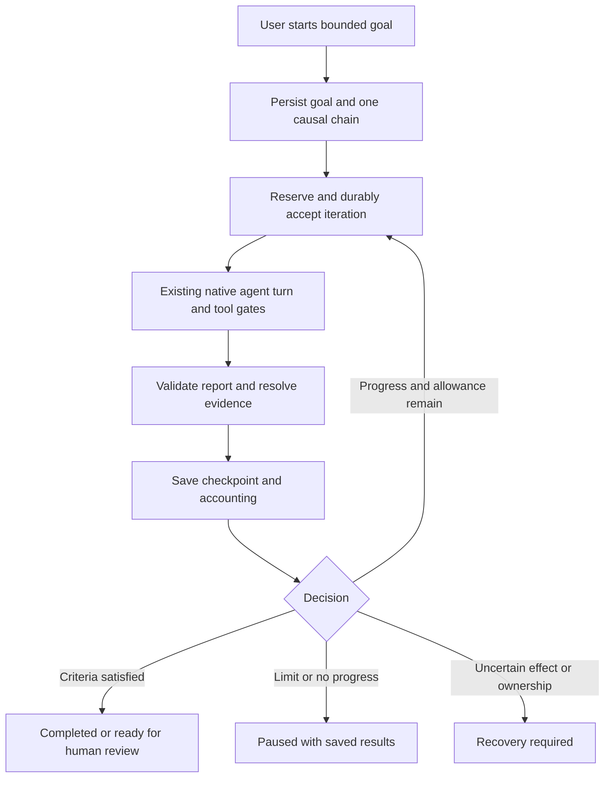

# Native goal runs: gnhf review and proposed Chatbook design

- Date: 2026-09-08
- Status: Accepted for implementation by the user on 2026-09-08 after preimplementation review; implementation in progress.
- User scope: an autonomous workflow **inside Chatbook**, confirmed in this conversation.
- First-release scope: iterative work using existing Chatbook tools, including CLI/script tools. No research-only restriction was selected by the user.
- Reference: gnhf v0.1.49, commit `0227fe415d38e6df0fad4828c7999ba2a3b065de`, dated 2026-09-04.
- Chatbook baseline: HEAD `22aa927f0287e84c76ab39836a05a028f2a73e82` plus the existing shared working tree. Some relevant agent changes are uncommitted; the local Workflows engine is planned work, not a shipped dependency.
- Evidence: README, source, test definitions, local task files, and ADR inspection. Neither gnhf nor Chatbook was executed for this review; existing task verification is attributed to those task records.
- [Implementation plan](../plans/2026-09-08-gnhf-inspired-goal-runs.md)
- [Accepted ADR-141](../../../backlog/decisions/141-native-console-goal-runs.md)
- [Preimplementation review and corrections](../reviews/2026-09-08-goal-runs-preimplementation-review.md)

## Recommendation

Add **Goal runs** to the native Console runtime. A user supplies an objective, completion criteria, a tool/resource scope, and finite limits. Chatbook repeatedly executes one bounded agent iteration, checks its result, saves progress, and decides whether to continue. Reuse the existing agent service, automatic-work ledger, tool gates, run logs, and change review.

CLI execution already exists. The native agent dispatches `run_skill_script` through the Console bridge to `LocalSkillsService.run_skill_script` and `run_script_subprocess`; the latter executes argv and returns process results. MCP also launches configured executable servers, and ACP owns configured runtime command launch. The first release reuses these capabilities. ADR-033's restriction on a particular built-in raw-shell interface is not an application-wide prohibition on CLI execution and is not a reason to defer coding or verification.

The missing capability is an explicit objective and iteration lifecycle above an ordinary agent turn. Chatbook already has a model/tool loop and automatic child-completion wakes. Neither establishes that a user's larger objective is complete.

Keep reusable procedure authoring with Workflows under ADR-138. The first Goal runs release belongs in Console and does not depend on finishing the Workflows editor, its 21 adapters, or server synchronization. A later Workflows entry can invoke this same runner through an explicitly negotiated capability.

## What gnhf does well

| Mechanism | Source observation | Adaptation |
| --- | --- | --- |
| Small iterations | The prompt asks for one independently verifiable contribution and a final structured result. | Give each native agent turn one bounded increment and a typed report. |
| Replaceable execution | A small `Agent.run(prompt, cwd, options)` contract normalizes output, usage, messages, and cancellation across adapters. | Start with Chatbook's existing native provider/agent seam; introduce another backend only when its authority and recovery contracts are proven. |
| Externalized memory | The orchestrator appends summaries, changes, and learnings to a run-local notes file. | Save bounded, private iteration reports and derive a compact handoff; keep full evidence separately addressable. |
| Failure classification | It distinguishes ordinary failure, permanent failure, rejected usage windows, and billed overage. | Use typed retry/review states; do not treat permission denial or uncertain effects as ordinary retryable failure. |
| Reviewable progress | Successful iterations produce commits; commit-hook failures preserve the pending edits for repair. | Use existing CLI verification and turn snapshots. Add repository checkpoint policy explicitly, including preserving failed commits for repair. |
| Observable lifecycle | Events drive the display; stop requests, waiting states, and a final report expose the run's state. | Use app-owned execution with view-only Console controls and a durable stop reason. |

References: [iteration prompt](https://github.com/kunchenguid/gnhf/blob/0227fe415d38e6df0fad4828c7999ba2a3b065de/src/templates/iteration-prompt.ts), [adapter types](https://github.com/kunchenguid/gnhf/blob/0227fe415d38e6df0fad4828c7999ba2a3b065de/src/core/agents/types.ts), [run metadata](https://github.com/kunchenguid/gnhf/blob/0227fe415d38e6df0fad4828c7999ba2a3b065de/src/core/run.ts), [orchestrator](https://github.com/kunchenguid/gnhf/blob/0227fe415d38e6df0fad4828c7999ba2a3b065de/src/core/orchestrator.ts), [Git operations](https://github.com/kunchenguid/gnhf/blob/0227fe415d38e6df0fad4828c7999ba2a3b065de/src/core/git.ts).

## Important limits in the reference

These are source-level findings about the inspected version, not a claim that its test suite fails.

1. **Completion is agent-reported.** `success` controls acceptance; `should_fully_stop` controls the natural-language stop condition. The orchestrator does not independently run the validation commands requested in the prompt. Its tests explicitly allow a stop report alongside `success=false`. Chatbook should separate the model's recommendation, observed evidence, and goal completion. [Orchestrator](https://github.com/kunchenguid/gnhf/blob/0227fe415d38e6df0fad4828c7999ba2a3b065de/src/core/orchestrator.ts), [stop tests](https://github.com/kunchenguid/gnhf/blob/0227fe415d38e6df0fad4828c7999ba2a3b065de/src/core/orchestrator.test.ts).
2. **Git is its effect boundary.** Acceptance stages the working tree; failure normally resets tracked files and removes untracked files. This cannot reverse a sent request, a note mutation, or another database write. Reuse would also conflict with Chatbook's guarded, user-edit-aware revert behavior. [Git operations](https://github.com/kunchenguid/gnhf/blob/0227fe415d38e6df0fad4828c7999ba2a3b065de/src/core/git.ts).
3. **Unattended permissions are permissive by default.** Unless overridden, the Codex adapter adds its approval/sandbox bypass flag, the Claude adapter skips permissions, and ACP uses `approve-all`. Chatbook must retain its own permission decisions and disclose external-agent authority separately. [Codex adapter](https://github.com/kunchenguid/gnhf/blob/0227fe415d38e6df0fad4828c7999ba2a3b065de/src/core/agents/codex.ts), [Claude adapter](https://github.com/kunchenguid/gnhf/blob/0227fe415d38e6df0fad4828c7999ba2a3b065de/src/core/agents/claude.ts), [ACP adapter](https://github.com/kunchenguid/gnhf/blob/0227fe415d38e6df0fad4828c7999ba2a3b065de/src/core/agents/acp.ts).
4. **Resume is not a lifetime spending ledger.** The CLI restores iteration numbering and run metadata; the new orchestrator initializes token and failure counters to zero. The saved end-state sidecar is not restored into those counters on this path. Chatbook should preserve admission counters across restart and retries. [CLI](https://github.com/kunchenguid/gnhf/blob/0227fe415d38e6df0fad4828c7999ba2a3b065de/src/cli.ts), [orchestrator initialization](https://github.com/kunchenguid/gnhf/blob/0227fe415d38e6df0fad4828c7999ba2a3b065de/src/core/orchestrator.ts#L145).
5. **Prompt memory grows by appending.** Notes remain useful evidence, but a long run needs bounded context selection. A no-op success is discouraged in the prompt rather than established by an independent progress test. [Prompt](https://github.com/kunchenguid/gnhf/blob/0227fe415d38e6df0fad4828c7999ba2a3b065de/src/templates/iteration-prompt.ts), [notes writer](https://github.com/kunchenguid/gnhf/blob/0227fe415d38e6df0fad4828c7999ba2a3b065de/src/core/run.ts#L381).

The source includes focused tests for limits, backoff, interruption, commit failure, and cleanup. Those are useful test scenarios to adapt; their presence is not runtime verification here. gnhf's [license file](https://github.com/kunchenguid/gnhf/blob/0227fe415d38e6df0fad4828c7999ba2a3b065de/LICENSE) identifies MIT. The proposed first release introduces no gnhf runtime dependency or copied implementation.

## Existing Chatbook building blocks

| Need | Existing owner | What remains |
| --- | --- | --- |
| One bounded agent turn | [agent_service.py](../../../tldw_chatbook/Agents/agent_service.py), [agent_runtime.py](../../../tldw_chatbook/Agents/agent_runtime.py), [agent_models.py](../../../tldw_chatbook/Agents/agent_models.py) | An outer goal/iteration controller and result contract. `RunOutcome.status == "done"` is not goal completion. |
| App lifetime, headless work, provider and transcript integration | [console_runtime.py](../../../tldw_chatbook/Chat/console_runtime.py), [console_chat_controller.py](../../../tldw_chatbook/Chat/console_chat_controller.py), [console_agent_bridge.py](../../../tldw_chatbook/Chat/console_agent_bridge.py) | Explicit goal-origin submission, cancellation, admission, and exact run projection. Avoid screen-owned loops. |
| Durable budgets and recovery | [automatic_work.py](../../../tldw_chatbook/DB/automatic_work.py), [automatic_work_runtime.py](../../../tldw_chatbook/Agents/automatic_work_runtime.py), [execution_capacity.py](../../../tldw_chatbook/Agents/execution_capacity.py) | A goal-iteration attempt type. Current wake claims require completed survivor runs; a new goal must not fabricate them. |
| Private run history | [AgentRuns_DB.py](../../../tldw_chatbook/DB/AgentRuns_DB.py), [run_log.py](../../../tldw_chatbook/Agents/run_log.py), [run_log_search.py](../../../tldw_chatbook/Agents/run_log_search.py) | Goal records, ordered iterations, bounded reports, evidence references, and retention rules. |
| Tools, permissions and workspace scope | [tool_catalog.py](../../../tldw_chatbook/Agents/tool_catalog.py), [builtin_tool_gate.py](../../../tldw_chatbook/Agents/builtin_tool_gate.py), [project_instruction_runtime.py](../../../tldw_chatbook/Agents/project_instruction_runtime.py) | Reapply these boundaries every iteration, including after waiting or restart. Tool selection can narrow authority only. |
| Agent-invocable CLI/scripts | [native dispatch](../../../tldw_chatbook/Agents/agent_runtime.py), [Console bridge](../../../tldw_chatbook/Chat/console_agent_bridge.py), [local script service](../../../tldw_chatbook/Skills_Interop/local_skills_service.py), [subprocess runner](../../../tldw_chatbook/Skills_Interop/skill_script_runner.py) | Reuse `run_skill_script`, current trust/grants, arguments, output capture and process cleanup. Preserve actual exit/timeout/output evidence per iteration. The script service uses a scratch cwd; workspace targets must be explicit inputs. |
| Executable integrations | [MCP stdio client](../../../tldw_chatbook/MCP/client.py), [ACP process manager](../../../tldw_chatbook/ACP_Interop/runtime_process.py) | Reuse configured commands. Qualify any whole external-agent iteration adapter separately from the already-supported ability to launch/invoke executable tools. |
| File review and guarded undo | [change_tracking.py](../../../tldw_chatbook/Workspaces/change_tracking.py), [change_revert.py](../../../tldw_chatbook/Workspaces/change_revert.py), [change_review_screen.py](../../../tldw_chatbook/UI/Screens/change_review_screen.py) | Associate existing snapshots with an iteration. A shadow snapshot is not a commit in the user's repository and does not isolate concurrent writers. |
| Research, sources and notes | Existing Library/RAG/local tool providers and [local_research_service.py](../../../tldw_chatbook/Research_Interop/local_research_service.py) | Reuse domain operations; do not rebuild research or notes inside the goal runner. |
| Reusable procedures | [Workflows screen](../../../tldw_chatbook/UI/Screens/workflows_screen.py), [ADR-138](../../../backlog/decisions/138-portable-workflow-definitions-and-local-execution.md) | The current screen is a shell. Tasks 32088–32095 describe the existing first local milestone. Goal integration follows that work. |
| External agent interoperability | [ACP runtime session](../../../tldw_chatbook/ACP_Interop/runtime_session.py) and [process owner](../../../tldw_chatbook/ACP_Interop/runtime_process.py) | Readiness/handoff code is not proof of a full unattended iteration backend with accounting and recovery. |

Relevant implemented-but-uncommitted work is documented in tasks 32034–32037. Rebase/reconcile with those owners before implementation; do not replace their shared admission or recovery mechanisms.

## Alternatives

| Approach | Benefit | Cost / decision |
| --- | --- | --- |
| **Native goal runner over Console — recommended** | Reuses providers, permission UI, CLI/skill/MCP tools, durable accounting and review. Supports coding and non-Git work. | Requires an explicit outer state machine and a small extension to automatic admission. |
| Embed or wrap gnhf as an external executable | Quickly reproduces its coding loop. | Adds Node/CLI distribution, independent authority and spending state, and Git-specific recovery. Keep as a possible separate integration. |
| Add an arbitrary loop node to Workflows immediately | One procedure editor for everything. | The sequential engine/editor is still being built; dynamic control flow and a new portable step contract would broaden ADR-138's v1. Defer. |

## User experience and first release

Console offers **Start goal run** through an implemented action/button and the command palette. A compact setup form captures objective, completion criteria, selected sources/folder binding, provider/model, allowed tool subset, and limits. Starting creates a dedicated goal conversation so ordinary chat and its drafts remain independently usable. All fields displayed at final confirmation must match the immutable submitted request across asynchronous validation; a failed validation restores usable controls.

Additional source bindings provide bounded read-only context or file access through existing permission owners. A selected source is usable without granting writes outside the primary writable binding or reads from unselected sibling roots. Its contents remain untrusted task data, not automatically activated project instructions. Registry identity and scope are rechecked at actual use.

The service owns an idempotent launch operation. It first saves the launch identity, payload hash, preallocated conversation UUID and chain in AgentRunsDB, then provisions that exact conversation through `ChatPersistenceService`. Chat history and workspace membership live in different stores; they cannot share the goal ledger's transaction. A retry reconciles the same identities and verifies ownership instead of creating another conversation. No iteration is admitted until all required bindings are ready. A crash during setup leaves a recoverable Starting record.

The status card shows the current increment, iterations used/remaining, budget tokens with uncertainty, elapsed/deadline, and why execution is waiting. It links to iteration evidence and existing Review. **Pause after iteration**, **Stop now**, **Resume**, and **Review result** appear only when their actions are supported. Resume retains the original counters; a new explicit run may link to earlier work without rewriting its accounting.

The first demonstration should exercise the requested iteration workflow with existing CLI tools: run a configured validation script against a temporary project, inspect its failure, make an authorized file correction, rerun the same check, and retain the real exit status, output and file diff. The trusted verifier stays outside the editable project, with its identity and inputs bound at launch. Use the existing skill/MCP execution route and its configured authority. A source-to-draft example can also demonstrate non-coding use; it is not the feature's imposed scope.

Completion criteria distinguish objective checks (required sections, retrievable selected source IDs) from human judgment (quality and factual adequacy). The model can recommend completion; a report needing human judgment becomes **Ready for review**. Only recorded check results and any required human decision can complete the goal. Source existence does not prove that every claim is supported. The immutable launch field `human_review_required` defaults to `true`. A user may explicitly set it to `false` only when at least one launch-bound verifier is selected and those checks define sufficient objective completion. Neither free-text criteria nor a model report can change this choice; older saved launches retain the review-required default.

Human result review (`awaiting_result_review`) and interrupted-execution recovery (`recovery_required`) are separate states and actions. Approving quality applies only to the exact checkpoint and artifact digest being viewed. It cannot clear uncertain usage, authorize replay of a command, or release a still-running worker. Ordinary chat remains usable; sending a manual message in the goal's conversation pauses future goal iterations and follows normal occupancy rules. A message does not silently revise the immutable objective, criteria or tool scope.

## Execution and ownership

`GoalRunService` is app-owned through `ConsoleRuntime`. It is the state-transition owner and uses the existing controller/bridge to execute turns. Screens observe snapshots and issue commands. Scheduling is event-driven with bounded backoff; there is no model-driven infinite `while` prompt, hidden fake user submission, or polling timer owned by a screen.

Add a trusted `GOAL_ITERATION` submission origin. A typed, coordinator-issued authorization carries goal, iteration, attempt, chain, session, conversation and owner identities. The controller verifies it at the dispatch boundary before any billable preparation. It shares primary occupancy and manual reserves with ordinary automatic wakes. Do not label these turns `MANUAL` or manufacture a fleet completion to obtain a wake token.

Extend `AutomaticWorkLedger` with goal-specific preparation/acceptance using its existing FULL-synchronized transaction boundary. Goal creation and chain association use the same AgentRunsDB. Preparation reserves a generation; acceptance consumes it exactly once before execution. Failed pre-dispatch admission releases only its own reservation. Model/helper calls retain the current exact-request input-plus-bounded-output admission. Both the first and subsequent goal iterations are automatic and charged, even though Start was an explicit user action.

Discriminate attempt kinds at every authority boundary, including read/accept/abort/complete and fleet delivery queries. Shared occupancy checks still span both kinds. A goal context requires its current accepted attempt; the fleet allowance for surviving children to use a completed attempt does not apply. After owned work settles conclusively, one FULL transaction stores the bounded report, retained evidence, decision and counters and marks the matching attempt completed. Uncertain effects instead retain a recovery-required attempt with conservative charges; recording available evidence does not settle them. An identical repeated checkpoint is idempotent; conflicting content for the same attempt is rejected. Provider-call accounting already settled by the ledger is not charged again. If this commit fails, retain the accepted attempt and conservative accounting and admit no successor.

Reuse one runtime startup audit and owner identity for both kinds. The existing audit is initiated through `ConsoleFleetWakeCoordinator`; adding goals must lift/share that lifecycle instead of running another independent `ledger.recover()` when a goal service or screen is created. Both coordinators wait for the same audit result; goals then project their own saved states.

The first release allows one active goal per Console runtime, subject to stricter existing automatic/manual-capacity limits. It disables goal-created subagents to keep iteration settlement unambiguous. This does not disable direct `run_skill_script` or MCP tool invocation, which are not child-agent spawns. Later fan-out must retain one causal budget and wait for all owned effects needed by its checkpoint. The existing fleet behavior for ordinary chat does not change.

Here active means holding admission or physical execution ownership, including approval waits and Stopping. Paused goals and result reviews may remain in history after their workers settle. Freshness checks still apply if another conversation or program changes their artifacts.

Selected tools require an immutable `GoalToolScope` covering catalog tools, progressive discovery/loading and runtime tools separately. The current `allowed_tools` filter does not cover runtime schemas or direct `run_skill_script` dispatch. Apply the goal scope both when advertising tools and immediately before invocation, including restored calls and dispatch after an approval wait. Bind allowed scripts to their resolved skill/script identity and trust fingerprint; MCP tools retain exact server/tool bindings. Selection only narrows existing permission grants. Installing a skill or discovering a tool cannot expand the current goal's authority.

CLI authority is the selected executor's actual authority. The skill runner's scratch cwd, scrubbed environment and process limits do not provide a filesystem or network sandbox. Scope checks on local file tools do not confine arbitrary script code. Retain the existing trusted-script execution model and describe it truthfully in setup; stricter isolation would require a separately qualified executor. Narrow script timeouts to the remaining iteration/chain allowance where supported, and retain ownership through actual cleanup.

## Persistence, memory and evidence

Extend AgentRunsDB rather than introducing another budget database:

- `goal_runs`: identity, conversation/provisioning state, immutable launch operation/payload hash, objective/criteria and verification specifications, resource/provider/tool binding references, policy snapshot, chain ID, revision, status, reason and timestamps.
- `goal_iterations`: goal ID/ordinal, automatic attempt ID, native agent run ID, status, revision, check results and evidence references. Uniqueness on goal/ordinal and launch operation prevents duplicate work.
- `goal_reports`: bounded model-authored summary, learnings, next action and candidate draft. Payload resides in private storage, separate from the body-free automatic-work tables and ordinary diagnostic logs.

Report parsing uses Pydantic strict types and forbids extra fields. Limits: objective 8 KiB UTF-8; criteria 8 KiB; complete report 64 KiB; candidate draft 32 KiB; at most 32 evidence references and eight learnings. Reject oversized data before unbounded decoding/allocation. A report never supplies dispatch authority, resource bindings, policy changes or verification results.

Evidence references resolve to records owned by the exact native run, approved source scope, or existing snapshot; another conversation's record is invalid. References to earlier checkpoints must name evidence already accepted within the same goal. A `VerificationSpec` binds each objective check to an authorized executor/verifier identity, fixed or validated arguments, input scope and expected result. The model cannot choose a different passing command as the check.

Manifest capture and result resolution use the same exact specification identity. One script may serve distinct argument configurations; ambiguous definitions for the same effective invocation are refused at launch/admission. Legacy saved definitions remain inspectable without being granted execution authority. The latest owned result for a selected verifier supersedes earlier results, including an older success on unchanged inputs.

Capture typed process evidence at the executor boundary before formatting tool text. Today the Console bridge returns `ToolResult(ok=True)` even for a nonzero exit or timeout; that means the invocation produced a result, not that validation passed. Record `ScriptRunResult` fields, operation/run identity, verifier fingerprint and checked artifact manifest separately. Require the specified exit/result condition, completed cleanup and any required complete output. Unknown exit, timeout, changed verifier, missing evidence or incomplete required output cannot pass. Generic MCP text is not independent verification without an adapter that supplies a trustworthy result contract.

Bind verification to the exact checked artifact version. For a live-directory check, compare the declared input manifest before and after execution and again before completion or result approval; any change invalidates that check. A later edit invalidates prior results even if they were once successful. For inputs that cannot be stably identified, report review-required instead of claiming current verified completion. These checks detect freshness changes; shadow snapshots and hashes do not isolate concurrent writers. Store what version was verified and distinguish it from the current workspace.

Copy the small evidence required for a checkpoint into the private goal store, capped at 128 KiB per retained record and 4 MiB per goal. Large sources/output files remain references, with missing or pruned artifacts shown as unavailable; truncated output is never silently promoted to complete proof. Reserve retained-payload capacity before an iteration: default 128 MiB aggregate for goal payloads, including reports/evidence, so repeated completed goals cannot grow that store without a bound. Pause admission if the reservation cannot fit. Explicit removal of settled goal payloads can reclaim space; keep accounting tombstones and never delete active/uncertain records or user workspace files. This cap does not claim to bound all existing Console logs or script artifacts.

`run_log_eviction.py` trims provider request context, not disk history. Do not use it as an evidence-retention owner. Script output directories have their own pruning in `LocalSkillsService`; required bounded evidence must be copied before it becomes dependent on an evictable output path.

The next request receives the immutable objective/criteria, the latest accepted checkpoint, and bounded recent learnings. It also receives a bounded projection of the selected primary root, additional source read references, exact authorized verifier invocation and required target/input information, derived through canonical executor/resource owners. These selections need not be duplicated in objective prose. This mandatory launch projection retains the existing 128 KiB launch ceiling and complete prepared-request budget; it does not consume or enlarge the separate checkpoint-memory limit. The checkpoint/learnings handoff has a 16 KiB ceiling; objective and criteria are included separately under their own bounds. Goal dispatch needs an explicit request-history builder: normal `submit_draft` reconstructs conversation history, so merely appending a compact prompt would still replay prior iterations. Keep full transcript rows for inspection, but build each new native iteration from the authorized handoff and currently applicable context. Do not carry a provider continuation from an earlier settled iteration; continuation within one iteration remains protocol-coherent. Select memory deterministically, then check the complete prepared request after substitutions/context injection against the stricter model context/token budget. If mandatory content cannot fit, pause rather than truncate the objective or criteria. Full logs remain accessible through scoped run-log tools. Automatically loaded AGENTS bodies remain ephemeral under ADR-069 and do not enter goal memory.

## Progress, stopping and recovery

| Condition | Required behavior |
| --- | --- |
| Agent returns `done` | Validate the iteration report and actual evidence; do not complete the goal solely from this status. |
| New meaningful source evidence, changed draft, or verified criterion | Record progress and consider another increment within remaining limits. |
| Reworded summary with unchanged evidence/draft/criteria | Count no progress. Pause after two consecutive such iterations; every attempt still spends its admitted allowance. |
| Malformed report or an ordinary failed increment | Record failure without applying rollback. Pause after three consecutive failures or an earlier resource bound. |
| Permission refusal, missing/retargeted binding, auth failure | Pause with actionable reason. No retries intended to obtain a different permission answer; no automatic provider switch. |
| Typed retryable provider rejection before any possible effect | Save retry time and use bounded backoff within the same lifetime allowance. Untyped errors are not guessed from substrings. |
| Unknown effect, unconfirmed cancellation, persistence failure after acceptance | Recovery required; retain ownership and conservative charges; block automatic replacement. Quality approval cannot resolve this state. |
| Known iteration budget exhaustion | Save observed work and pause with a typed limit reason. Do not infer failure class from error prose or automatically replay partial writes. |
| Pause requested | Finish the current increment, persist its result, admit no successor. |
| Stop requested | Stop admission immediately and request cooperative cancellation. Show Stopping until local owned work actually exits; keep late evidence on the original attempt. |
| Screen navigation | Execution survives; view detaches. Headless permission handling remains the existing fail-closed behavior. |
| Restart | Inspect durable attempts before scheduling. Uncertain accepted work requires review; never automatically replay it. Cleanly checkpointed goals require explicit Resume before another increment. Existing settled result review remains available without dispatch. |

A retryable no-effect classification requires a trusted adapter's local before-dispatch gate. The first release does not infer that proof from a remote HTTP 429, `ChatRateLimitError`, or error text. Unqualified remote failures retain conservative usage/effect treatment. Proof about one rejected call cannot refund earlier helper work or an already accepted iteration; typed permanent local rejection does not retry.

Initial goal limits are **3 accepted iterations, 32 model calls, 500,000 budget tokens, 8,192 maximum output tokens per call, 900 elapsed seconds, and zero goal subagents**. Each iteration also narrows the native `RunBudget` to **8 model turns, 64 steps and 240 elapsed seconds**, bounded by remaining chain allowance and stricter applicable executor limits. The shared chain counts helper calls as well. Reusing the ordinary Console turn defaults would let one iteration consume the whole goal allowance before a checkpoint. Runtime budget exits need typed reasons; the current `RunOutcome.status='stuck'` plus prose is insufficient for safe continuation decisions.

Use a distinct `agents.goal_runs_enabled` gate and `max_goal_*` policy settings. `autowake_enabled` and `max_autowake_*` keep their existing fleet meaning; disabling fleet follow-ups must not disable an explicitly enabled goal. Both origins still share the ledger, runtime capacity and manual reserves. Resolve the immutable origin's applicable policy consistently in `check`, `output_cap`, call/attempt admission and post-approval checks. Snapshot finite ceilings at launch; live settings may narrow them but increases cannot refill them. Zero disables admission rather than meaning unlimited.

The deadline follows ADR-134: it includes waits and pauses after first acceptance. Tool approval may wait indefinitely under ADR-067, but a goal's allowance is not extended by waiting; a late approval cannot dispatch after exhaustion. This differs intentionally from the separately approved Workflows active-time clock. Review at a checkpoint costs no model call. Longer runs require an explicit finite policy/new-run decision; configuration increases, navigation and retry do not refill an existing chain. Unknown usage stays reserved and visible, and budget tokens are not a dollar guarantee.

## Subsequent milestones

**Workflows integration:** after the existing local milestone, allow an explicit invocation of a saved goal specification using the same service. Record exact goal/native/workflow run identities. A locally registered goal capability must advertise that target requirement; other clients retain unsupported definitions without silently executing them. Do not claim server parity or change v1 sequential/v2 branching/v3 parallel scope. A workflow invokes and awaits one goal operation, rather than gaining arbitrary graph loops. Both workflow and goal budgets apply, with the stricter admission decision winning and no duplicate billing.

**Repository checkpoints:** CLI verification is part of the first release through existing tools. A subsequent checkpoint slice adds explicit worktree/commit policy using the chosen existing execution capability: preserve dirty checkout/index/user edits, honor configured signing/hooks, record validation before committing, and retain failed commits for repair. Its work is orchestration and repository-state handling, not adding CLI support. A whole external-agent iteration backend can reuse ACP/CLI integration once its result/usage/cancellation protocol is connected to the goal service. No automatic push, merge, publish, or force cleanup is part of the proposal.

**Broader tool automation:** admit effect classes individually. File snapshots cannot undo database/network effects; each write adapter needs operation identity, a replay policy, and a truthful recovery action. Existing Notes, Library and Research services remain owners. Scheduling while Chatbook is closed belongs to existing Scheduling/server-offload owners and is a separate capability from app-headless execution.

## Acceptance and review

The first release is useful when a user can start a CLI-backed validation goal, see at least two separately logged increments, inspect the failed check, corrected files and successful rerun, pause/resume without resetting budgets, navigate away without losing the run, and cancel/restart without duplicate tool work. A forged success report, nonzero command or stale successful check cannot produce verified completion. Preserve the existing script path's POSIX support and cleanup behavior rather than claiming stronger cancellation or cross-platform coverage than the selected executor provides.

Use real SQLite and the real controller/agent dispatch path with controlled providers for deterministic tests. Count attempted provider/tool calls, not only visible output; the fleet retry-storm lesson applies. Include an actual subprocess restart test against isolated stores, plus Textual mounted controls/navigation. A separately opted-in local-model demonstration validates actual source reading and output quality. No cloud spend or full-suite run is implicit in this plan.

This proposal makes a new goal lifecycle and extends automatic admission, storage and long-lived UX. ADR required: yes. ADR path: `backlog/decisions/141-native-console-goal-runs.md` (Accepted). Existing ADR-032/033/063/067/069/131/134/135/138 remain governing constraints. Implementation task records should be created through Backlog after design review; this document does not mark the feature or those existing tasks complete.
