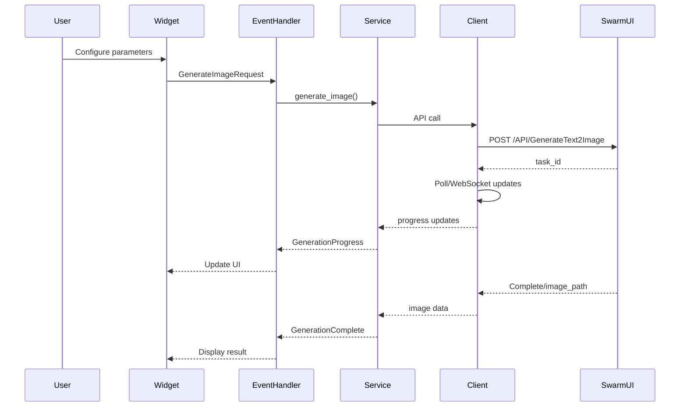

# Media Generation Integration Plan - SwarmUI

## Executive Summary
Integration of SwarmUI image generation capabilities into tldw_chatbook's chat interface, enabling users to generate AI images through conversation context, custom inputs, or pre-defined templates.

## Architecture Overview

### 1. Module Structure

```
tldw_chatbook/
├── Media_Creation/                    # Main media creation module
│   ├── __init__.py
│   ├── swarmui_client.py             # Core API client
│   ├── image_generation_service.py    # Service layer
│   ├── generation_templates.py        # Template definitions
│   └── providers/                     # Future: other API providers
│       └── __init__.py
├── Widgets/
│   └── Media_Creation/                # UI components
│       ├── __init__.py
│       ├── swarmui_widget.py         # Main generation widget
│       ├── generation_history_widget.py
│       └── template_editor_widget.py
├── Event_Handlers/
│   └── Media_Creation_Events/         # Event handling
│       ├── __init__.py
│       └── swarmui_events.py
└── DB/
    └── migrations/
        └── add_media_generation_tables.sql
```

### 2. Core Components

#### 2.1 SwarmUI Client (`swarmui_client.py`)
**Responsibilities:**
- Session lifecycle management
- API authentication
- Request/response handling
- Error recovery and retries
- WebSocket connection for real-time updates

**Key Methods:**
```python
class SwarmUIClient:
    async def get_session(self) -> str
    async def generate_image(self, params: Dict) -> Dict
    async def get_models(self) -> List[str]
    async def get_generation_status(self, task_id: str) -> Dict
    async def download_image(self, image_path: str) -> bytes
```

#### 2.2 Image Generation Service (`image_generation_service.py`)
**Responsibilities:**
- High-level generation orchestration
- Template application
- Context extraction from conversations
- Parameter validation and defaults
- Result caching and history management

**Key Methods:**
```python
class ImageGenerationService:
    async def generate_from_template(template_id: str, context: Dict) -> GenerationResult
    async def generate_from_conversation(conversation_id: int, params: Dict) -> GenerationResult
    async def generate_custom(prompt: str, params: Dict) -> GenerationResult
    def extract_context_from_messages(messages: List) -> Dict
```

#### 2.3 Generation Templates (`generation_templates.py`)
**Template Categories:**
- Portrait (headshot, full body, character design)
- Landscape (nature, urban, fantasy)
- Concept Art (sci-fi, fantasy, abstract)
- Product (mockups, presentations)
- Style Transfer (artistic styles)

**Template Structure:**
```python
@dataclass
class GenerationTemplate:
    id: str
    name: str
    category: str
    base_prompt: str
    negative_prompt: str
    default_params: Dict
    context_mappings: Dict  # Maps conversation context to prompt variables
```

### 3. User Interface

#### 3.1 Main Widget Integration
- **Location**: Chat right sidebar (collapsible section)
- **Components**:
  - Template selector dropdown
  - Prompt text area with context injection
  - Negative prompt input
  - Parameter controls (sliders/inputs):
    - Model selection
    - Image dimensions (width/height)
    - Steps (quality vs speed)
    - CFG scale (prompt adherence)
    - Seed (reproducibility)
  - Generate button with progress indicator
  - Result preview with actions (save, copy, regenerate)

#### 3.2 Context Integration Features
- **"Use Last Message"** button - extracts context from recent chat
- **"Summarize Conversation"** - creates prompt from entire chat
- **Variable placeholders** - {{character_name}}, {{setting}}, etc.

### 4. Event Flow



### 5. Database Schema

```sql
CREATE TABLE media_generations (
    id INTEGER PRIMARY KEY AUTOINCREMENT,
    conversation_id INTEGER,
    user_id TEXT,
    generation_type TEXT, -- 'image', 'audio', 'video'
    prompt TEXT NOT NULL,
    negative_prompt TEXT,
    parameters JSON,
    template_id TEXT,
    provider TEXT, -- 'swarmui', 'dalle', etc.
    status TEXT, -- 'pending', 'processing', 'completed', 'failed'
    result_path TEXT,
    result_metadata JSON,
    error_message TEXT,
    created_at TIMESTAMP DEFAULT CURRENT_TIMESTAMP,
    completed_at TIMESTAMP,
    FOREIGN KEY (conversation_id) REFERENCES conversations(id)
);

CREATE INDEX idx_media_generations_conversation ON media_generations(conversation_id);
CREATE INDEX idx_media_generations_status ON media_generations(status);
```

### 6. Configuration

```toml
[media_creation]
enabled = true
default_provider = "swarmui"

[media_creation.swarmui]
api_url = "http://localhost:7801"
api_key = ""  # Optional, if authentication is enabled
timeout = 60  # seconds
max_retries = 3
enable_websocket = true

# Default generation parameters
default_model = "OfficialStableDiffusion/sd_xl_base_1.0"
default_width = 1024
default_height = 1024
default_steps = 20
default_cfg_scale = 7.0
default_sampler = "dpmpp_2m_sde"

# Limits
max_width = 2048
max_height = 2048
max_steps = 150
max_batch_size = 4
```

### 7. Implementation Phases

#### Phase 1: Core Infrastructure (Current)
- [x] Create module structure
- [ ] Implement basic SwarmUI client
- [ ] Build simple generation service
- [ ] Create basic widget

#### Phase 2: Enhanced Features
- [ ] WebSocket support for real-time updates
- [ ] Template system implementation
- [ ] Context extraction from conversations
- [ ] Generation history and gallery

#### Phase 3: Advanced Integration
- [ ] Multi-provider support (DALL-E, Midjourney, etc.)
- [ ] Batch generation
- [ ] Image-to-image generation
- [ ] Inpainting/outpainting support
- [ ] Model management UI

### 8. Technical Considerations

#### 8.1 Performance
- **Async Operations**: All API calls must be async to prevent UI blocking
- **Caching**: Cache session IDs with TTL
- **Streaming**: Use WebSocket for large responses
- **Resource Management**: Limit concurrent generations

#### 8.2 Error Handling
- **Graceful Degradation**: Fall back to basic features if advanced fail
- **User Feedback**: Clear error messages with suggested actions
- **Retry Logic**: Exponential backoff for transient failures
- **Logging**: Comprehensive logging for debugging

#### 8.3 Security
- **Input Validation**: Sanitize all user inputs
- **API Key Management**: Use keyring for secure storage
- **Rate Limiting**: Implement client-side rate limiting
- **Content Filtering**: Optional NSFW detection

#### 8.4 Scalability
- **Modular Design**: Easy to add new providers
- **Queue System**: For handling multiple requests
- **Progress Tracking**: Database-backed job tracking
- **Result Storage**: Configurable storage backends

### 9. Testing Strategy

#### 9.1 Unit Tests
- Client API methods
- Service layer logic
- Template system
- Context extraction

#### 9.2 Integration Tests
- End-to-end generation flow
- Error handling scenarios
- WebSocket communication
- Database operations

#### 9.3 UI Tests
- Widget interaction
- Event handling
- Progress updates
- Result display

### 10. Future Enhancements

#### 10.1 Short Term
- Preset styles and artistic movements
- Prompt enhancement using LLM
- Batch operations UI
- Export to various formats

#### 10.2 Medium Term
- Integration with other media types (audio, video)
- Advanced editing capabilities
- Community template sharing
- Performance metrics dashboard

#### 10.3 Long Term
- Local model support
- Custom model training
- Workflow automation
- Plugin system for extensions

## Risk Analysis

### Technical Risks
1. **API Availability**: SwarmUI server may be down
   - *Mitigation*: Implement health checks and fallback options
   
2. **Performance Issues**: Large images or slow generation
   - *Mitigation*: Progressive loading, thumbnails, cancellation support

3. **Compatibility**: SwarmUI API changes
   - *Mitigation*: Version detection, adapter pattern

### User Experience Risks
1. **Complexity**: Too many options overwhelming users
   - *Mitigation*: Progressive disclosure, smart defaults

2. **Expectations**: Generation quality not meeting expectations
   - *Mitigation*: Clear quality indicators, example gallery

### Operational Risks
1. **Resource Usage**: High memory/CPU usage
   - *Mitigation*: Resource limits, queue management

2. **Storage**: Generated images consuming disk space
   - *Mitigation*: Automatic cleanup, compression options

## Success Metrics

1. **Functionality**
   - Successful generation rate > 95%
   - Average generation time < 30s
   - Error recovery success > 90%

2. **User Experience**
   - Widget load time < 500ms
   - Progress update frequency > 1Hz
   - User satisfaction score > 4.0/5.0

3. **Reliability**
   - Uptime > 99%
   - Data loss incidents = 0
   - Crash rate < 0.1%

## Conclusion

This plan provides a comprehensive approach to integrating SwarmUI image generation into tldw_chatbook. The modular design ensures extensibility while maintaining clean separation of concerns. The phased implementation allows for iterative development with early user feedback.

## Appendix A: API Examples

### SwarmUI Session Request
```http
GET /API/GetNewSession
Response: {"session_id": "abc123..."}
```

### Image Generation Request
```http
POST /API/GenerateText2Image
{
  "session_id": "abc123",
  "prompt": "a serene mountain landscape at sunset",
  "negative_prompt": "blur, low quality",
  "model": "OfficialStableDiffusion/sd_xl_base_1.0",
  "width": 1024,
  "height": 1024,
  "steps": 25,
  "cfg_scale": 7.5,
  "seed": -1
}
```

## Appendix B: UI Mockup

```
┌─ Image Generation ──────────────┐
│ Template: [Custom         ▼]    │
│                                  │
│ Prompt:                          │
│ ┌──────────────────────────────┐ │
│ │A majestic castle on a hill... │ │
│ └──────────────────────────────┘ │
│ [Use Last Message] [From Context]│
│                                  │
│ Negative Prompt:                 │
│ ┌──────────────────────────────┐ │
│ │blur, low quality              │ │
│ └──────────────────────────────┘ │
│                                  │
│ Model: [SDXL Base 1.0      ▼]    │
│ Size: [1024x1024          ▼]     │
│ Steps: [====25====] Quality: 7.5 │
│                                  │
│ [Generate] [Cancel]              │
│                                  │
│ ▓▓▓▓▓▓░░░░ Generating... 60%     │
│                                  │
│ Preview:                         │
│ ┌──────────────────────────────┐ │
│ │                               │ │
│ │      [Generated Image]        │ │
│ │                               │ │
│ └──────────────────────────────┘ │
│ [Save] [Copy] [Regenerate]       │
└──────────────────────────────────┘
```