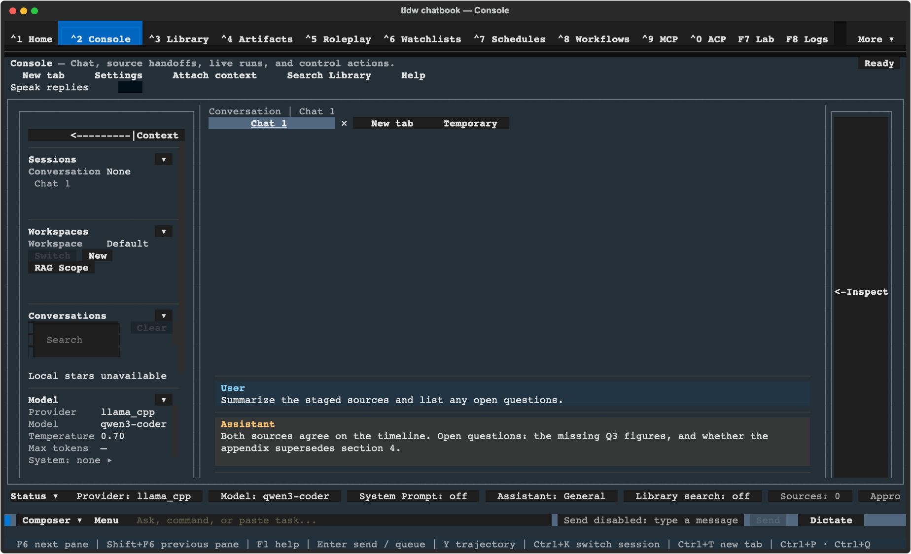

# tldw_chatbook

[](#project-status)
[](https://www.python.org/)
[](LICENSE)

tldw_chatbook is a local-first terminal application for chatting with large
language models, working with personal knowledge, and supervising tools and
agent workflows. It connects to hosted model APIs or a local model server while
keeping conversations, notes, prompts, and other core application data on your
machine by default.



> **New here?** Follow the [five-minute quick start](#quick-start), then use
> [Your first conversation](#your-first-conversation). The
> [User Guide](Docs/User_Guide/index.md) covers every major screen and workflow.

## Project status

tldw_chatbook is **Alpha** software. The current package version is `0.1.8.0`.
The core application is usable, but the project is moving quickly: interfaces
can change, advanced integrations vary in maturity, and older data may
occasionally need migration or recovery.

- **Available now:** the Textual application shell, hosted and local-server
  model connections, streaming conversations, local conversations and notes,
  Library search and ingestion, Roleplay, Artifacts and Chatbooks, Settings,
  and the source installation described below.
- **Still evolving:** ACP runtime integration, some agent and tool workflows,
  write synchronization, deeper server-backed features, and optional
  capabilities that depend on large models, native libraries, or external
  services.
- **Goal:** a modular terminal environment where LLM conversations, local
  knowledge, media, and explicitly controlled tools can work together without
  forcing every integration into the core install.

“Local-first” describes storage and ownership, not necessarily inference.
Hosted providers receive the prompts you send to them. Local models normally run
in a separate server such as Ollama, llama.cpp, vLLM, MLX-LM, or another
OpenAI-compatible endpoint.

## Why tldw_chatbook?

- **Use your choice of model.** Switch between hosted providers and local model
  servers without changing applications.
- **Keep useful context close.** Store and search conversations, notes, prompts,
  media, collections, and imported source material locally.
- **Work with more than text.** Ingest documents, web pages, audio, video, and
  e-books with the optional capability groups you choose.
- **Build grounded conversations.** Search the Library with SQLite FTS5 or add
  embeddings for semantic and hybrid RAG.
- **Create different kinds of conversations.** Use ordinary assistant chats,
  characters, personas, lorebooks, and chat dictionaries.
- **Stay in control of automation.** Review tool calls, permissions, agent runs,
  schedules, workflows, and recovery states in the UI.
- **Install only what you need.** The core package stays smaller while RAG,
  media, speech, local inference, MCP, and browser serving remain optional.

## Quick start

### Requirements

- Python `>=3.11`
- Windows, macOS, or Linux
- A terminal with Unicode support
- Either an API key for a hosted provider or a separately running local model
  server

### 1. Clone the repository

```bash
git clone https://github.com/rmusser01/tldw_chatbook.git
cd tldw_chatbook
```

### 2. Create and activate a virtual environment

macOS or Linux:

```bash
python3 --version
python3 -m venv .venv
source .venv/bin/activate
```

Windows PowerShell:

```powershell
py -3 --version
py -3 -m venv .venv
.venv\Scripts\Activate.ps1
```

Windows Command Prompt:

```bat
py -3 -m venv .venv
.venv\Scripts\activate.bat
```

Use an executable that reports Python 3.11 or newer. A versioned executable such
as `python3.12` or `py -3.12` is fine.

### 3. Install the core application

```bash
python -m pip install --upgrade pip
python -m pip install -e .
```

### 4. Launch it

```bash
tldw-cli
```

The first-run wizard opens on a new profile. Choose **Quick setup** to connect a
provider, select a model, and keep the remaining features at their recommended
defaults. The full setup track also covers RAG, tools, notes sync, appearance,
speech, and key protection.

### 5. Send a message

Finish the wizard, open **Console** with **Ctrl+2**, type in the composer, and
send. Press **F1** for screen-specific shortcuts or **Ctrl+P** for the command
palette.

If setup was skipped or interrupted, open
**Settings › Diagnostics › Run setup wizard**. Provider, endpoint, key, and
model settings can also be repaired directly under
**Settings › Providers & Models**.

## Your first conversation

### Hosted provider

1. Choose a hosted provider in the first-run wizard.
2. Enter its API key and select one of its available models.
3. Finish setup and open **Console**.
4. Send a message.

Prompts and responses cross the selected provider’s service boundary and are
handled under that provider’s terms. Keys can be saved through the guided setup
or supplied through supported environment variables.

### Local model server

1. Start the local server separately.
2. Choose the matching local or OpenAI-compatible provider in the wizard.
3. Confirm its endpoint and select a model exposed by that server.
4. Finish setup, open **Console**, and send a message.

Local servers on localhost may be detected by the wizard. tldw_chatbook does not
claim an embedded model runtime: the external server owns model loading and
inference; the app owns the conversation and workflow interface.

See [First-Run Setup](Docs/User_Guide/First_Run_Setup.md) and
[Console basics](Docs/User_Guide/console/chat-basics.md) for a detailed
walkthrough.

## Installation options

The editable source install is the primary path while the project is Alpha:

```bash
python -m pip install -e .
```

A published package can be installed with:

```bash
python -m pip install tldw_chatbook
```

The examples below use editable source installs. For a published package, add
the same optional-dependency group to the package name.

### Common combinations

```bash
# Development and tests
python -m pip install -e ".[dev]"

# Semantic and hybrid RAG
python -m pip install -e ".[embeddings_rag,chunker]"

# Audio/video ingestion and document extraction
python -m pip install -e ".[audio,video,pdf,ebook]"

# Web search plus browser-served TUI
python -m pip install -e ".[websearch,web]"

# MCP integration
python -m pip install -e ".[mcp]"

# Local model integrations
python -m pip install -e ".[local_vllm,local_transformers]"
```

Optional groups can install large ML dependencies, download model assets, or
require native libraries. Add only the groups you plan to use.

### Optional feature groups

| Group | Adds |
| --- | --- |
| `embeddings_rag` | Embeddings, vector storage, semantic search, and hybrid RAG |
| `chunker` | Language-aware and advanced text chunking |
| `websearch` | Web retrieval, extraction, and search dependencies |
| `coding_map` | Code parsing, syntax highlighting, and repository mapping helpers |
| `local_vllm` | vLLM local-inference integration |
| `local_mlx` | MLX-LM support on compatible Apple Silicon systems |
| `local_transformers` | Hugging Face Transformers local-model support |
| `mcp` | Model Context Protocol client/server dependencies |
| `audio` | Audio ingestion, processing, and transcription |
| `video` | Video ingestion and transcription |
| `media_processing` | Shared audio/video processing stack |
| `pdf` | PDF extraction with PyMuPDF and Docling |
| `ebook` | EPUB and e-book extraction |
| `image_generation` | Image-generation HTTP adapter support |
| `video_playback` | In-app video decoding and playback widgets |
| `svg` | SVG rasterization; the Cairo system library may also be required |
| `frontmatter` | YAML front matter support in Markdown notes and previews |
| `speech_recording` | Microphone recording support |
| `realtime` | Realtime audio/model dependencies |
| `local_tts` | Local TTS engines such as Kokoro ONNX |
| `chatterbox` | Chatterbox TTS support |
| `higgs_tts` | Supporting packages for Higgs Audio; manual Higgs installation is also required |
| `transcription_faster_whisper` | CPU/CUDA-optimized Whisper |
| `transcription_parakeet_onnx` | Cross-platform Parakeet ONNX runtime |
| `transcription_transcribe_cpp` | Direct local GGUF transcription runtime |
| `transcription_lightning_whisper` | Apple Silicon Lightning Whisper |
| `transcription_parakeet` | Compatibility alias for Parakeet ONNX |
| `mlx_whisper` | Legacy Apple Silicon transcription bundle |
| `nemo` | NVIDIA NeMo speech models |
| `diarization` | Speaker diarization dependencies |
| `ocr_docext` | OCR and document-extraction integrations |
| `subscriptions` | Feed and subscription parsing helpers |
| `debugging` | Prometheus and OpenTelemetry development instrumentation |
| `web` | Browser serving through `textual-serve` |
| `dev` | Test, packaging, and development tools |

The list in `pyproject.toml` is authoritative. For recovery commands and
ownership, see
[Release Recovery and Setup](Docs/Development/release-recovery-setup.md).

### Speech and transcription choices

The `audio`, `video`, and `media_processing` groups include practical
cross-platform transcription defaults. Additional engines can be installed
alongside them:

```bash
# Cross-platform audio ingestion
python -m pip install -e ".[audio]"

# Add Apple Silicon-optimized Whisper
python -m pip install -e ".[audio,transcription_lightning_whisper]"

# Direct local GGUF transcription
python -m pip install -e ".[audio,transcription_transcribe_cpp]"
```

Some speech engines have hardware, model-download, or system-library
requirements. See the
[Speech Services Guide](Docs/Features/Speech-Services-Guide.md) before choosing
a large local stack.

Higgs Audio requires manual installation of its upstream package before the
`higgs_tts` extra can be used. Follow the
[Higgs Audio guide](Docs/Development/TTS/Higgs-Audio-TTS-Guide.md) rather than
guessing compatible versions.

## What you can do

The application is organized around workflows. You do not need every
destination or optional dependency to use the core chat experience.

### Conversations and live work

Use **Console** to:

- stream responses from hosted or local providers;
- create, save, search, branch, edit, regenerate, and resume conversations;
- attach images and other supported context;
- stage Library sources for grounded answers;
- review tool calls, results, approvals, and agent-run activity;
- switch sessions, models, context policy, and workspace bindings;
- inspect failures and follow explicit recovery actions.

The conversation transcript is the primary work surface. Home, Library,
Research, Roleplay, and other destinations can hand context or work back to the
active Console session.

Read the [Console guide](Docs/User_Guide/console.md) for chat basics, context
and RAG, attachments, tools, sessions, branching, and rewind.

### Local knowledge, search, and RAG

Use **Library** to work with:

- conversations, notes, prompts, media, skills, and collections;
- local files and imported source material;
- full-text search with SQLite FTS5 and BM25 ranking;
- semantic and hybrid retrieval with `embeddings_rag`;
- source selection and handoff into Console;
- document, web, audio, video, PDF, and e-book ingestion;
- study workflows such as flashcards and quizzes.

Basic full-text search does not require the embeddings stack. Semantic/vector
retrieval, some re-ranking, and model-backed indexing do.

Library access in Console is intentionally split into explicit controls:
manual Library search, automatic retrieval policy, assistant tool permission,
and direct/RAG retrieval mode. New conversations do not silently grant every
tool or source.

See the [Library guide](Docs/User_Guide/library.md) and
[Search and RAG](Docs/User_Guide/library/search-and-rag.md).

### Notes and file sync

Notes support Markdown content, folders, templates, import/export, search, and
links to other local content. File Notes can synchronize a chosen folder with
the application’s note store; review its conflict and backup behavior before
pointing it at important files.

See [Library Notes](Docs/User_Guide/library/notes.md) and
[File Notes](Docs/User_Guide/library/file-notes.md).

### Media and speech

With the appropriate extras, tldw_chatbook can:

- import local files and supported URLs;
- extract text and structure from documents, PDFs, and e-books;
- transcribe audio and video with local or configured remote engines;
- attach images to supported vision models;
- record voice input;
- synthesize and play spoken responses;
- generate images or videos through configured adapters;
- preview supported media inside the application.

These workflows can be resource-intensive. Local engines may download large
models; remote engines send selected media or text to their service.

See [Media and Conversations](Docs/User_Guide/library/media-and-conversations.md),
[Console attachments, images, and voice](Docs/User_Guide/console/attachments-images-voice.md),
and [Console video](Docs/User_Guide/console/video.md).

### Roleplay, characters, and lore

Use **Roleplay** to manage:

- character cards and character conversations;
- user personas and profile context;
- chat dictionaries;
- lorebooks and world information;
- import/export of supported character formats.

See the
[Roleplay and Chat Dictionaries guide](Docs/User_Guide/roleplay-chat-dictionaries.md).

### Artifacts and Chatbooks

**Artifacts** collects outputs that should live beyond one message: reports,
datasets, generated files, and Chatbooks. Chatbooks provide a portable bundle
for selected conversation and source material.

See [Artifacts](Docs/User_Guide/artifacts.md).

### Home, Research, Watchlists, Schedules, and Workflows

- **Home** shows attention items, running work, recent activity, and useful next
  actions.
- **Research** provides grounded workspaces and durable research-run
  observation.
- **Watchlists** monitors configured sources and exposes runs, alerts, and
  recovery.
- **Schedules** owns timing and triggers for supported recurring work.
- **Workflows** defines reusable procedures, dry runs, and outputs.

Some live service, runtime, and write-sync paths remain intentionally explicit
or blocked until their required backend is configured. An unavailable state
should tell you what is missing rather than pretending the workflow ran.

Guides:
[Home](Docs/User_Guide/home.md) ·
[Research](Docs/User_Guide/research_workspace.md) ·
[Watchlists](Docs/User_Guide/watchlists.md) ·
[Schedules](Docs/User_Guide/schedules.md) ·
[Workflows](Docs/User_Guide/workflows.md)

### Tools, MCP, and ACP

The built-in tool system includes simple local tools and a catalog that can
incorporate local, skill, and MCP providers. Console renders calls, results,
permissions, and failures inline.

**MCP** manages Model Context Protocol servers, discovered tools, permissions,
authentication, and audit information. Install `mcp` when its optional
dependencies are needed:

```bash
python -m pip install -e ".[mcp]"
```

The standalone stdio server can then be launched with:

```bash
python -m tldw_chatbook.MCP
```

**ACP** manages compatible agent runtimes, sessions, diffs, and terminals. ACP
does not include a runtime by itself; configure a compatible runtime in the ACP
destination before attempting to launch a session.

See [MCP](Docs/User_Guide/mcp.md),
[ACP](Docs/User_Guide/acp.md), and
[Agent runs and tools](Docs/User_Guide/console/agent-runs-and-tools.md).

### Models, evaluation, and Lab

**Lab** groups model management, speech, and evaluation workflows. Evaluation
support includes configurable tasks, metrics, result storage, and comparisons.
Optional model and media stacks add hardware-specific capabilities without
making them core requirements.

See [Lab](Docs/User_Guide/lab.md).

## Application destinations

| Shortcut | Destination | Purpose |
| --- | --- | --- |
| **Ctrl+1** | Home | Status, attention items, running work, and next actions |
| **Ctrl+2** | Console | Conversations, context, tools, approvals, and runs |
| **Ctrl+3** | Library | Notes, media, prompts, conversations, skills, search, RAG, and ingestion |
| **F10** | Research | Grounded workspaces and research-run observation |
| **Ctrl+4** | Artifacts | Generated outputs, reports, datasets, and Chatbooks |
| **Ctrl+5** | Roleplay | Characters, personas, dictionaries, and lore |
| **Ctrl+6** | Watchlists | Monitored sources, runs, alerts, and recovery |
| **Ctrl+7** | Schedules | Timing and triggers |
| **Ctrl+8** | Workflows | Reusable procedures and outputs |
| **Ctrl+9** | MCP | MCP servers, tools, permissions, and auth |
| **Ctrl+0** | ACP | Compatible agent runtimes and sessions |
| **F7** | Lab | Models, speech, and evaluations |
| **F8** | Logs | Application logs and diagnostics |
| **F9** | Settings | Providers, storage, appearance, privacy, and application behavior |

Legacy route names may still resolve during migration, but they are not the
primary navigation model.

## Model connections

Provider integrations include major hosted APIs and OpenAI-compatible services.
The exact provider and model catalog evolves faster than this README; use the
first-run wizard or **Settings › Providers & Models** for the current list.

Local and compatible endpoints can include:

- Ollama
- llama.cpp
- KoboldCpp
- vLLM
- Aphrodite
- MLX-LM
- any compatible endpoint that exposes the expected API and model identifiers

Capabilities such as images, tool calling, structured output, reasoning, and
streaming depend on both the selected model and provider adapter. The UI reports
readiness and recovery information rather than assuming support from a model
name alone.

## Configuration

### Preferred setup path

Use the first-run wizard and **Settings** for ordinary configuration. Hand-edit
TOML only when a setting has no UI owner or you need a reproducible advanced
profile.

The main config file is:

```text
~/.config/tldw_cli/config.toml
```

Run the wizard again from **Settings › Diagnostics › Run setup wizard**.
Provider and model repair belongs under **Settings › Providers & Models**.

Configuration precedence is generally:

1. supported environment variables;
2. `config.toml`;
3. built-in defaults.

Provider-specific details can vary, so prefer the current Settings UI and
maintained guides over copied configuration blocks.

### API keys and secrets

API keys can be entered in the wizard or Settings, or supplied with the
provider’s supported environment variable. Common examples include
`OPENAI_API_KEY`, `ANTHROPIC_API_KEY`, `DASHSCOPE_API_KEY`,
`MOONSHOT_API_KEY`, and `ZAI_API_KEY`.

Do not commit keys to the repository. Config encryption and keyring-backed
storage are available for supported paths; the wizard’s **Protect keys** step
explains the active choice.

### Local data

The default base data directory on a typical Unix-like system is:

```text
~/.local/share/tldw_cli/
```

Profiles live below it:

```text
~/.local/share/tldw_cli/<profile>/
```

A fresh install normally uses `default_user`. Profile directories can contain
SQLite databases, logs, caches, generated media, exports, model artifacts, and
tool/workspace state. Exact paths vary by platform and configuration.

Before deleting, moving, or sharing this directory:

1. inspect the active paths in **Settings › Storage**;
2. close other running instances;
3. back up the profile data you care about;
4. remember that generated files and optional model caches may be large.

Local storage does not prevent a configured feature from sending selected
content elsewhere. Hosted models, web search, MCP servers, agent runtimes, and
server-backed workflows each introduce a separate trust boundary.

### Advanced profiles

`TLDW_CONFIG_PATH` can select a different config file. A config override does
not automatically relocate every data path; set `[paths].data_dir` inside that
profile when true isolation is required.

## Browser access

Install the `web` group to serve the Textual application in a browser:

```bash
python -m pip install -e ".[web]"
tldw-serve
```

Common options:

```bash
tldw-serve --host localhost --port 8080 --title "tldw chatbook"
```

The default bind address is localhost. Binding to `0.0.0.0` makes the service
reachable through network interfaces; do that only with appropriate firewall,
authentication, and network controls. Browser access does not make private
Library content safe to expose publicly.

## Troubleshooting

### `tldw-cli` is not found

Activate the virtual environment and reinstall through its interpreter:

```bash
python -m pip install -e .
```

Then confirm the environment’s scripts directory is on `PATH`.

### The Console says the provider or model is blocked

Open **Settings › Providers & Models** and check:

- provider selection;
- API key or local endpoint;
- default model;
- connection/readiness result.

Run the setup wizard again if several fields are missing.

### A local model does not respond

Confirm the separate model server is running, the configured endpoint is
reachable, and the model identifier exactly matches one exposed by that server.

### An advanced feature is unavailable

Read the recovery message, install the named optional group, and restart the
application. Missing an optional group should not make the core install
unusable.

### RAG has no sources

Import or select content in Library, choose a source or search result, and stage
it into Console. Semantic/vector search additionally requires the
`embeddings_rag` group and an available embedding model.

### Startup or migration fails

Open **Logs** with **F8** and inspect the error before deleting data. Back up the
active profile, then use the
[Release Recovery and Setup guide](Docs/Development/release-recovery-setup.md).

### The UI looks wrong in the terminal

Use a Unicode-capable terminal, try a larger window, and press **F1** to inspect
screen controls. Some media rendering depends on terminal image support.

## Project structure

<details>
<summary>Major directories</summary>

```text
tldw_chatbook/
├── Agents/                 Agent orchestration and tool catalogs
├── Artifacts/              Artifact contracts and storage
├── Character_Chat/         Characters, cards, lore, and roleplay logic
├── Chat/                   Conversation and transcript behavior
├── Chatbooks/              Portable Chatbook creation and import
├── DB/                     SQLite databases, schemas, and migrations
├── Evals/                  Evaluation runners and metrics
├── Event_Handlers/         Textual message and worker coordination
├── Image_Generation/       Image-generation adapters
├── LLM_Calls/              Hosted and local provider integrations
├── Local_Ingestion/        File and media ingestion
├── MCP/                    MCP client/server and permission handling
├── Notes/                  Notes and file-sync logic
├── RAG_Search/             Search, indexing, chunking, and retrieval
├── TTS/                    Text-to-speech providers and playback
├── Tools/                  Built-in and local tool implementations
├── UI/                     Screens, views, wizards, and navigation
├── Video_Generation/       Video-generation adapters and stores
├── Widgets/                Reusable Textual widgets
├── Workspaces/             Workspace bindings and lifecycle
├── app.py                  Main Textual application
├── cli.py                  Lightweight installed command entry point
├── config.py               Configuration and path resolution
└── Constants.py            Shared application constants
```

</details>

## Development

Install development dependencies:

```bash
python -m pip install -e ".[dev]"
```

Run the application from the installed entry point:

```bash
tldw-cli
```

Run focused tests while developing:

```bash
python -m pytest Tests/Chat/
python -m pytest Tests/UI/test_legacy_entrypoints_retired.py
```

Run the full suite before a release or merge when the complete environment is
available:

```bash
python -m pytest
```

Coverage:

```bash
python -m pytest --cov=tldw_chatbook
```

See [Testing](Docs/Testing.md) and [Contributing](CONTRIBUTING.md) before making
large changes. Public APIs should use type hints; database queries must be
parameterized; file paths and external inputs must be validated at their
boundaries.

## Documentation

- [User Guide](Docs/User_Guide/index.md) — task-oriented application guidance
- [First-Run Setup](Docs/User_Guide/First_Run_Setup.md) — wizard tracks and recovery
- [Console](Docs/User_Guide/console.md) — conversations, context, tools, and runs
- [Library](Docs/User_Guide/library.md) — local content, ingestion, search, and RAG
- [Settings](Docs/User_Guide/settings.md) — providers, models, storage, and behavior
- [Release Recovery and Setup](Docs/Development/release-recovery-setup.md) — blocked states and optional dependencies
- [Changelog](CHANGELOG.md) — release history
- [Contributing](CONTRIBUTING.md) — development and pull-request guidance

The User Guide tracks the `dev` branch. If a label differs in an older
checkout, compare the installed version and the guide’s verification note.

## Inspiration

- [Elia](https://github.com/darrenburns/elia)
- [ParLlama](https://github.com/paulrobello/parllama)

## Contributing

Contributions are welcome. Read [CONTRIBUTING.md](CONTRIBUTING.md), keep pull
requests focused, and include verification appropriate to the behavior being
changed. Development work targets the `dev` branch before reaching `main`.

Use the [issue tracker](https://github.com/rmusser01/tldw_chatbook/issues) for
reproducible bugs, feature discussion, and documentation gaps.

## License

tldw_chatbook is licensed under the
[GNU Affero General Public License v3.0 or later](LICENSE).

## Contact

For project questions and feature requests, open a
[GitHub issue](https://github.com/rmusser01/tldw_chatbook/issues). For security
issues, do not publish sensitive details in a public issue; contact the
maintainer privately at [contact@rmusser.net](mailto:contact@rmusser.net).
