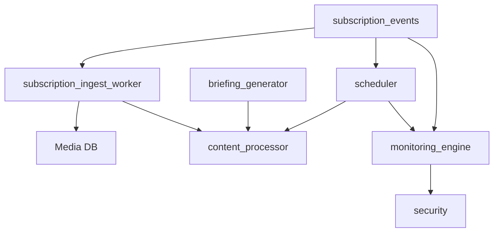
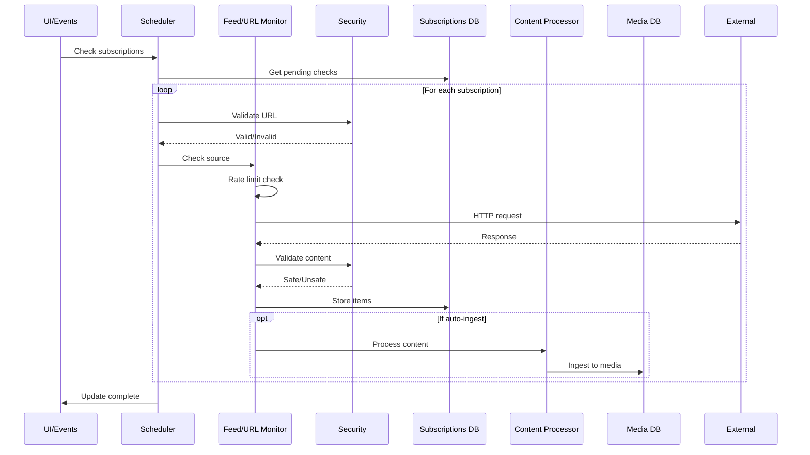
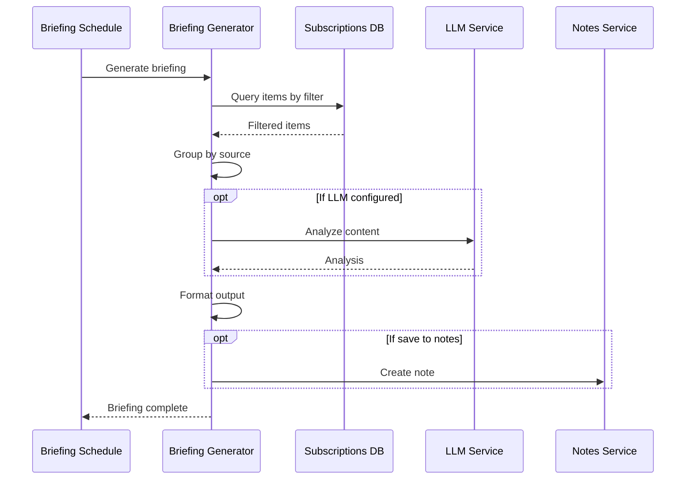
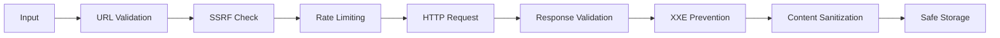

# Subscriptions Module Architecture

## Table of Contents
1. [Overview](#overview)
2. [Architecture Decisions Records (ADRs)](#architecture-decisions-records-adrs)
3. [Module Structure](#module-structure)
4. [Component Architecture](#component-architecture)
5. [Data Flow](#data-flow)
6. [Security Architecture](#security-architecture)
7. [Integration Points](#integration-points)
8. [Performance Considerations](#performance-considerations)
9. [Future Enhancements](#future-enhancements)

## Overview

The Subscriptions module provides a comprehensive content monitoring and ingestion system for tldw_chatbook. It enables users to track RSS/Atom feeds, monitor URLs for changes, and automatically generate briefings from aggregated content.

### Key Capabilities
- **Multi-format Support**: RSS, Atom, JSON Feed, URL monitoring, Podcast feeds
- **Security-First Design**: XXE prevention, SSRF protection, encrypted credentials
- **Intelligent Processing**: LLM analysis, keyword extraction, content summarization
- **Automated Workflows**: Scheduled checks, auto-ingestion, briefing generation
- **Resilient Operations**: Circuit breakers, rate limiting, error recovery

## Architecture Decisions Records (ADRs)

### ADR-001: Async-First Architecture
**Status**: Accepted  
**Context**: The system needs to handle multiple concurrent subscription checks without blocking the UI.  
**Decision**: Use Python's asyncio throughout with Textual's worker system for background tasks.  
**Consequences**: 
- ✅ Non-blocking UI operations
- ✅ Efficient resource utilization
- ✅ Natural integration with httpx for async HTTP
- ⚠️ Increased complexity in error handling
- ⚠️ Need for careful synchronization

### ADR-002: Security by Design
**Status**: Accepted  
**Context**: Web content monitoring exposes the system to various security risks (XXE, SSRF, malicious content).  
**Decision**: Implement defense-in-depth with multiple security layers.  
**Consequences**:
- ✅ Protection against common web vulnerabilities
- ✅ Safe handling of untrusted content
- ✅ Encrypted credential storage
- ⚠️ Additional processing overhead
- ⚠️ Some legitimate use cases may be restricted (e.g., internal URLs)

### ADR-003: LLM-Optional Processing
**Status**: Accepted  
**Context**: LLM analysis provides value but shouldn't be required for basic functionality.  
**Decision**: Make LLM analysis optional with graceful fallbacks.  
**Consequences**:
- ✅ System works without LLM configuration
- ✅ Cost-conscious users can opt-out
- ✅ Faster processing for simple use cases
- ⚠️ Dual code paths to maintain
- ⚠️ Reduced functionality without LLM

### ADR-004: Database-Driven State
**Status**: Accepted  
**Context**: Need persistent storage for subscriptions, items, and monitoring state.  
**Decision**: Use SQLite with comprehensive schema including audit trails.  
**Consequences**:
- ✅ ACID compliance for data integrity
- ✅ Rich querying capabilities
- ✅ Built-in backup/restore
- ⚠️ Schema migrations needed
- ⚠️ Potential performance bottlenecks

### ADR-005: Modular Component Design
**Status**: Accepted  
**Context**: The subscription system has many concerns (monitoring, security, processing, scheduling).  
**Decision**: Separate concerns into focused modules with clear interfaces.  
**Consequences**:
- ✅ Easy to test individual components
- ✅ Clear separation of concerns
- ✅ Reusable components
- ⚠️ More files to manage
- ⚠️ Need for careful dependency management

### ADR-006: Bridge Pattern for Media Integration
**Status**: Accepted  
**Context**: Subscription items need to flow into the existing media database.  
**Decision**: Create a bridge worker that maps subscription items to media entries.  
**Consequences**:
- ✅ Loose coupling with media system
- ✅ Preserves existing media workflows
- ✅ Flexible mapping logic
- ⚠️ Additional translation layer
- ⚠️ Potential for mapping inconsistencies

### ADR-007: Adaptive Scheduling
**Status**: Accepted  
**Context**: Different sources update at different frequencies; checking too often wastes resources.  
**Decision**: Implement pattern analysis to adapt check frequencies.  
**Consequences**:
- ✅ Optimized resource usage
- ✅ Better responsiveness for active sources
- ✅ Reduced load on external servers
- ⚠️ Complex pattern detection logic
- ⚠️ May miss sporadic updates

## Module Structure

```
Subscriptions/
├── __init__.py              # Module exports and version info
├── SUB-Arch.md             # This architecture document
├── monitoring_engine.py     # Core monitoring functionality
├── security.py             # Security utilities and validators
├── scheduler.py            # Task scheduling and pattern analysis
├── content_processor.py    # Content analysis and processing
└── briefing_generator.py   # Briefing and newsletter generation
```

### Module Dependencies



## Component Architecture

### 1. Monitoring Engine (`monitoring_engine.py`)

**Purpose**: Core subscription checking logic with protocol-specific handlers.

**Key Classes**:
- `FeedMonitor`: RSS/Atom/JSON feed parsing with security features
- `URLMonitor`: Web page change detection
- `RateLimiter`: Token bucket rate limiting
- `CircuitBreaker`: Fault tolerance pattern
- `ContentExtractor`: Clean text extraction from HTML

**Design Patterns**:
- **Strategy Pattern**: Different monitors for different content types
- **Circuit Breaker**: Automatic failure recovery
- **Token Bucket**: Rate limiting algorithm

### 2. Security Layer (`security.py`)

**Purpose**: Comprehensive security validation and protection.

**Key Classes**:
- `SecurityValidator`: URL validation, SSRF protection
- `SSRFProtector`: Advanced SSRF with DNS rebinding prevention
- `CredentialEncryptor`: AES-256 encryption for credentials
- `InputValidator`: User input sanitization

**Security Features**:
- XXE prevention via defusedxml
- SSRF protection with IP range blocking
- Input sanitization and validation
- Credential encryption at rest

### 3. Scheduler (`scheduler.py`)

**Purpose**: Background task scheduling with intelligent timing.

**Key Classes**:
- `SubscriptionScheduler`: Main scheduling engine
- `UpdatePattern`: Pattern analysis for adaptive scheduling
- `ScheduledTask`: Priority queue task representation
- `TextualSchedulerWorker`: Textual integration

**Scheduling Features**:
- Priority-based task queue
- Adaptive frequency adjustment
- Business hours detection
- Concurrent execution limiting

### 4. Content Processor (`content_processor.py`)

**Purpose**: Transform raw content into structured, analyzed data.

**Key Classes**:
- `ContentProcessor`: Main processing pipeline
- `KeywordExtractor`: Extract keywords from content
- `ContentSummarizer`: Non-LLM summarization fallback

**Processing Pipeline**:
1. Content extraction and cleaning
2. Keyword extraction from metadata
3. Optional LLM analysis
4. Result formatting for storage

### 5. Briefing Generator (`briefing_generator.py`)

**Purpose**: Aggregate and summarize content into briefings.

**Key Classes**:
- `BriefingGenerator`: Main briefing engine
- `BriefingSchedule`: Scheduled briefing management

**Output Formats**:
- Markdown with templates
- HTML with styling
- JSON for API consumption

## Data Flow

### Subscription Check Flow



### Briefing Generation Flow



## Security Architecture

### Threat Model

1. **XXE Attacks**: Malicious XML with external entities
2. **SSRF Attacks**: Requests to internal/cloud metadata endpoints
3. **Credential Theft**: Exposed authentication data
4. **Resource Exhaustion**: Unbounded requests/processing
5. **Injection Attacks**: Malicious content in feeds

### Security Controls



**Implementation Details**:

1. **URL Validation**:
   - Scheme restrictions (http/https only)
   - Hostname resolution and IP checking
   - Private IP range blocking

2. **XXE Prevention**:
   - defusedxml for safe XML parsing
   - DTD processing disabled
   - External entity resolution blocked

3. **Rate Limiting**:
   - Per-domain token buckets
   - Global rate limits
   - Exponential backoff on failures

4. **Credential Security**:
   - AES-256 encryption
   - PBKDF2 key derivation
   - Secure key storage

## Integration Points

### 1. Media Database Integration

**Location**: `Event_Handlers/subscription_ingest_worker.py`

```python
# Subscription item → Media entry mapping
media_data = {
    'url': item['url'],
    'title': item['title'],
    'type': map_subscription_to_media_type(subscription['type']),
    'content': processed_content,
    'keywords': extracted_keywords,
    'custom_metadata': {
        'subscription_id': subscription['id'],
        'subscription_name': subscription['name']
    }
}
```

### 2. UI Integration

**Location**: `UI/Subscription_Window.py`

- Tab-based interface matching app design
- Reactive updates via events
- Background worker integration

### 3. Event System Integration

**Location**: `Event_Handlers/subscription_events.py`

```python
# Custom events for subscription system
class NewSubscriptionItems(SubscriptionEvent)
class SubscriptionCheckComplete(SubscriptionEvent)
class SubscriptionError(SubscriptionEvent)
class SubscriptionHealthUpdate(SubscriptionEvent)
```

### 4. Configuration Integration

**Location**: `config.py` additions

```toml
[subscriptions]
enabled = true
default_check_interval = 3600
max_concurrent_checks = 10

[subscriptions.security]
enable_xxe_protection = true
enable_ssrf_protection = true
```

## Performance Considerations

### 1. Database Optimization

- **Indexes**: On priority, active status, last_checked
- **Covering indexes**: For common query patterns
- **WAL mode**: For concurrent access
- **Prepared statements**: Prevent SQL injection

### 2. Network Optimization

- **Connection pooling**: Reuse HTTP connections
- **HTTP/2 support**: Multiplexed requests
- **Compression**: gzip/deflate support
- **Conditional requests**: ETag/Last-Modified

### 3. Processing Optimization

- **Batch operations**: Process multiple items together
- **Async I/O**: Non-blocking operations
- **Caching**: Response and analysis caching
- **Early termination**: Stop processing on errors

### 4. Memory Management

- **Streaming parsing**: For large feeds
- **Content limits**: Prevent unbounded growth
- **Cleanup routines**: Remove old snapshots
- **Lazy loading**: Load items on demand

## Future Enhancements

### Phase 1: Enhanced Monitoring
- [ ] WebSocket support for real-time feeds
- [ ] API endpoint monitoring with schema validation
- [ ] Git repository monitoring for documentation
- [ ] Social media integration (Twitter, Reddit APIs)

### Phase 2: Advanced Analysis
- [ ] Sentiment analysis for content
- [ ] Trend detection across sources
- [ ] Duplicate detection with fuzzy matching
- [ ] Multi-language support

### Phase 3: Collaboration Features
- [ ] Shared subscription lists
- [ ] Collaborative filtering
- [ ] Team briefings with role-based views
- [ ] Annotation and commenting

### Phase 4: Enterprise Features
- [ ] SAML/OAuth authentication
- [ ] Audit logging and compliance
- [ ] Custom deployment options
- [ ] API for external integrations

### Phase 5: AI Enhancement
- [ ] Smart categorization
- [ ] Predictive importance scoring
- [ ] Automated tagging
- [ ] Custom model fine-tuning

## Conclusion

The Subscriptions module provides a robust, secure, and extensible foundation for content monitoring and aggregation. Its modular architecture, comprehensive security features, and intelligent processing capabilities make it a valuable addition to the tldw_chatbook ecosystem.

The design prioritizes:
- **Security**: Multiple layers of protection
- **Performance**: Efficient resource utilization
- **Flexibility**: Extensible for new content types
- **Integration**: Seamless fit with existing systems
- **User Experience**: Automated workflows with manual control

This architecture positions the subscription system for growth while maintaining the quality and security standards of the broader application.